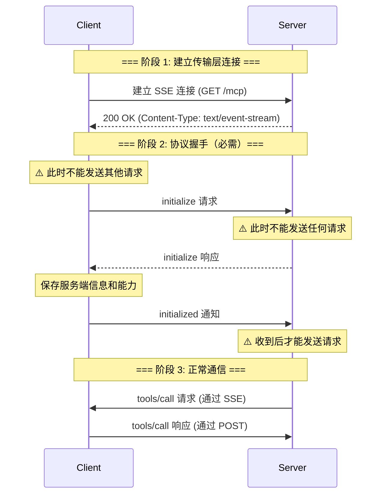
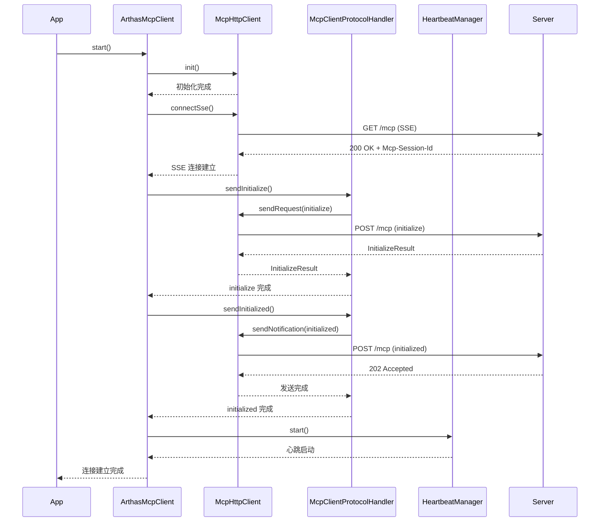
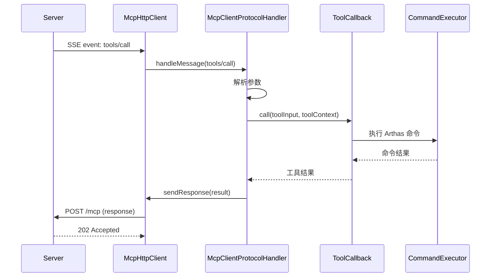
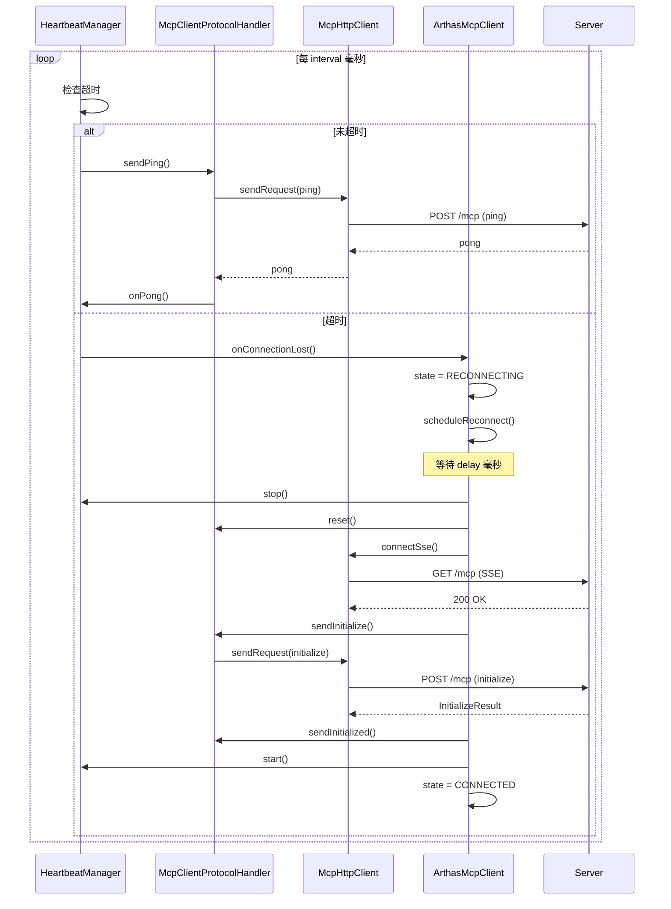

# Arthas MCP Client 模式源码级别分析

> **文档版本**: v1.0  
> **创建时间**: 2026-01-21  
> **作者**: Arthas Team

---

## 📋 目录

1. [架构概览](#1-架构概览)
2. [Netty 数据流结构](#2-netty-数据流结构)
3. [连接建立流程](#3-连接建立流程)
4. [连接维护机制](#4-连接维护机制)
5. [核心组件详解](#5-核心组件详解)
6. [完整时序图](#6-完整时序图)
7. [关键代码路径](#7-关键代码路径)

---

## 1. 架构概览

### 1.1 整体架构

Arthas MCP Client 采用**反向连接**模式，主动连接到公网管控平台，提供 MCP 工具服务。

```
┌─────────────────────────────────────────────────────────────┐
│                    Arthas MCP Client                        │
│                                                             │
│  ┌──────────────────┐      ┌──────────────────┐           │
│  │ ArthasMcpClient  │─────▶│ McpHttpClient    │           │
│  │  (主控制器)       │      │  (Netty HTTP客户端)│          │
│  └────────┬─────────┘      └─────────┬────────┘           │
│           │                           │                     │
│           │                           │                     │
│  ┌────────▼─────────┐      ┌─────────▼────────┐           │
│  │ McpClientProtocol│      │ HeartbeatManager │           │
│  │ Handler          │      │  (心跳管理)       │           │
│  │  (协议处理)       │      └──────────────────┘           │
│  └──────────────────┘                                      │
│           │                                                 │
│           │                                                 │
│  ┌────────▼─────────┐                                      │
│  │ ToolCallback     │                                      │
│  │  (工具执行)       │                                      │
│  └──────────────────┘                                      │
└─────────────────────────────────────────────────────────────┘
                        │
                        │ HTTP/SSE
                        ▼
┌─────────────────────────────────────────────────────────────┐
│                  管控平台 / 智能体                           │
│                  (MCP Server)                               │
└─────────────────────────────────────────────────────────────┘
```

### 1.2 核心组件

| 组件 | 职责 | 文件 |
|------|------|------|
| **ArthasMcpClient** | 主控制器，管理生命周期和状态 | `ArthasMcpClient.java` |
| **McpHttpClient** | Netty HTTP/SSE 客户端 | `McpHttpClient.java` |
| **McpClientProtocolHandler** | MCP 协议处理器 | `McpClientProtocolHandler.java` |
| **HeartbeatManager** | 心跳管理器 | `HeartbeatManager.java` |
| **ReconnectStrategy** | 重连策略（指数退避） | `ReconnectStrategy.java` |

---

## 2. Netty 数据流结构

### 2.1 Inbound 数据流（接收数据）

Arthas MCP Client 有**两条独立的 Inbound 数据流**：

#### 2.1.1 SSE 长连接 Inbound（接收管控平台的请求）

```
┌─────────────────────────────────────────────────────────────┐
│                      Netty Pipeline                         │
└─────────────────────────────────────────────────────────────┘
                        │
                        │ TCP 数据包
                        ▼
┌─────────────────────────────────────────────────────────────┐
│  1. SslHandler (可选)                                       │
│     - 处理 HTTPS 加密                                        │
└────────────────────────┬────────────────────────────────────┘
                        │ 解密后的数据
                        ▼
┌─────────────────────────────────────────────────────────────┐
│  2. HttpClientCodec                                         │
│     - 解码 HTTP 响应                                         │
│     - HttpResponse + HttpContent                            │
└────────────────────────┬────────────────────────────────────┘
                        │ HTTP 对象
                        ▼
┌─────────────────────────────────────────────────────────────┐
│  3. IdleStateHandler                                        │
│     - 检测读超时（2.5 倍心跳间隔）                           │
│     - 触发 IdleStateEvent                                   │
│     - 作用：防止 SSE 连接假死（网络断开但 TCP 未关闭）       │
└────────────────────────┬────────────────────────────────────┘
                        │ HTTP 对象 + 空闲事件
                        ▼
┌─────────────────────────────────────────────────────────────┐
│  4. SseHandler (自定义)                                     │
│     - 解析 SSE 事件流                                        │
│     - 提取 event: 和 data: 字段                             │
│     - 反序列化 JSON-RPC 消息                                 │
└────────────────────────┬────────────────────────────────────┘
                        │ JSONRPCMessage
                        ▼
┌─────────────────────────────────────────────────────────────┐
│  McpClientProtocolHandler.handleMessage()                   │
│     - 处理 tools/call 请求                                   │
│     - 处理 ping 请求                                         │
│     - 执行工具并返回响应                                      │
└─────────────────────────────────────────────────────────────┘
```

**关键代码**：`McpHttpClient.SseHandler`

```java
private class SseHandler extends SimpleChannelInboundHandler<HttpObject> {
    
    @Override
    protected void channelRead0(ChannelHandlerContext ctx, HttpObject msg) {
        if (msg instanceof HttpResponse) {
            // 1. 检查响应头
            HttpResponse response = (HttpResponse) msg;
            String contentType = response.headers().get(HttpHeaderNames.CONTENT_TYPE);
            
            // 2. 提取 session ID
            String newSessionId = response.headers().get("Mcp-Session-Id");
            if (newSessionId != null) {
                sessionId = newSessionId;
            }
            
            sseConnected = true;
        }
        
        if (msg instanceof HttpContent) {
            // 3. 累积 SSE 数据
            HttpContent content = (HttpContent) msg;
            String chunk = content.content().toString(CharsetUtil.UTF_8);
            sseBuffer.append(chunk);
            
            // 4. 解析完整的 SSE 事件（以 \n\n 分隔）
            processSseEvents();
        }
    }
    
    private void processSseEvents() {
        // 查找完整事件（以 \n\n 结束）
        int eventEnd;
        while ((eventEnd = buffer.indexOf("\n\n", lastEventEnd)) != -1) {
            String event = buffer.substring(lastEventEnd, eventEnd);
            
            // 解析 event: 和 data: 字段
            String eventType = "message";
            String data = null;
            
            for (String line : event.split("\n")) {
                if (line.startsWith("event:")) {
                    eventType = line.substring(6).trim();
                } else if (line.startsWith("data:")) {
                    data = line.substring(5).trim();
                }
            }
            
            // 反序列化 JSON-RPC 消息
            if ("message".equals(eventType) && messageHandler != null) {
                McpSchema.JSONRPCMessage message = 
                    McpSchema.deserializeJsonRpcMessage(objectMapper, data);
                
                // 交给协议处理器
                messageHandler.accept(message);
            }
        }
    }
}
```

#### 2.1.2 HTTP POST 响应 Inbound（接收请求的响应）

```
┌─────────────────────────────────────────────────────────────┐
│                      Netty Pipeline                         │
└─────────────────────────────────────────────────────────────┘
                        │
                        │ TCP 数据包
                        ▼
┌─────────────────────────────────────────────────────────────┐
│  1. SslHandler (可选)                                       │
└────────────────────────┬────────────────────────────────────┘
                        │
                        ▼
┌─────────────────────────────────────────────────────────────┐
│  2. HttpClientCodec                                         │
│     - 解码 HTTP 响应                                         │
└────────────────────────┬────────────────────────────────────┘
                        │
                        ▼
┌─────────────────────────────────────────────────────────────┐
│  3. HttpObjectAggregator                                    │
│     - 聚合 HTTP 响应（完整的 FullHttpResponse）              │
└────────────────────────┬────────────────────────────────────┘
                        │ FullHttpResponse
                        ▼
┌─────────────────────────────────────────────────────────────┐
│  4. HttpResponseHandler (自定义)                            │
│     - 提取响应体                                             │
│     - 反序列化 JSON-RPC 响应                                 │
│     - 完成 CompletableFuture                                │
└─────────────────────────┬────────────────────────────────────┘
                        │ JSONRPCResponse
                        ▼
┌─────────────────────────────────────────────────────────────┐
│  pendingRequests.get(id).complete(response)                 │
│     - 通过 request ID 匹配 pending 请求                      │
└─────────────────────────────────────────────────────────────┘
```

**关键代码**：`McpHttpClient.HttpResponseHandler`

```java
private class HttpResponseHandler<T> extends SimpleChannelInboundHandler<FullHttpResponse> {
    
    @Override
    protected void channelRead0(ChannelHandlerContext ctx, FullHttpResponse response) {
        try {
            String body = response.content().toString(CharsetUtil.UTF_8);
            
            // 提取 session ID
            String newSessionId = response.headers().get("Mcp-Session-Id");
            if (newSessionId != null) {
                sessionId = newSessionId;
            }
            
            // 反序列化 JSON-RPC 响应
            if (contentType.contains("application/json")) {
                McpSchema.JSONRPCMessage message = 
                    McpSchema.deserializeJsonRpcMessage(objectMapper, body);
                
                if (message instanceof McpSchema.JSONRPCResponse) {
                    future.complete((T) message);
                }
            }
        } finally {
            ctx.close();  // 短连接，立即关闭
        }
    }
}
```

### 2.2 Outbound 数据流（发送数据）

Arthas MCP Client 有**两种 Outbound 数据流**：

#### 2.2.1 HTTP POST 请求 Outbound（发送请求/响应/通知）

```
┌─────────────────────────────────────────────────────────────┐
│  McpClientProtocolHandler / McpHttpClient                   │
│     - sendInitialize()                                      │
│     - sendInitialized()                                     │
│     - sendPing()                                            │
│     - sendResponse()                                        │
└────────────────────────┬────────────────────────────────────┘
                        │ JSONRPCMessage
                        ▼
┌─────────────────────────────────────────────────────────────┐
│  序列化为 JSON                                               │
│     objectMapper.writeValueAsString(message)                │
└────────────────────────┬────────────────────────────────────┘
                        │ JSON 字符串
                        ▼
┌─────────────────────────────────────────────────────────────┐
│  构造 HTTP POST 请求                                         │
│     DefaultFullHttpRequest(POST, /mcp?sessionId=xxx)        │
│     - Content-Type: application/json                        │
│     - Mcp-Session-Id: xxx                                   │
│     - Authorization: Bearer xxx                             │
└────────────────────────┬────────────────────────────────────┘
                        │ FullHttpRequest
                        ▼
┌─────────────────────────────────────────────────────────────┐
│                      Netty Pipeline                         │
└─────────────────────────────────────────────────────────────┘
                        │
                        ▼
┌─────────────────────────────────────────────────────────────┐
│  1. HttpClientCodec                                         │
│     - 编码 HTTP 请求                                         │
└────────────────────────┬────────────────────────────────────┘
                        │
                        ▼
┌─────────────────────────────────────────────────────────────┐
│  2. SslHandler (可选)                                       │
│     - 加密数据                                               │
└────────────────────────┬────────────────────────────────────┘
                        │ TCP 数据包
                        ▼
                   发送到服务器
```

**关键代码**：`McpHttpClient.sendPostRequest()`

```java
private void sendPostRequest(Channel channel, Object message) {
    // 1. 序列化消息
    String jsonBody = objectMapper.writeValueAsString(message);
    ByteBuf content = Unpooled.copiedBuffer(jsonBody, CharsetUtil.UTF_8);
    
    // 2. 构造 URI（带 session ID）
    String uri = "/mcp";
    if (sessionId != null) {
        uri += "?sessionId=" + sessionId;
    }
    
    // 3. 构造 HTTP 请求
    DefaultFullHttpRequest request = new DefaultFullHttpRequest(
        HttpVersion.HTTP_1_1, HttpMethod.POST, uri, content);
    
    // 4. 设置请求头
    request.headers().set(HttpHeaderNames.HOST, host + ":" + port);
    request.headers().set(HttpHeaderNames.CONTENT_TYPE, "application/json");
    request.headers().set(HttpHeaderNames.CONTENT_LENGTH, content.readableBytes());
    request.headers().set(HttpHeaderNames.CONNECTION, HttpHeaderValues.CLOSE);
    
    // 5. 添加认证和 session ID
    if (config.getAuthToken() != null) {
        request.headers().set(HttpHeaderNames.AUTHORIZATION, "Bearer " + config.getAuthToken());
    }
    if (sessionId != null) {
        request.headers().set("Mcp-Session-Id", sessionId);
    }
    
    // 6. 发送
    channel.writeAndFlush(request);
}
```

#### 2.2.2 SSE GET 请求 Outbound（建立长连接）

```
┌─────────────────────────────────────────────────────────────┐
│  McpHttpClient.connectSse()                                 │
└────────────────────────┬────────────────────────────────────┘
                        │
                        ▼
┌─────────────────────────────────────────────────────────────┐
│  构造 HTTP GET 请求                                          │
│     DefaultFullHttpRequest(GET, /mcp?sessionId=xxx)         │
│     - Accept: text/event-stream                             │
│     - Connection: keep-alive                                │
│     - Cache-Control: no-cache                               │
└────────────────────────┬────────────────────────────────────┘
                        │ FullHttpRequest
                        ▼
┌─────────────────────────────────────────────────────────────┐
│                      Netty Pipeline                         │
│  (与 HTTP POST 相同的编码流程)                               │
└─────────────────────────────────────────────────────────────┘
                        │
                        ▼
                   发送到服务器
                        │
                        ▼
              服务器保持连接，持续推送 SSE 事件
```

**关键代码**：`McpHttpClient.sendSseRequest()`

```java
private void sendSseRequest(Channel channel) {
    // 1. 构造 URI（带 session ID）
    String uri = "/mcp";
    if (sessionId != null) {
        uri += "?sessionId=" + sessionId;
    }
    
    // 2. 构造 HTTP GET 请求
    DefaultFullHttpRequest request = new DefaultFullHttpRequest(
        HttpVersion.HTTP_1_1, HttpMethod.GET, uri);
    
    // 3. 设置 SSE 请求头
    request.headers().set(HttpHeaderNames.HOST, host + ":" + port);
    request.headers().set(HttpHeaderNames.ACCEPT, "text/event-stream");
    request.headers().set(HttpHeaderNames.CACHE_CONTROL, "no-cache");
    request.headers().set(HttpHeaderNames.CONNECTION, HttpHeaderValues.KEEP_ALIVE);
    
    // 4. 添加认证
    if (config.getAuthToken() != null) {
        request.headers().set(HttpHeaderNames.AUTHORIZATION, "Bearer " + config.getAuthToken());
    }
    
    // 5. 发送
    channel.writeAndFlush(request);
}
```

### 2.3 数据流总结

| 数据流类型 | 连接类型 | Pipeline 特点 | 用途 |
|-----------|---------|--------------|------|
| **SSE Inbound** | 长连接 | 无 `HttpObjectAggregator`，流式处理 | 接收管控平台的工具调用请求 |
| **POST Response Inbound** | 短连接 | 有 `HttpObjectAggregator`，聚合响应 | 接收 initialize/ping 等请求的响应 |
| **POST Request Outbound** | 短连接 | 标准 HTTP 编码 | 发送 initialize/ping/response |
| **SSE Request Outbound** | 长连接 | 标准 HTTP 编码 | 建立 SSE 长连接 |

---

## 3. 连接建立流程

### 3.1 完整连接流程

```mermaid
sequenceDiagram
    participant App as 应用程序
    participant Client as ArthasMcpClient
    participant HTTP as McpHttpClient
    participant Protocol as McpClientProtocolHandler
    participant Server as 管控平台

    App->>Client: start()
    activate Client
    
    Client->>Client: 初始化组件
    Note over Client: 1. 创建 scheduler<br/>2. 创建 protocolHandler<br/>3. 注册工具<br/>4. 创建 httpClient
    
    Client->>HTTP: init()
    activate HTTP
    HTTP->>HTTP: 创建 EventLoopGroup
    HTTP->>HTTP: 初始化 SslContext (如果 HTTPS)
    HTTP-->>Client: 初始化完成
    deactivate HTTP
    
    Client->>Client: connect()
    
    Note over Client,Server: === 步骤 1: 建立 SSE 连接 ===
    Client->>HTTP: connectSse()
    activate HTTP
    HTTP->>HTTP: 创建 Bootstrap
    HTTP->>HTTP: 配置 Pipeline:<br/>SslHandler + HttpClientCodec<br/>+ IdleStateHandler + SseHandler
    HTTP->>Server: TCP 连接
    activate Server
    Server-->>HTTP: 连接成功
    HTTP->>Server: GET /mcp?sessionId=xxx<br/>Accept: text/event-stream
    Server-->>HTTP: HTTP/1.1 200 OK<br/>Content-Type: text/event-stream<br/>Mcp-Session-Id: xxx
    HTTP->>HTTP: 保存 sessionId
    HTTP-->>Client: SSE 连接建立
    deactivate HTTP
    
    Note over Client,Server: === 步骤 2: 发送 initialize 请求 ===
    Client->>Protocol: sendInitialize()
    activate Protocol
    Protocol->>Protocol: 构造 InitializeRequest:<br/>- protocolVersion<br/>- clientCapabilities<br/>- clientInfo
    Protocol->>HTTP: sendRequest(initialize)
    activate HTTP
    HTTP->>HTTP: 创建新的 Bootstrap (短连接)
    HTTP->>HTTP: 配置 Pipeline:<br/>SslHandler + HttpClientCodec<br/>+ HttpObjectAggregator<br/>+ HttpResponseHandler
    HTTP->>Server: TCP 连接
    Server-->>HTTP: 连接成功
    HTTP->>Server: POST /mcp?sessionId=xxx<br/>Content-Type: application/json<br/>Body: {"jsonrpc":"2.0","method":"initialize",...}
    Server->>Server: 处理 initialize
    Server-->>HTTP: HTTP/1.1 200 OK<br/>Body: {"jsonrpc":"2.0","result":{...}}
    HTTP->>HTTP: 解析响应
    HTTP->>HTTP: 关闭连接
    HTTP-->>Protocol: InitializeResult
    deactivate HTTP
    Protocol->>Protocol: 保存服务端信息:<br/>- serverInfo<br/>- serverCapabilities<br/>- negotiatedProtocolVersion
    Protocol-->>Client: initialize 完成
    deactivate Protocol
    
    Note over Client,Server: === 步骤 3: 发送 initialized 通知 ===
    Client->>Protocol: sendInitialized()
    activate Protocol
    Protocol->>HTTP: sendNotification(initialized)
    activate HTTP
    HTTP->>Server: POST /mcp?sessionId=xxx<br/>Body: {"jsonrpc":"2.0","method":"notifications/initialized"}
    Server-->>HTTP: HTTP/1.1 202 Accepted
    HTTP->>HTTP: 关闭连接
    HTTP-->>Protocol: 发送完成
    deactivate HTTP
    Protocol->>Protocol: 设置 initialized = true
    Protocol-->>Client: initialized 完成
    deactivate Protocol
    
    Note over Client,Server: === 步骤 4: 启动心跳 ===
    Client->>Client: startHeartbeat()
    Client->>Client: 创建 HeartbeatManager
    Client->>Client: 调度定时任务
    
    Client-->>App: 连接建立完成
    deactivate Client
    
    Note over Client,Server: === 正常运行：接收工具调用请求 ===
    Server->>HTTP: SSE event: message<br/>data: {"jsonrpc":"2.0","method":"tools/call",...}
    activate HTTP
    HTTP->>HTTP: 解析 SSE 事件
    HTTP->>Protocol: handleMessage(tools/call)
    activate Protocol
    Protocol->>Protocol: 执行工具
    Protocol->>HTTP: sendResponse(result)
    HTTP->>Server: POST /mcp?sessionId=xxx<br/>Body: {"jsonrpc":"2.0","result":{...}}
    Server-->>HTTP: HTTP/1.1 202 Accepted
    Protocol-->>HTTP: 响应完成
    deactivate Protocol
    deactivate HTTP
```



### 3.2 关键步骤代码

#### 步骤 1: 建立 SSE 连接

```java
// ArthasMcpClient.connect()
private CompletableFuture<Void> connect() {
    return httpClient.connectSse()  // 步骤 1
            .thenCompose(v -> protocolHandler.sendInitialize())  // 步骤 2
            .thenCompose(result -> protocolHandler.sendInitialized())  // 步骤 3
            .thenRun(this::startHeartbeat)  // 步骤 4
            .thenRun(() -> {
                reconnectStrategy.reset();
                logger.info("Connection established successfully");
            });
}
```

```java
// McpHttpClient.connectSse()
public CompletableFuture<Void> connectSse() {
    CompletableFuture<Void> future = new CompletableFuture<>();
    
    Bootstrap bootstrap = new Bootstrap();
    bootstrap.group(eventLoopGroup)
            .channel(NioSocketChannel.class)
            .handler(new ChannelInitializer<SocketChannel>() {
                @Override
                protected void initChannel(SocketChannel ch) {
                    ChannelPipeline pipeline = ch.pipeline();
                    
                    // SSL
                    if (ssl && sslContext != null) {
                        pipeline.addLast("ssl", sslContext.newHandler(ch.alloc(), host, port));
                    }
                    
                    // HTTP 编解码
                    pipeline.addLast("http-codec", new HttpClientCodec());
                    
                    // 注意：SSE 不能使用 HttpObjectAggregator
                    
                    // 读超时检测（2.5 倍心跳间隔）
                    long sseReadTimeout = (long) (config.getHeartbeat().getInterval() * 2.5 / 1000);
                    pipeline.addLast("idle-state", new IdleStateHandler(
                            sseReadTimeout, 0, 0, TimeUnit.SECONDS));
                    
                    // SSE 处理器
                    pipeline.addLast("sse-handler", new SseHandler(future));
                }
            });

    // 连接服务器
    ChannelFuture connectFuture = bootstrap.connect(host, port);
    connectFuture.addListener((ChannelFutureListener) f -> {
        if (f.isSuccess()) {
            sseChannel = f.channel();
            sendSseRequest(sseChannel);  // 发送 GET 请求
        } else {
            future.completeExceptionally(f.cause());
        }
    });
    
    return future;
}
```

#### 步骤 2: 发送 initialize 请求

```java
// McpClientProtocolHandler.sendInitialize()
public CompletableFuture<McpSchema.InitializeResult> sendInitialize() {
    // 1. 构建客户端能力
    McpSchema.ClientCapabilities capabilities = McpSchema.ClientCapabilities.builder()
            .build();
    
    // 2. 构建客户端信息
    McpSchema.Implementation clientInfo = new McpSchema.Implementation(
            config.getClientName(),
            config.getClientVersion()
    );
    
    // 3. 构建 initialize 请求参数
    McpSchema.InitializeRequest params = new McpSchema.InitializeRequest(
            ProtocolVersions.MCP_2025_06_18,
            capabilities,
            clientInfo
    );
    
    // 4. 构建 JSON-RPC 请求
    McpSchema.JSONRPCRequest request = new McpSchema.JSONRPCRequest(
            McpSchema.JSONRPC_VERSION,
            McpSchema.METHOD_INITIALIZE,
            httpClient.nextRequestId(),
            params
    );
    
    // 5. 发送请求并等待响应
    return httpClient.sendRequest(request)
            .thenApply(response -> {
                if (response.getError() != null) {
                    throw new RuntimeException("Initialize failed: " + response.getError().getMessage());
                }
                
                // 6. 解析响应
                McpSchema.InitializeResult result = objectMapper.convertValue(
                        response.getResult(), McpSchema.InitializeResult.class);
                
                // 7. 保存服务端信息
                serverInfo = result.getServerInfo();
                serverCapabilities = result.getCapabilities();
                negotiatedProtocolVersion = result.getProtocolVersion();
                
                return result;
            });
}
```

#### 步骤 3: 发送 initialized 通知

```java
// McpClientProtocolHandler.sendInitialized()
public CompletableFuture<Void> sendInitialized() {
    McpSchema.JSONRPCNotification notification = new McpSchema.JSONRPCNotification(
            McpSchema.JSONRPC_VERSION,
            McpSchema.METHOD_NOTIFICATION_INITIALIZED,
            null
    );
    
    return httpClient.sendNotification(notification)
            .thenRun(() -> {
                initialized = true;
                logger.info("Sent initialized notification");
            });
}
```

#### 步骤 4: 启动心跳

```java
// ArthasMcpClient.startHeartbeat()
private void startHeartbeat() {
    if (!config.getHeartbeat().isEnabled()) {
        return;
    }

    heartbeatManager = new HeartbeatManager(
            config.getHeartbeat().getInterval(),
            config.getHeartbeat().getTimeout(),
            scheduler
    );

    heartbeatManager.start(
            // 发送心跳
            () -> protocolHandler.sendPing()
                    .thenRun(() -> heartbeatManager.onPong())
                    .exceptionally(ex -> {
                        logger.warn("Heartbeat failed: {}", ex.getMessage());
                        return null;
                    }),
            // 心跳超时
            () -> {
                logger.warn("Heartbeat timeout, triggering reconnect");
                onConnectionLost();
            }
    );
}
```

### 3.3 MCP 协议握手详解：为什么需要 initialize 和 initialized？

#### 3.3.1 握手流程概述

根据 **MCP (Model Context Protocol) 协议规范**，`initialize` 和 `initialized` 是**必需的握手步骤**，不能跳过。这两个步骤构成了 MCP 协议的核心握手机制。



#### 3.3.2 initialize 请求（Request-Response）

**作用**：
1. ✅ **协议版本协商**：客户端告诉服务端支持的协议版本，服务端返回实际使用的版本
2. ✅ **能力协商**：双方交换各自支持的功能特性（capabilities）
3. ✅ **身份识别**：交换客户端和服务端的名称、版本等信息

**数据格式**：

```json
// 客户端发送
{
  "jsonrpc": "2.0",
  "method": "initialize",
  "id": 1,
  "params": {
    "protocolVersion": "2024-11-05",           // 客户端支持的协议版本
    "capabilities": {                          // 客户端能力
      "roots": { "listChanged": true },
      "sampling": {}
    },
    "clientInfo": {
      "name": "arthas-mcp-client",
      "version": "1.0.0"
    }
  }
}

// 服务端响应
{
  "jsonrpc": "2.0",
  "id": 1,
  "result": {
    "protocolVersion": "2024-11-05",           // 协商后的协议版本
    "capabilities": {                          // 服务端能力
      "tools": {},                             // 支持工具调用
      "prompts": {},                           // 支持提示词
      "resources": {}                          // 支持资源
    },
    "serverInfo": {
      "name": "mcp-server",
      "version": "1.0.0"
    }
  }
}
```

**关键约束**：
- ⚠️ 在收到 `initialize` 响应之前，**客户端不能发送其他请求**（除了 `ping`）
- ⚠️ 在收到 `initialize` 请求之前，**服务端不能发送任何请求**
- ⚠️ 这是建立连接后的**第一个必须完成的步骤**

**代码实现**：

```java
// McpClientProtocolHandler.sendInitialize()
public CompletableFuture<McpSchema.InitializeResult> sendInitialize() {
    // 1. 构造客户端能力
    Map<String, Object> clientCapabilities = new HashMap<>();
    clientCapabilities.put("roots", Map.of("listChanged", true));
    clientCapabilities.put("sampling", Map.of());
    
    // 2. 构造客户端信息
    McpSchema.Implementation clientInfo = new McpSchema.Implementation(
            "arthas-mcp-client",
            "1.0.0"
    );
    
    // 3. 构造 initialize 请求
    McpSchema.InitializeRequest request = new McpSchema.InitializeRequest(
            McpSchema.LATEST_PROTOCOL_VERSION,  // "2024-11-05"
            clientCapabilities,
            clientInfo
    );
    
    // 4. 发送请求并处理响应
    return httpClient.sendRequest(request, McpSchema.InitializeResult.class)
            .thenApply(response -> {
                McpSchema.InitializeResult result = response.getResult();
                
                // 5. 保存服务端信息（关键！）
                serverInfo = result.getServerInfo();
                serverCapabilities = result.getCapabilities();
                negotiatedProtocolVersion = result.getProtocolVersion();
                
                logger.info("Initialize completed: server={}, protocol={}", 
                           serverInfo.getName(), negotiatedProtocolVersion);
                
                return result;
            });
}
```

#### 3.3.3 initialized 通知（Notification，无需响应）

**作用**：
1. ✅ **确认握手完成**：客户端告诉服务端"我已经收到并处理了你的 initialize 响应"
2. ✅ **激活连接**：只有在收到 `initialized` 通知后，服务端才能开始发送请求（如 `tools/call`）
3. ✅ **同步点**：确保双方都准备好进行正常通信，防止竞态条件

**数据格式**：

```json
// 客户端发送（单向通知，无需响应）
{
  "jsonrpc": "2.0",
  "method": "notifications/initialized"
  // 注意：没有 id，没有 params
}
```

**关键约束**：
- ⚠️ 这是一个**单向通知**，服务端不需要响应（返回 202 Accepted 即可）
- ⚠️ 在发送 `initialized` 之前，客户端可以发送其他请求（如 `ping`）
- ⚠️ 在收到 `initialized` 之前，服务端**不能主动发送请求**（如 `tools/call`）

**代码实现**：

```java
// McpClientProtocolHandler.sendInitialized()
public CompletableFuture<Void> sendInitialized() {
    // 1. 构造 initialized 通知
    McpSchema.JSONRPCNotification notification = new McpSchema.JSONRPCNotification(
            McpSchema.JSONRPC_VERSION,
            McpSchema.METHOD_NOTIFICATION_INITIALIZED,
            null  // 没有参数
    );
    
    // 2. 发送通知
    return httpClient.sendNotification(notification)
            .thenRun(() -> {
                // 3. 标记为已初始化（关键！）
                initialized = true;
                logger.info("Sent initialized notification");
            });
}
```

#### 3.3.4 为什么需要这两个步骤？

##### 1. **版本兼容性**

```java
// 场景：客户端和服务端支持不同的协议版本

// 客户端支持多个版本
clientSupportedVersions = ["2024-11-05", "2024-06-18", "2024-01-01"]

// 服务端支持的版本
serverSupportedVersions = ["2024-11-05", "2024-06-18"]

// 通过 initialize 协商，选择双方都支持的最新版本
negotiatedVersion = "2024-11-05"

// 后续通信都使用协商后的版本
// 如果没有 initialize，双方可能使用不兼容的版本，导致通信失败
```

##### 2. **能力发现**

```java
// 场景：客户端需要知道服务端支持哪些功能

// 客户端能力
clientCapabilities = {
  "roots": { "listChanged": true },
  "sampling": {}
}

// 服务端能力（通过 initialize 响应获得）
serverCapabilities = {
  "tools": {},        // 支持工具调用
  "prompts": {},      // 支持提示词
  "resources": {}     // 支持资源
}

// 客户端根据服务端能力决定可以使用哪些功能
if (serverCapabilities.containsKey("tools")) {
  // 可以调用工具
  handleToolCall(request);
}

if (serverCapabilities.containsKey("prompts")) {
  // 可以使用提示词
  handlePromptRequest(request);
}

// 如果没有 initialize，客户端不知道服务端支持什么，可能调用不存在的功能
```

##### 3. **防止竞态条件**

```
❌ 没有 initialized 通知的情况（可能出现竞态条件）：

时间线：
T1: Client 发送 initialize 请求
T2: Server 返回 initialize 响应
T3: Server 立即发送 tools/call 请求 ← 问题！
T4: Client 收到 tools/call，但还没处理完 initialize 响应
    → Client 不知道 Server 的能力
    → Client 可能还没准备好处理请求
    → 导致错误或未定义行为

✅ 有 initialized 通知的情况（明确的同步点）：

时间线：
T1: Client 发送 initialize 请求
T2: Server 返回 initialize 响应
T3: Client 处理响应，保存 Server 信息和能力
T4: Client 发送 initialized 通知 ← 明确告诉 Server "我准备好了"
T5: Server 收到 initialized，开始发送 tools/call 请求
T6: Client 收到 tools/call，已经知道 Server 的能力
    → 可以正确处理请求
    → 没有竞态条件
```

##### 4. **状态同步**

```java
// 客户端状态机
enum ClientState {
    DISCONNECTED,      // 未连接
    CONNECTED,         // SSE 连接已建立
    INITIALIZING,      // 正在发送 initialize
    INITIALIZED,       // 已收到 initialize 响应
    READY              // 已发送 initialized，可以正常通信
}

// 状态转换
DISCONNECTED → (connectSse) → CONNECTED
CONNECTED → (sendInitialize) → INITIALIZING
INITIALIZING → (receive initialize response) → INITIALIZED
INITIALIZED → (sendInitialized) → READY

// 只有在 READY 状态，才能处理 tools/call 等请求
if (state != ClientState.READY) {
    throw new IllegalStateException("Client not ready");
}
```

#### 3.3.5 完整握手时序对比

```
✅ 正确的 MCP 握手流程：

1. 建立 SSE 连接
   └─▶ GET /mcp
       └─▶ 200 OK (Content-Type: text/event-stream)

2. 发送 initialize 请求 ← 必需步骤 1
   └─▶ POST /mcp
       └─▶ Body: {"method":"initialize",...}
       └─▶ 200 OK
           └─▶ Body: {"result":{"serverInfo":{...},"capabilities":{...}}}
           └─▶ 客户端保存服务端信息

3. 发送 initialized 通知 ← 必需步骤 2
   └─▶ POST /mcp
       └─▶ Body: {"method":"notifications/initialized"}
       └─▶ 202 Accepted
       └─▶ 客户端标记为 ready

4. 开始正常通信
   └─▶ 服务端可以发送 tools/call
   └─▶ 客户端可以处理请求

❌ 错误的流程（跳过握手）：

1. 建立 SSE 连接
2. 直接开始通信 ← 违反 MCP 协议！
   └─▶ 不知道对方的协议版本
   └─▶ 不知道对方的能力
   └─▶ 可能出现竞态条件
   └─▶ 违反协议规范，可能被拒绝连接
```

#### 3.3.6 类比其他协议

MCP 的握手流程类似于其他网络协议的握手机制：

| 协议 | 握手步骤 | 作用 | 是否必需 |
|------|---------|------|---------|
| **TCP** | SYN → SYN-ACK → ACK | 建立可靠连接 | ✅ 必需 |
| **TLS** | ClientHello → ServerHello → ... | 协商加密参数 | ✅ 必需 |
| **HTTP/2** | SETTINGS frame | 协商连接参数 | ✅ 必需 |
| **WebSocket** | Upgrade handshake | 升级协议 | ✅ 必需 |
| **MCP** | initialize → initialized | 协商协议版本和能力 | ✅ 必需 |

#### 3.3.7 总结

**`initialize` 和 `initialized` 是 MCP 协议的核心握手机制，不能跳过！**

- ✅ **initialize**：协商协议版本、交换能力、识别身份（Request-Response）
- ✅ **initialized**：确认握手完成、激活连接、同步状态（Notification）
- ⚠️ **必需性**：这不是 SSE 的要求，而是 **MCP 协议规范** 的要求
- ⚠️ **通用性**：无论使用什么传输层（SSE、WebSocket、stdio），都必须执行这两个步骤
- ⚠️ **后果**：跳过握手会导致协议不兼容、功能未知、竞态条件、违反规范

---

## 4. 连接维护机制

### 4.1 心跳机制

```
┌─────────────────────────────────────────────────────────────┐
│                      HeartbeatManager                       │
└─────────────────────────────────────────────────────────────┘
                        │
                        │ 定时任务（每 interval 毫秒）
                        ▼
┌─────────────────────────────────────────────────────────────┐
│  1. 检查是否超时                                             │
│     elapsed = now - lastPongTime                            │
│     if (elapsed > interval + timeout) {                     │
│         timeoutAction.run();  // 触发重连                    │
│         return;                                             │
│     }                                                       │
└────────────────────────┬────────────────────────────────────┘
                        │ 未超时
                        ▼
┌─────────────────────────────────────────────────────────────┐
│  2. 发送心跳                                                 │
│     pingAction.run();                                       │
│     └─▶ protocolHandler.sendPing()                          │
│         └─▶ httpClient.sendRequest(ping)                    │
│             └─▶ POST /mcp?sessionId=xxx                     │
│                 Body: {"jsonrpc":"2.0","method":"ping"}     │
└────────────────────────┬────────────────────────────────────┘
                        │
                        ▼
┌─────────────────────────────────────────────────────────────┐
│  3. 收到响应                                                 │
│     httpClient.pendingRequests.get(id).complete(response)   │
│     └─▶ heartbeatManager.onPong()                           │
│         └─▶ lastPongTime = now                              │
└─────────────────────────────────────────────────────────────┘
```

**关键代码**：`HeartbeatManager.start()`

```java
public void start(Runnable pingAction, Runnable timeoutAction) {
    lastPongTime.set(System.currentTimeMillis());
    
    heartbeatTask = scheduler.scheduleAtFixedRate(() -> {
        try {
            // 1. 检查是否超时
            long now = System.currentTimeMillis();
            long elapsed = now - lastPongTime.get();
            
            if (elapsed > interval + timeout) {
                logger.warn("Heartbeat timeout: {}ms since last pong", elapsed);
                if (timeoutAction != null) {
                    timeoutAction.run();  // 触发重连
                }
                return;
            }
            
            // 2. 发送心跳
            if (pingAction != null) {
                pingAction.run();
            }
            
        } catch (Exception e) {
            logger.error("Heartbeat error", e);
        }
    }, interval, interval, TimeUnit.MILLISECONDS);
}
```

### 4.2 重连机制（指数退避）

```
┌─────────────────────────────────────────────────────────────┐
│  连接丢失触发器                                              │
│  - SSE 连接断开                                              │
│  - 心跳超时                                                  │
│  - 读超时（IdleStateEvent）                                  │
└────────────────────────┬────────────────────────────────────┘
                        │
                        ▼
┌─────────────────────────────────────────────────────────────┐
│  ArthasMcpClient.onConnectionLost()                         │
│     if (state.compareAndSet(CONNECTED, RECONNECTING)) {     │
│         scheduleReconnect();                                │
│     }                                                       │
└────────────────────────┬────────────────────────────────────┘
                        │
                        ▼
┌─────────────────────────────────────────────────────────────┐
│  ReconnectStrategy.getNextDelay()                           │
│     - 第 1 次: 5 秒                                          │
│     - 第 2 次: 10 秒                                         │
│     - 第 3 次: 20 秒                                         │
│     - 第 4 次: 40 秒                                         │
│     - ...                                                   │
│     - 最大: 5 分钟                                           │
└────────────────────────┬────────────────────────────────────┘
                        │ delay
                        ▼
┌─────────────────────────────────────────────────────────────┐
│  scheduler.schedule(() -> {                                 │
│      // 1. 停止心跳                                          │
│      heartbeatManager.stop();                               │
│                                                             │
│      // 2. 重置协议状态                                      │
│      protocolHandler.reset();                               │
│                                                             │
│      // 3. 重新连接                                          │
│      connect()                                              │
│          .thenRun(() -> {                                   │
│              state.set(CONNECTED);                          │
│              logger.info("Reconnected successfully");       │
│          })                                                 │
│          .exceptionally(ex -> {                             │
│              logger.warn("Reconnect failed");               │
│              scheduleReconnect();  // 继续重连               │
│              return null;                                   │
│          });                                                │
│  }, delay, TimeUnit.MILLISECONDS);                          │
└─────────────────────────────────────────────────────────────┘
```

**关键代码**：`ArthasMcpClient.scheduleReconnect()`

```java
private void scheduleReconnect() {
    if (state.get() != State.RECONNECTING) {
        return;
    }

    long delay = reconnectStrategy.getNextDelay();
    int attempt = reconnectStrategy.getAttemptCount();
    
    logger.info("Scheduling reconnect attempt {} in {}ms", attempt, delay);

    scheduler.schedule(() -> {
        if (state.get() != State.RECONNECTING) {
            return;
        }

        logger.info("Attempting reconnect (attempt {})", attempt);

        // 1. 停止心跳
        if (heartbeatManager != null) {
            heartbeatManager.stop();
        }

        // 2. 重置协议状态
        protocolHandler.reset();

        // 3. 重新连接
        connect()
                .thenRun(() -> {
                    state.set(State.CONNECTED);
                    logger.info("Reconnected successfully after {} attempts", attempt);
                })
                .exceptionally(ex -> {
                    logger.warn("Reconnect attempt {} failed: {}", attempt, ex.getMessage());
                    if (state.get() == State.RECONNECTING) {
                        scheduleReconnect();  // 继续重连
                    }
                    return null;
                });
    }, delay, TimeUnit.MILLISECONDS);
}
```

**关键代码**：`ReconnectStrategy.getNextDelay()`

```java
public synchronized long getNextDelay() {
    attemptCount.incrementAndGet();
    long delay = currentDelay;
    
    // 指数退避：delay = delay * multiplier
    currentDelay = Math.min((long) (currentDelay * multiplier), maxDelay);
    
    return delay;
}
```

### 4.3 Session ID 管理

Session ID 是连接的唯一标识，用于：
1. **关联请求和响应**：服务端通过 session ID 识别客户端
2. **支持重连**：重连时使用相同的 session ID，服务端可以恢复状态

```
┌─────────────────────────────────────────────────────────────┐
│  Session ID 生命周期                                         │
└─────────────────────────────────────────────────────────────┘

1. 首次连接
   ┌──────────────┐
   │ sessionId = null │
   └────────┬─────────┘
            │
            ▼
   GET /mcp
   ┌──────────────────────────────────────┐
   │ 服务端生成 session ID                 │
   │ 响应头: Mcp-Session-Id: abc123       │
   └────────┬─────────────────────────────┘
            │
            ▼
   ┌──────────────────┐
   │ sessionId = "abc123" │
   └──────────────────┘

2. 后续请求
   ┌──────────────────┐
   │ sessionId = "abc123" │
   └────────┬─────────┘
            │
            ▼
   POST /mcp?sessionId=abc123
   请求头: Mcp-Session-Id: abc123

3. 重连
   ┌──────────────────┐
   │ sessionId = "abc123" │  (保留旧的 session ID)
   └────────┬─────────┘
            │
            ▼
   GET /mcp?sessionId=abc123
   ┌──────────────────────────────────────┐
   │ 服务端识别旧 session，恢复状态        │
   │ 或生成新 session ID                  │
   └──────────────────────────────────────┘
```

**关键代码**：Session ID 提取

```java
// McpHttpClient.SseHandler.channelRead0()
if (msg instanceof HttpResponse) {
    HttpResponse response = (HttpResponse) msg;
    
    // 提取 session ID
    String newSessionId = response.headers().get("Mcp-Session-Id");
    if (newSessionId != null) {
        sessionId = newSessionId;
        logger.info("Received session ID: {}", sessionId);
    }
}
```

```java
// McpHttpClient.sendPostRequest()
String uri = "/mcp";
if (sessionId != null) {
    uri += "?sessionId=" + sessionId;  // URL 参数
}

request.headers().set("Mcp-Session-Id", sessionId);  // 请求头
```

---

### 4.4 IdleStateHandler 详解

#### 4.4.1 作用

`IdleStateHandler` 是 Netty 提供的空闲检测处理器，用于检测 Channel 的读、写或读写空闲状态。在 Arthas MCP Client 中，它用于：

1. **检测 SSE 连接假死**：网络断开但 TCP 连接未关闭（半开连接）
2. **触发重连**：当 SSE 长连接长时间没有数据时，主动关闭连接并重连
3. **补充心跳机制**：心跳检测应用层活性，IdleStateHandler 检测传输层活性

#### 4.4.2 配置参数

```java
// McpHttpClient.connectSse()
long sseReadTimeout = (long) (config.getHeartbeat().getInterval() * 2.5 / 1000);
pipeline.addLast("idle-state", new IdleStateHandler(
        sseReadTimeout,  // readerIdleTime: 读空闲超时（秒）
        0,               // writerIdleTime: 写空闲超时（0 = 不检测）
        0,               // allIdleTime: 读写空闲超时（0 = 不检测）
        TimeUnit.SECONDS
));
```

**参数说明**：
- **readerIdleTime = 2.5 × 心跳间隔**：
  - 默认心跳间隔 = 30 秒
  - 读超时 = 75 秒
  - 为什么是 2.5 倍？避免在边界上超时（服务端心跳可能有延迟）
- **writerIdleTime = 0**：不检测写空闲（客户端主动发送请求，无需检测）
- **allIdleTime = 0**：不检测读写空闲

#### 4.4.3 工作原理

```
时间线：
T0: SSE 连接建立，IdleStateHandler 启动
T1: 收到 SSE 数据（服务端心跳或工具调用请求）
    └─▶ 重置读空闲计时器
T2: 收到 SSE 数据
    └─▶ 重置读空闲计时器
...
Tn: 75 秒内没有收到任何数据
    └─▶ 触发 IdleStateEvent (READER_IDLE)
        └─▶ SseHandler.userEventTriggered()
            └─▶ 关闭 Channel
                └─▶ SseHandler.channelInactive()
                    └─▶ connectionLostHandler.run()
                        └─▶ ArthasMcpClient.onConnectionLost()
                            └─▶ 触发重连
```

**关键代码**：

```java
// McpHttpClient.SseHandler.userEventTriggered()
@Override
public void userEventTriggered(ChannelHandlerContext ctx, Object evt) throws Exception {
    if (evt instanceof IdleStateEvent) {
        IdleStateEvent event = (IdleStateEvent) evt;
        
        if (event.state() == IdleState.READER_IDLE) {
            // SSE 连接读空闲，可能是网络断开或服务端挂了
            logger.warn("SSE connection idle (no data for {}s), closing...", 
                       sseReadTimeout);
            ctx.close();  // 关闭连接，触发 channelInactive
        }
    }
    super.userEventTriggered(ctx, evt);
}

@Override
public void channelInactive(ChannelHandlerContext ctx) throws Exception {
    logger.info("SSE channel inactive");
    sseConnected = false;
    
    // 触发连接丢失处理器（重连）
    if (connectionLostHandler != null && headersReceived) {
        connectionLostHandler.run();
    }
    
    super.channelInactive(ctx);
}
```

#### 4.4.4 与心跳机制的配合

IdleStateHandler 和 HeartbeatManager 是**互补的两层防护**：

| 层次 | 机制 | 检测对象 | 超时时间 | 触发条件 | 作用 |
|------|------|---------|---------|---------|------|
| **传输层** | IdleStateHandler | TCP 连接 | 75 秒 | SSE 连接无数据 | 检测网络断开 |
| **应用层** | HeartbeatManager | MCP 协议 | 60 秒 | ping 无响应 | 检测服务端挂起 |

**配合示例**：

```
场景 1：网络断开（TCP 连接假死）
├─ 心跳发送 ping 请求 → 超时（无法建立 TCP 连接）
├─ SSE 连接无数据 → 75 秒后 IdleStateHandler 触发
└─ 结果：IdleStateHandler 先触发重连

场景 2：服务端挂起（TCP 连接正常，但服务端不响应）
├─ 心跳发送 ping 请求 → 超时（TCP 连接成功，但无响应）
├─ SSE 连接无数据 → 75 秒后 IdleStateHandler 触发
└─ 结果：HeartbeatManager 先触发重连（60 秒）

场景 3：服务端正常，但长时间无工具调用
├─ 心跳发送 ping 请求 → 成功（30 秒一次）
├─ SSE 连接有数据（ping 响应通过 SSE 返回）
└─ 结果：IdleStateHandler 不触发（有数据）
```

#### 4.4.5 为什么需要 IdleStateHandler？

##### 问题 1：TCP 半开连接（Half-Open Connection）

```
正常情况：
Client ─────────────────────────────────────▶ Server
       ◀─────────────────────────────────────
       (双向通信正常)

异常情况（网络断开，但 TCP 未关闭）：
Client ─────────X (网络断开)
       (Client 不知道连接已断开，继续等待数据)
       (Server 也不知道，继续保持连接)

结果：
- Client 的 SSE Channel 仍然是 isActive() = true
- 但实际上无法收发数据
- 心跳的 ping 请求会超时，但 SSE 连接不会自动关闭
- 如果没有 IdleStateHandler，SSE 连接会一直挂着
```

**解决方案**：IdleStateHandler 检测到长时间无数据，主动关闭连接

##### 问题 2：服务端静默失败（Silent Failure）

```
场景：服务端进程挂了，但操作系统没有发送 TCP FIN/RST

Client ─────────────────────────────────────▶ Server (进程已挂)
       (发送 ping 请求)
       (等待响应...)
       (超时)

问题：
- 心跳超时会触发重连
- 但 SSE 连接仍然保持（TCP 层面未断开）
- 重连时会创建新的 SSE Channel
- 旧的 SSE Channel 没有关闭，导致资源泄漏

解决方案：IdleStateHandler 检测到无数据，关闭旧连接
```

##### 问题 3：防火墙/NAT 超时

```
场景：防火墙或 NAT 设备有空闲超时（如 60 秒）

Client ─────────────────────────────────────▶ Firewall ─────▶ Server
       (建立 SSE 连接)
       (60 秒内无数据)
       Firewall 关闭连接映射
       (Client 和 Server 都不知道)

问题：
- Client 认为连接正常
- Server 认为连接正常
- 但实际上中间的防火墙已经关闭了连接
- 发送数据会失败

解决方案：
1. 心跳间隔 < 防火墙超时（30 秒 < 60 秒）
2. IdleStateHandler 检测异常情况
```

#### 4.4.6 实际案例

##### 案例 1：网络抖动

```
时间线：
T0: SSE 连接建立
T30: 心跳 ping → 成功
T60: 心跳 ping → 成功
T70: 网络抖动，连接断开（但 TCP 未关闭）
T90: 心跳 ping → 超时（无法建立新连接）
T145: IdleStateHandler 触发（75 秒无数据）
     └─▶ 关闭旧的 SSE Channel
     └─▶ 触发重连
T150: 重连成功

结果：
- HeartbeatManager 检测到 ping 超时（T90）
- 但由于旧的 SSE Channel 还在，可能影响重连
- IdleStateHandler 确保旧连接被关闭（T145）
```

##### 案例 2：服务端重启

```
时间线：
T0: SSE 连接建立
T30: 心跳 ping → 成功
T60: 服务端重启（TCP 连接断开）
T61: SSE Channel 收到 FIN，触发 channelInactive
     └─▶ 立即触发重连

结果：
- 服务端主动关闭连接，TCP 发送 FIN
- Netty 立即检测到，触发 channelInactive
- IdleStateHandler 不需要介入
```

##### 案例 3：长时间无工具调用

```
时间线：
T0: SSE 连接建立
T30: 心跳 ping → 成功（通过 SSE 返回 pong）
T60: 心跳 ping → 成功
T90: 心跳 ping → 成功
...
T3600: 1 小时后，仍然正常

结果：
- 心跳每 30 秒发送一次
- SSE 连接每 30 秒收到 pong 数据
- IdleStateHandler 的读空闲计时器每 30 秒重置一次
- 连接保持正常
```

#### 4.4.7 配置建议

| 场景 | 心跳间隔 | IdleStateHandler 读超时 | 说明 |
|------|---------|------------------------|------|
| **内网环境** | 60 秒 | 150 秒 (2.5×) | 网络稳定，可以放宽 |
| **公网环境** | 30 秒 | 75 秒 (2.5×) | 网络不稳定，需要更频繁检测 |
| **移动网络** | 15 秒 | 37.5 秒 (2.5×) | 网络极不稳定，频繁检测 |
| **防火墙严格** | 20 秒 | 50 秒 (2.5×) | 避免防火墙超时 |

**经验法则**：
- 读超时 = 2.5 × 心跳间隔（允许 1 次心跳失败 + 0.5 倍缓冲）
- 心跳间隔 < 防火墙/NAT 超时的 50%
- 心跳超时 = 2 × 心跳间隔（允许 1 次重试）

---

## 5. 核心组件详解

### 5.1 ArthasMcpClient（主控制器）

**职责**：
- 管理客户端生命周期（启动、停止）
- 管理客户端状态（DISCONNECTED、CONNECTING、CONNECTED、RECONNECTING、STOPPED）
- 协调各组件（HttpClient、ProtocolHandler、HeartbeatManager）
- 处理连接丢失和重连

**状态机**：

```
┌──────────────┐
│ DISCONNECTED │ (初始状态)
└──────┬───────┘
       │ start()
       ▼
┌──────────────┐
│  CONNECTING  │
└──────┬───────┘
       │ connect() 成功
       ▼
┌──────────────┐
│  CONNECTED   │ ◄─────────┐
└──────┬───────┘           │
       │ 连接丢失           │ reconnect() 成功
       ▼                   │
┌──────────────┐           │
│ RECONNECTING │───────────┘
└──────┬───────┘
       │ stop()
       ▼
┌──────────────┐
│   STOPPED    │ (终止状态)
└──────────────┘
```

**关键方法**：

| 方法 | 职责 |
|------|------|
| `start()` | 启动客户端，初始化组件并建立连接 |
| `connect()` | 执行连接流程（SSE + initialize + initialized + heartbeat） |
| `startHeartbeat()` | 启动心跳管理器 |
| `onConnectionLost()` | 处理连接丢失，触发重连 |
| `scheduleReconnect()` | 调度重连任务（指数退避） |
| `stop()` | 停止客户端，清理资源 |

### 5.2 McpHttpClient（Netty HTTP/SSE 客户端）

**职责**：
- 管理 Netty EventLoopGroup 和 SSL 上下文
- 建立 SSE 长连接接收服务端请求
- 发送 HTTP POST 请求（initialize、ping、response）
- 管理 pending 请求（request ID → CompletableFuture）
- 管理 session ID

**关键属性**：

| 属性 | 类型 | 说明 |
|------|------|------|
| `eventLoopGroup` | `EventLoopGroup` | Netty 事件循环组 |
| `sslContext` | `SslContext` | SSL 上下文（HTTPS） |
| `sseChannel` | `Channel` | SSE 长连接的 Channel |
| `sessionId` | `String` | 会话 ID |
| `pendingRequests` | `Map<Object, CompletableFuture>` | 待响应的请求 |
| `messageHandler` | `Consumer<JSONRPCMessage>` | SSE 消息处理器 |
| `connectionLostHandler` | `Runnable` | 连接丢失处理器 |

**关键方法**：

| 方法 | 职责 |
|------|------|
| `init()` | 初始化 EventLoopGroup 和 SslContext |
| `connectSse()` | 建立 SSE 长连接 |
| `sendRequest()` | 发送 JSON-RPC 请求并等待响应 |
| `sendResponse()` | 发送 JSON-RPC 响应 |
| `sendNotification()` | 发送 JSON-RPC 通知 |
| `close()` | 关闭客户端，清理资源 |

### 5.3 McpClientProtocolHandler（协议处理器）

**职责**：
- 处理 MCP 协议消息（请求、响应、通知）
- 执行工具调用（tools/call）
- 发送协议消息（initialize、initialized、ping）
- 管理服务端信息和能力
- 管理 Arthas 命令会话

**关键属性**：

| 属性 | 类型 | 说明 |
|------|------|------|
| `toolCallbacks` | `Map<String, ToolCallback>` | 工具回调映射 |
| `commandSessionManager` | `ArthasCommandSessionManager` | 命令会话管理器 |
| `serverInfo` | `Implementation` | 服务端信息 |
| `serverCapabilities` | `ServerCapabilities` | 服务端能力 |
| `initialized` | `boolean` | 是否已初始化 |

**关键方法**：

| 方法 | 职责 |
|------|------|
| `handleMessage()` | 处理收到的 JSON-RPC 消息 |
| `handleToolsList()` | 处理 tools/list 请求 |
| `handleToolsCall()` | 处理 tools/call 请求，执行工具 |
| `sendInitialize()` | 发送 initialize 请求 |
| `sendInitialized()` | 发送 initialized 通知 |
| `sendPing()` | 发送 ping 请求 |
| `reset()` | 重置状态（用于重连） |

### 5.4 HeartbeatManager（心跳管理器）

**职责**：
- 定时发送心跳（ping）
- 检测心跳超时
- 触发超时回调（重连）

**关键属性**：

| 属性 | 类型 | 说明 |
|------|------|------|
| `interval` | `long` | 心跳间隔（毫秒） |
| `timeout` | `long` | 超时时间（毫秒） |
| `lastPongTime` | `AtomicLong` | 上次收到 pong 的时间戳 |
| `heartbeatTask` | `ScheduledFuture` | 心跳定时任务 |

**关键方法**：

| 方法 | 职责 |
|------|------|
| `start()` | 启动心跳，传入 ping 动作和超时动作 |
| `stop()` | 停止心跳 |
| `onPong()` | 记录收到 pong 的时间 |

### 5.5 ReconnectStrategy（重连策略）

**职责**：
- 实现指数退避算法
- 计算下次重连延迟
- 管理重连尝试次数

**关键属性**：

| 属性 | 类型 | 说明 |
|------|------|------|
| `initialDelay` | `long` | 初始延迟（默认 5 秒） |
| `maxDelay` | `long` | 最大延迟（默认 5 分钟） |
| `multiplier` | `double` | 延迟倍数（默认 2.0） |
| `attemptCount` | `AtomicInteger` | 尝试次数 |
| `currentDelay` | `long` | 当前延迟 |

**关键方法**：

| 方法 | 职责 |
|------|------|
| `getNextDelay()` | 获取下次重连延迟，并更新 currentDelay |
| `reset()` | 重置计数和延迟 |

---

## 6. 完整时序图

### 6.1 启动和连接



### 6.2 工具调用



### 6.3 心跳和重连



---

## 7. 关键代码路径

### 7.1 启动流程

```
ArthasMcpClient.start()
├─ 初始化 scheduler
├─ 创建 McpClientProtocolHandler
│  └─ 注册工具回调
├─ 创建 McpHttpClient
│  └─ 初始化 EventLoopGroup 和 SslContext
└─ connect()
   ├─ McpHttpClient.connectSse()
   │  ├─ 创建 Bootstrap
   │  ├─ 配置 Pipeline (SslHandler + HttpClientCodec + IdleStateHandler + SseHandler)
   │  ├─ 连接服务器
   │  └─ 发送 GET /mcp 请求
   ├─ McpClientProtocolHandler.sendInitialize()
   │  ├─ 构造 InitializeRequest
   │  ├─ McpHttpClient.sendRequest()
   │  │  ├─ 创建新的 Bootstrap (短连接)
   │  │  ├─ 配置 Pipeline (SslHandler + HttpClientCodec + HttpObjectAggregator + HttpResponseHandler)
   │  │  ├─ 连接服务器
   │  │  ├─ 发送 POST /mcp 请求
   │  │  └─ 等待响应
   │  └─ 保存服务端信息
   ├─ McpClientProtocolHandler.sendInitialized()
   │  └─ McpHttpClient.sendNotification()
   └─ startHeartbeat()
      └─ HeartbeatManager.start()
```

### 7.2 工具调用流程

```
服务端推送 SSE 事件
└─ McpHttpClient.SseHandler.channelRead0()
   ├─ 累积 SSE 数据到 sseBuffer
   ├─ processSseEvents()
   │  ├─ 查找完整事件 (\n\n 分隔)
   │  ├─ 解析 event: 和 data: 字段
   │  └─ 反序列化 JSON-RPC 消息
   └─ messageHandler.accept(message)
      └─ McpClientProtocolHandler.handleMessage()
         └─ handleToolsCall()
            ├─ 解析 CallToolRequest
            ├─ 查找 ToolCallback
            ├─ 构造 ToolContext
            │  └─ 添加 ArthasCommandContext
            ├─ callback.call(toolInput, toolContext)
            │  └─ 执行 Arthas 命令
            └─ sendResponse(result)
               └─ McpHttpClient.sendResponse()
                  └─ 发送 POST /mcp 请求
```

### 7.3 心跳流程

```
HeartbeatManager 定时任务 (每 interval 毫秒)
├─ 检查超时
│  └─ elapsed = now - lastPongTime
│     └─ if (elapsed > interval + timeout)
│        └─ timeoutAction.run()
│           └─ ArthasMcpClient.onConnectionLost()
│              └─ scheduleReconnect()
└─ 发送心跳
   └─ pingAction.run()
      └─ McpClientProtocolHandler.sendPing()
         └─ McpHttpClient.sendRequest(ping)
            ├─ 发送 POST /mcp 请求
            └─ 收到响应
               └─ HeartbeatManager.onPong()
                  └─ lastPongTime = now
```

### 7.4 重连流程

```
ArthasMcpClient.onConnectionLost()
├─ state.compareAndSet(CONNECTED, RECONNECTING)
└─ scheduleReconnect()
   ├─ delay = reconnectStrategy.getNextDelay()
   │  └─ currentDelay = min(currentDelay * multiplier, maxDelay)
   └─ scheduler.schedule(() -> {
      ├─ heartbeatManager.stop()
      ├─ protocolHandler.reset()
      │  ├─ initialized = false
      │  ├─ serverInfo = null
      │  └─ commandSessionManager.closeCommandSession()
      └─ connect()
         ├─ connectSse()
         ├─ sendInitialize()
         ├─ sendInitialized()
         └─ startHeartbeat()
   }, delay)
```

---

## 8. 总结

### 8.1 设计亮点

1. **双通道设计**：
   - SSE 长连接：接收管控平台的请求（低延迟）
   - HTTP POST 短连接：发送请求和响应（简单可靠）

2. **Netty Pipeline 优化**：
   - SSE 连接：无 `HttpObjectAggregator`，流式处理，支持实时推送
   - POST 连接：有 `HttpObjectAggregator`，聚合响应，简化处理

3. **健壮的连接维护**：
   - 心跳机制：定时检测连接状态
   - 指数退避重连：避免雪崩效应
   - Session ID 管理：支持状态恢复

4. **异步非阻塞**：
   - 全部使用 `CompletableFuture`
   - Netty 异步 I/O
   - 无阻塞等待

5. **会话支持**：
   - `ArthasCommandSessionManager`：支持 `dashboard` 等异步命令
   - 固定 session ID：一个客户端实例对应一个会话

### 8.2 关键技术点

| 技术点 | 实现方式 |
|--------|---------|
| **HTTP/SSE 客户端** | Netty Bootstrap + HttpClientCodec |
| **SSL/TLS** | Netty SslContext (InsecureTrustManagerFactory) |
| **SSE 解析** | 自定义 SseHandler，流式处理 |
| **JSON-RPC** | Jackson ObjectMapper |
| **心跳** | ScheduledExecutorService 定时任务 |
| **重连** | 指数退避算法 |
| **会话管理** | Session ID (URL 参数 + 请求头) |
| **异步执行** | CompletableFuture |

### 8.3 与 Server 模式的对比

| 特性 | Server 模式 | Client 模式 |
|------|------------|------------|
| **连接方向** | 被动接受连接 | 主动发起连接 |
| **网络要求** | 需要开放端口 | 无需开放端口 |
| **部署场景** | 内网环境 | 公网环境 |
| **接收请求** | HTTP POST | SSE 长连接 |
| **发送响应** | HTTP 响应 | HTTP POST |
| **心跳** | 无（HTTP 无状态） | 有（检测连接） |
| **重连** | 无需重连 | 自动重连 |
| **Session** | 每次请求独立 | 持久化 session |

---

**文档结束**