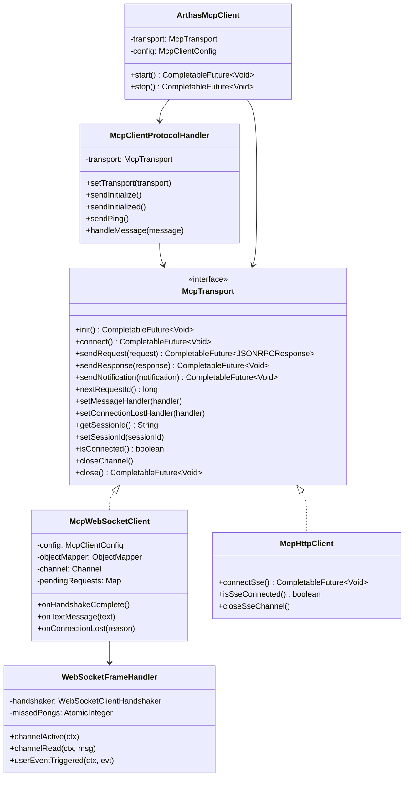

# Arthas MCP Client — WebSocket 传输层改造文档

## 1. 改造背景

原有 Arthas MCP Client 采用 **HTTP/SSE 双通道模式** 与管控平台通信：

- **SSE 通道**（Server→Client）：接收管控平台下发的工具调用请求
- **HTTP POST 通道**（Client→Server）：发送 JSON-RPC 请求/响应/通知

该模式存在以下问题：

| 问题 | 说明 |
|------|------|
| 频繁建连开销 | 每次发送 HTTP POST 都需要新建 TCP 连接（或依赖连接池） |
| 双通道复杂度 | 需要维护 SSE + HTTP 两条通道的生命周期和状态同步 |
| SSE 单向限制 | SSE 只支持服务端推送，客户端发送仍需走 HTTP，天然不对称 |
| 资源浪费 | 每条 HTTP POST 都需要完整的 HTTP 头部，传输冗余大 |

## 2. 改造目标

- 引入 **WebSocket 单通道双向复用**，替代 HTTP/SSE 双通道
- **保持 MCP 协议层不变**（JSON-RPC 消息格式、initialize/tools_call 等流程完全复用）
- **保留 HTTP/SSE 模式**作为降级选项，通过配置灵活切换
- 最小化对现有代码的修改，新增代码放入独立的 `ws` 包

## 3. 架构概览

### 3.1 分层架构

```
┌─────────────────────────────────────────────────┐
│              ArthasMcpClient（客户端主类）          │
│   状态管理 / 重连调度 / 心跳编排 / 生命周期        │
├─────────────────────────────────────────────────┤
│         McpClientProtocolHandler（协议层）         │
│  initialize / tools_list / tools_call / ping     │
│  ─── 依赖 McpTransport 接口 ───                  │
├──────────────────────┬──────────────────────────┤
│  McpWebSocketClient  │     McpHttpClient        │
│  (ws 包, 新增)        │     (现有, 适配接口)      │
│  WebSocket 全双工     │     HTTP POST + SSE      │
├──────────────────────┴──────────────────────────┤
│                  Netty (网络层)                    │
└─────────────────────────────────────────────────┘
```

### 3.2 类关系图



## 4. 文件变更清单

### 4.1 新增文件

| 文件 | 包 | 说明 |
|------|-----|------|
| `McpTransport.java` | `protocol.client` | 传输层抽象接口，定义 12 个公共方法 |
| `McpWebSocketClient.java` | `protocol.client.ws` | WebSocket 传输层核心实现（454 行） |
| `WebSocketFrameHandler.java` | `protocol.client.ws` | Netty ChannelHandler，处理握手和帧分发（171 行） |
| `mcp_ws_server.py` | 项目根目录 | Python WebSocket 调试服务端脚本 |

### 4.2 修改文件

| 文件 | 改动摘要 |
|------|----------|
| `McpHttpClient.java` | 添加 `implements McpTransport`，新增 `connect()` / `isConnected()` / `closeChannel()` 三个接口映射方法，原有逻辑零修改 |
| `McpClientProtocolHandler.java` | 字段类型从 `McpHttpClient` 改为 `McpTransport`，新增 `setTransport()` 方法，保留 `@Deprecated setHttpClient()` 做向后兼容 |
| `McpClientConfig.java` | 新增 `TransportType` 枚举（`WEBSOCKET` / `HTTP_SSE`），新增 `transportType` 字段（默认 `WEBSOCKET`），`validate()` 方法支持 `ws://` / `wss://` URL |
| `ArthasMcpClient.java` | 字段从 `McpHttpClient httpClient` 改为 `McpTransport transport`，`start()` 方法根据 `transportType` 创建不同的传输层实例 |
| `McpClientBootstrap.java` | 默认 URL 改为 `ws://`，新增传输类型自动推断和显式配置 |

## 5. 核心设计详解

### 5.1 McpTransport 接口

传输层的统一抽象，协议层和客户端层通过此接口与传输层交互：

```java
public interface McpTransport {
    // 生命周期
    CompletableFuture<Void> init();          // 初始化资源
    CompletableFuture<Void> connect();       // 建立连接
    void closeChannel();                     // 关闭当前通道（用于重连）
    CompletableFuture<Void> close();         // 销毁全部资源

    // 消息收发
    CompletableFuture<JSONRPCResponse> sendRequest(JSONRPCRequest request);
    CompletableFuture<Void> sendResponse(JSONRPCResponse response);
    CompletableFuture<Void> sendNotification(JSONRPCNotification notification);
    long nextRequestId();

    // 回调注册
    void setMessageHandler(Consumer<JSONRPCMessage> handler);
    void setConnectionLostHandler(Runnable handler);

    // 状态查询
    boolean isConnected();
    String getSessionId();
    void setSessionId(String sessionId);
}
```

### 5.2 Netty Pipeline 结构

WebSocket 模式下的 Netty Pipeline 如下：

```
┌─────────────┐
│  SslHandler  │  ← 仅 wss:// 时添加
├─────────────┤
│HttpClientCodec│  ← WebSocket 握手阶段的 HTTP 编解码
├─────────────┤
│HttpObject    │  ← 聚合 HTTP 分片响应（握手用）
│ Aggregator   │
├─────────────┤
│IdleState     │  ← 读空闲检测（2.5×心跳间隔）
│ Handler      │     触发 Ping/Pong 传输层保活
├─────────────┤
│WebSocket     │  ← 自定义 Handler
│ FrameHandler │     握手完成 / TextFrame / PongFrame / CloseFrame
└─────────────┘
```

**Pipeline 各组件职责：**

| Handler | 职责 | 握手后是否保留 |
|---------|------|--------------|
| `SslHandler` | TLS 加解密 | 是 |
| `HttpClientCodec` | HTTP 请求/响应编解码（握手需要） | 是（WebSocket Frame 仍经过它） |
| `HttpObjectAggregator` | 聚合完整 HTTP 响应 | 是 |
| `IdleStateHandler` | 读空闲超时检测 | 是 |
| `WebSocketFrameHandler` | 业务帧处理 + 握手完成回调 | 是 |

### 5.3 WebSocket 握手流程

```
Client                                     Server
  │                                          │
  │  ── TCP Connect ──────────────────────>  │
  │                                          │
  │  ── HTTP Upgrade (GET /mcp) ──────────>  │
  │     Upgrade: websocket                   │
  │     Connection: Upgrade                  │
  │     Sec-WebSocket-Key: xxx               │
  │     Authorization: Bearer <token>        │
  │     ?sessionId=<id>                      │
  │                                          │
  │  <── HTTP 101 Switching Protocols ─────  │
  │      Upgrade: websocket                  │
  │      Sec-WebSocket-Accept: yyy           │
  │                                          │
  │  ═══ WebSocket 全双工通道建立 ═══════════  │
  │                                          │
  │  ── {"jsonrpc":"2.0","method":           │
  │      "initialize",...} ────────────────> │
  │                                          │
  │  <── {"jsonrpc":"2.0","result":          │
  │      {"serverInfo":...}} ──────────────  │
```

### 5.4 消息收发流程

WebSocket 模式下所有 JSON-RPC 消息均通过 `TextWebSocketFrame` 承载：

**发送流程：**
```
McpClientProtocolHandler
    │ sendRequest / sendResponse / sendNotification
    ▼
McpTransport (McpWebSocketClient)
    │ writeMessage() → ObjectMapper.writeValueAsString()
    ▼
TextWebSocketFrame(json)
    │ channel.writeAndFlush()
    ▼
Netty Pipeline → 服务端
```

**接收流程：**
```
服务端 → Netty Pipeline
    │
    ▼
WebSocketFrameHandler.channelRead()
    │ TextWebSocketFrame → text
    ▼
McpWebSocketClient.onTextMessage(text)
    │ McpSchema.deserializeJsonRpcMessage()
    │
    ├── JSONRPCResponse → pendingRequests.get(id).complete(response)
    │                     （匹配 sendRequest 的 Future）
    │
    └── JSONRPCRequest / JSONRPCNotification
        │ messageHandler.accept(message)
        ▼
    McpClientProtocolHandler.handleMessage()
        │ tools/list → 返回工具列表
        │ tools/call → 执行工具
        │ ping       → 返回空结果
```

### 5.5 请求-响应匹配机制

`McpWebSocketClient` 内部维护 `pendingRequests` 映射表：

```java
Map<Object, CompletableFuture<JSONRPCResponse>> pendingRequests = new ConcurrentHashMap<>();
```

| 操作 | 时机 | 动作 |
|------|------|------|
| `put(id, future)` | `sendRequest()` 发送前 | 注册请求 ID 和对应的 Future |
| `remove(id)` + `complete()` | `onTextMessage()` 收到响应 | 匹配请求 ID，完成 Future |
| `remove(id)` + `completeExceptionally()` | 超时 | `eventLoopGroup.schedule()` 定时检查 |
| `forEach` + `completeExceptionally()` | `close()` | 关闭时取消所有 pending 请求 |

## 6. 心跳保活设计

WebSocket 模式采用 **双层心跳** 策略：

### 6.1 传输层心跳（WebSocket Ping/Pong）

由 `IdleStateHandler` + `WebSocketFrameHandler` 实现：

```
                    ┌─ IdleStateHandler ──────────────────┐
                    │  readerIdleTime = 2.5 × interval    │
                    │  (默认 75s)                          │
                    └─────────┬───────────────────────────┘
                              │ 读空闲触发
                              ▼
                    WebSocketFrameHandler.userEventTriggered()
                              │
                              ├── missedPongs++ ≤ 2 → 发送 PingFrame
                              │
                              └── missedPongs++ > 2 → 关闭连接，触发重连
                              
收到 PongFrame → missedPongs.set(0)  // 重置计数器
```

**关键参数：**
- 读空闲检测时间：`heartbeatInterval × 2.5 / 1000` 秒（默认 75 秒）
- 最大允许连续未收到 Pong 次数：`MAX_MISSED_PONGS = 2`
- 超过阈值后关闭连接并触发 `onConnectionLost()`

### 6.2 应用层心跳（MCP ping）

由 `HeartbeatManager` 驱动，通过 `McpClientProtocolHandler.sendPing()` 发送 JSON-RPC ping 请求，复用现有逻辑：

```json
{"jsonrpc": "2.0", "method": "ping", "id": 5}
```

两层心跳互补：
- **传输层 Ping/Pong**：检测 TCP 连接存活性，开销极低（2 字节 Frame）
- **应用层 MCP ping**：验证服务端 JSON-RPC 处理链路可用性

## 7. 配置说明

### 7.1 TransportType 枚举

```java
public enum TransportType {
    WEBSOCKET,   // WebSocket 双向全双工（默认）
    HTTP_SSE     // HTTP/SSE 双通道（向后兼容）
}
```

### 7.2 配置方式

**方式一：环境变量**

```bash
# WebSocket 模式（默认）
export ARTHAS_MCP_CLIENT_SERVER_URL=ws://localhost:8080/mcp
export ARTHAS_MCP_CLIENT_AUTH_TOKEN=your-token

# 显式指定传输类型
export ARTHAS_MCP_CLIENT_TRANSPORT_TYPE=WEBSOCKET

# 切换为 HTTP/SSE 模式
export ARTHAS_MCP_CLIENT_SERVER_URL=http://localhost:8080/mcp
export ARTHAS_MCP_CLIENT_TRANSPORT_TYPE=HTTP_SSE
```

**方式二：Builder API**

```java
// WebSocket 模式（默认）
ArthasMcpClient client = ArthasMcpClient.create("ws://localhost:8080/mcp")
    .authToken("your-token")
    .transportType(McpClientConfig.TransportType.WEBSOCKET)  // 可省略，默认即 WS
    .toolCallbackProvider(provider)
    .build();

// HTTP/SSE 模式
ArthasMcpClient client = ArthasMcpClient.create("http://localhost:8080/mcp")
    .authToken("your-token")
    .transportType(McpClientConfig.TransportType.HTTP_SSE)
    .toolCallbackProvider(provider)
    .build();
```

### 7.3 URL Scheme 自动推断

| URL Scheme | 自动推断的 TransportType | 说明 |
|------------|------------------------|------|
| `ws://` | `WEBSOCKET` | 直接使用 |
| `wss://` | `WEBSOCKET` | SSL WebSocket |
| `http://` | 取决于 `transportType` 配置 | 若为 `WEBSOCKET`，内部自动转换为 `ws://` |
| `https://` | 取决于 `transportType` 配置 | 若为 `WEBSOCKET`，内部自动转换为 `wss://` |

### 7.4 全部环境变量列表

| 环境变量 | 默认值 | 说明 |
|---------|--------|------|
| `ARTHAS_MCP_CLIENT_SERVER_URL` | — | 服务端地址 |
| `ARTHAS_MCP_CLIENT_AUTH_TOKEN` | — | 认证 Token |
| `ARTHAS_MCP_CLIENT_TRANSPORT_TYPE` | `WEBSOCKET` | 传输类型 |
| `ARTHAS_MCP_CLIENT_RECONNECT_ENABLED` | `true` | 启用自动重连 |
| `ARTHAS_MCP_CLIENT_RECONNECT_INITIAL_DELAY` | `5000` | 重连初始延迟(ms) |
| `ARTHAS_MCP_CLIENT_RECONNECT_MAX_DELAY` | `300000` | 重连最大延迟(ms) |
| `ARTHAS_MCP_CLIENT_RECONNECT_MULTIPLIER` | `2.0` | 重连延迟倍数 |
| `ARTHAS_MCP_CLIENT_HEARTBEAT_ENABLED` | `true` | 启用应用层心跳 |
| `ARTHAS_MCP_CLIENT_HEARTBEAT_INTERVAL` | `30000` | 心跳间隔(ms) |
| `ARTHAS_MCP_CLIENT_HEARTBEAT_TIMEOUT` | `10000` | 心跳超时(ms) |
| `ARTHAS_MCP_CLIENT_CONNECT_TIMEOUT` | `10000` | 连接超时(ms) |
| `ARTHAS_MCP_CLIENT_REQUEST_TIMEOUT` | `30000` | 请求超时(ms) |

## 8. 重连机制

重连策略在 WebSocket 和 HTTP/SSE 模式下完全一致，由 `ArthasMcpClient` + `ReconnectStrategy` 统一管理：

```
连接断开 → onConnectionLost()
    │
    ├── 传输层触发：WebSocketFrameHandler 检测到 channelInactive / CloseFrame / 心跳超时
    │                McpHttpClient 检测到 SSE Channel 断开
    │
    └── 应用层触发：HeartbeatManager 检测到 MCP ping 超时
    
    ▼
state = RECONNECTING
    │
    ▼
scheduleReconnect()
    │ delay = ReconnectStrategy.getNextDelay()  (指数退避)
    │
    ▼ (delay 毫秒后)
    │
    ├── transport.closeChannel()    // 关闭旧连接通道
    ├── protocolHandler.reset()     // 重置协议状态
    └── connect()                   // 重新建立连接 + initialize + heartbeat
        │
        ├── 成功 → state = CONNECTED, 重置退避
        └── 失败 → 再次 scheduleReconnect()
```

## 9. Python 调试服务端

提供 `mcp_ws_server.py` 用于本地开发调试，模拟管控平台的 WebSocket 端点：

```bash
# 安装依赖
pip install websockets

# 启动（默认端口 8080）
python mcp_ws_server.py

# 指定端口
python mcp_ws_server.py --port 9090
```

支持的功能：
- WebSocket 握手和连接管理
- MCP initialize / initialized 协议流程
- tools/list 请求（获取客户端工具列表）
- tools/call 请求（调用客户端工具）
- ping/pong 心跳
- 交互式命令行输入工具调用参数

## 10. 与 HTTP/SSE 模式的对比

| 维度 | HTTP/SSE 模式 | WebSocket 模式 |
|------|--------------|---------------|
| 连接数 | 2 条（SSE + HTTP） | 1 条 |
| 通信方向 | SSE 单向推送 + HTTP 请求 | 全双工 |
| 连接建立 | SSE 1 次 + 每次 HTTP 1 次 | 仅 1 次握手 |
| 每消息开销 | 完整 HTTP 头（~200-500 字节） | 2-10 字节帧头 |
| 传输层心跳 | 无（依赖 SSE 连接检测） | WebSocket Ping/Pong |
| 应用层心跳 | MCP ping（复用） | MCP ping（复用） |
| SSL 支持 | HTTPS | WSS |
| 降级兼容 | — | 保留 HTTP/SSE 作为降级选项 |

## 11. 向后兼容性

本次改造保证 **100% 向后兼容**：

1. **McpHttpClient**：仅添加 `implements McpTransport` 和三个接口映射方法，原有所有方法签名和逻辑不变
2. **McpClientProtocolHandler**：保留 `@Deprecated setHttpClient()` 方法，内部转发到 `setTransport()`
3. **McpClientConfig**：`transportType` 默认值为 `WEBSOCKET`，如需使用原有模式只需设置 `HTTP_SSE`
4. **McpClientBootstrap**：支持 URL scheme 自动推断，`http://` 开头自动使用 HTTP/SSE 模式
