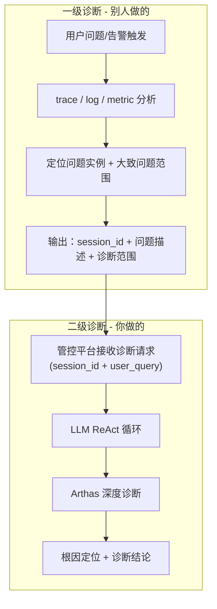

[任务规划完成]
完全合理，这个分层设计很清晰。让我帮你梳理一下：

---

## 两级诊断架构

### 这样分层的合理性

1. **职责边界清晰**：一级诊断解决"**哪里有问题**"（哪个服务、哪个实例），二级诊断解决"**问题的根因是什么**"（具体代码级别的定位）。这两个问题的工具集、分析方法完全不同。

2. **你的设计中 task 绑定单个 session_id 就说得通了**：因为到你这里的时候，一级诊断已经帮用户缩小了范围，给到你的就是一个明确的实例 + 问题描述。你不需要自己去做跨实例的服务拓扑分析。

3. **解释了 user_query 的来源**：你现在 `CreateDiagnosisRequest` 里的 `user_query` 实际上不是用户的原始自然语言问题，而是一级诊断输出的**结构化问题描述**（比如"该实例 GC 频繁，Full GC 耗时异常"），这让 LLM 的起点更精确，Token 消耗更少。

### 但有一点需要确认

> **一级诊断和你的二级诊断之间的接口协议是什么？**

当前你的入口只有 `session_id` + `user_query` 两个字段。但一级诊断既然已经做了 trace/log/metric 分析，它能给到的信息应该远不止一句话，比如：

| 一级诊断可输出的信息 | 对二级诊断的价值 |
|---|---|
| 问题类型（CPU/内存/延迟/死锁...） | 让 LLM 选择针对性的诊断策略，而不是盲目探索 |
| 相关方法/接口路径 | 让 Arthas 命令直接定向，减少搜索范围 |
| 时间窗口（问题发生时段） | trace/watch 可以限定时间范围 |
| 关联的上下游 session_id | 如果需要对比分析，可以关联查询 |

**建议**：你的 `CreateDiagnosisRequest` 可以预留一个 `diagnosis_context` 字段（dict 类型），让一级诊断传入这些结构化的上下文信息，你的 `ContextBuilder` 在构建 LLM prompt 时可以利用这些额外上下文，大幅提升诊断效率和准确率。不需要现在实现，但接口上预留会让后续对接更顺畅。

---

**总结**：两级分层完全合理，一级做广度（跨服务定位），二级做深度（单实例根因分析），你的管控平台定位为二级诊断引擎，task 绑单个 session 是正确的设计选择。只需要把一级→二级的接口协议设计好，让一级的分析成果能充分传递给二级利用即可。