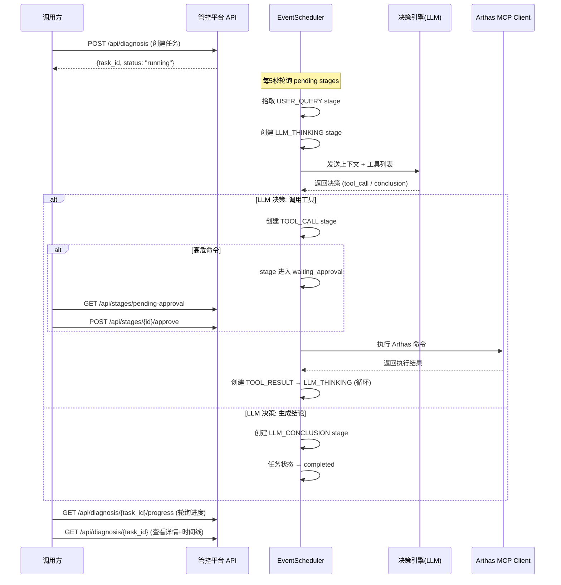

# Arthas 管控平台 API 接口文档

> **基础地址**: `http://{host}:{port}` （默认 `http://localhost:8080`）
> **版本**: v0.2.0
> **协议**: REST (JSON) + WebSocket
> **认证**: 如配置了 `CP_AUTH_TOKEN`，则 WebSocket 连接需在 Header 中携带 `Authorization: Bearer <token>`

---

## 一、接口总览

| 序号 | 方法 | 路径 | 分类 | 说明 |
|------|------|------|------|------|
| 1 | `WS` | `/mcp` | WebSocket | MCP 客户端反向连接端点 |
| 2 | `GET` | `/api/health` | 系统 | 健康检查 |
| 3 | `GET` | `/api/status` | 系统 | 平台运行状态 |
| 4 | `GET` | `/api/sessions` | 会话管理 | 获取活跃会话列表 |
| 5 | `POST` | `/api/diagnosis` | 诊断任务 | 创建诊断任务 |
| 6 | `GET` | `/api/diagnosis` | 诊断任务 | 查询诊断任务列表 |
| 7 | `GET` | `/api/diagnosis/{task_id}` | 诊断任务 | 查询任务详情（含 stage 时间线） |
| 8 | `GET` | `/api/diagnosis/{task_id}/progress` | 诊断任务 | 查询任务实时进度 |
| 9 | `GET` | `/api/diagnosis/{task_id}/conversation` | 诊断任务 | 查询完整对话文本 |
| 10 | `GET` | `/api/stages/pending-approval` | 审核管理 | 查询待审核阶段 |
| 11 | `POST` | `/api/stages/{stage_id}/approve` | 审核管理 | 审核通过 |
| 12 | `POST` | `/api/stages/{stage_id}/reject` | 审核管理 | 审核拒绝 |

---

## 二、枚举值说明

### TaskStatus（任务状态）

| 值 | 说明 |
|------|------|
| `running` | 运行中 |
| `completed` | 已完成 |
| `failed` | 已失败 |
| `cancelled` | 已取消 |

### StageType（阶段类型）

| 值 | 说明 |
|------|------|
| `USER_QUERY` | 用户提问（task 起点，stage_seq=1） |
| `LLM_THINKING` | LLM 推理（上下文发给 LLM，获取推理结果和 Action） |
| `TOOL_CALL` | 工具调用（向 Arthas 客户端发送命令执行） |
| `TOOL_RESULT` | 工具结果（接收 Arthas 执行结果） |
| `LLM_CONCLUSION` | LLM 结论（诊断结束，生成最终结论） |

### StageStatus（阶段状态）

| 值 | 说明 |
|------|------|
| `pending` | 待处理/可执行 |
| `waiting_approval` | 等待人工审核 |
| `completed` | 已完成（终态） |
| `failed` | 执行失败（终态） |

### ApprovalStatus（审核状态）

| 值 | 说明 |
|------|------|
| `not_required` | 无需审核 |
| `pending` | 待审核 |
| `approved` | 已通过 |
| `rejected` | 已拒绝 |

---

## 三、接口详情

---

### 1. WebSocket - MCP 客户端连接

**端点**: `ws://{host}:{port}/mcp`

**说明**: Arthas MCP Client 的反向 WebSocket 连接入口，用于客户端与管控平台之间的 MCP 协议通信。

**Query 参数**:

| 参数 | 类型 | 必填 | 说明 |
|------|------|------|------|
| `sessionId` | string | ✅ | Arthas 客户端会话 ID，也可通过 Header `mcp-session-id` 传递 |

**Headers**（启用认证时）:

| Header | 说明 |
|------|------|
| `Authorization` | `Bearer <token>`，需与服务端配置的 `CP_AUTH_TOKEN` 一致 |

**错误码**:

| Code | 说明 |
|------|------|
| `4000` | 缺少 sessionId |
| `4001` | 认证失败 |

**连接示例**:
```
ws://localhost:8080/mcp?sessionId=your-session-id
```

---

### 2. 健康检查

```
GET /api/health
```

**说明**: 健康检查端点，用于探活。

**响应示例**:
```json
{
  "status": "ok"
}
```

---

### 3. 获取平台状态

```
GET /api/status
```

**说明**: 返回管控平台的运行状态，包括会话数、执行池状态、锁状态、调度器状态等。

**响应示例**:
```json
{
  "status": "running",
  "sessions": {
    "total": 5,
    "active": 3
  },
  "pools": {
    "scheduled": {
      "running": 2,
      "max_concurrency": 10
    },
    "immediate": {
      "running": 0,
      "max_concurrency": 20
    }
  },
  "locks": {
    "total": 2,
    "held": 1
  },
  "event_scheduler": {
    "running": true
  },
  "database": {
    "url": "sqlite+aiosqlite:///diagnosis.db"
  }
}
```

---

### 4. 获取活跃会话列表

```
GET /api/sessions
```

**说明**: 返回所有活跃且已初始化的 Arthas 客户端会话信息。

**响应示例**:
```json
{
  "total": 2,
  "sessions": [
    {
      "session_id": "abc-123",
      "client_info": {"name": "arthas-mcp-client", "version": "1.0"},
      "connected_at": "2026-02-16T12:00:00",
      "initialized": true
    }
  ]
}
```

---

### 5. 创建诊断任务

```
POST /api/diagnosis
```

**说明**: 创建一个新的诊断任务。创建后会在数据库中写入 task + 初始 `USER_QUERY` stage（status=pending），EventScheduler 定时轮询将自动拾取并驱动诊断流程。

**请求体** (`CreateDiagnosisRequest`):

| 字段 | 类型 | 必填 | 说明 |
|------|------|------|------|
| `session_id` | string | ✅ | 目标 Arthas 客户端的 session ID |
| `user_query` | string | ✅ | 用户原始提问（最少 1 个字符） |
| `metadata` | object | ❌ | 附加元数据（如来源、优先级等） |

**请求示例**:
```json
{
  "session_id": "abc-123-def-456",
  "user_query": "我的 Java 应用 CPU 占用很高，帮我排查一下",
  "metadata": {
    "source": "web_ui",
    "priority": "high"
  }
}
```

**成功响应** (200):
```json
{
  "task_id": "f47ac10b-58cc-4372-a567-0e02b2c3d479",
  "session_id": "abc-123-def-456",
  "status": "running",
  "message": "诊断任务已创建，等待轮询处理"
}
```

**错误响应** (404):
```json
{
  "detail": "会话不存在或未初始化: abc-123-def-456"
}
```

---

### 6. 查询诊断任务列表

```
GET /api/diagnosis
```

**说明**: 查询诊断任务列表，支持多条件筛选和分页。

**Query 参数**:

| 参数 | 类型 | 必填 | 默认值 | 说明 |
|------|------|------|------|------|
| `session_id` | string | ❌ | - | 按 session_id 筛选 |
| `status` | string | ❌ | - | 按任务状态筛选（`running`/`completed`/`failed`/`cancelled`） |
| `start_time` | string | ❌ | - | 创建时间起始，ISO 8601 格式（如 `2026-02-16T00:00:00`） |
| `end_time` | string | ❌ | - | 创建时间截止，ISO 8601 格式 |
| `limit` | int | ❌ | 50 | 每页数量（范围 1-200） |
| `offset` | int | ❌ | 0 | 偏移量 |

**请求示例**:
```
GET /api/diagnosis?session_id=abc-123&status=running&limit=10&offset=0
```

**响应示例**:
```json
{
  "total": 2,
  "tasks": [
    {
      "task_id": "f47ac10b-58cc-4372-a567-0e02b2c3d479",
      "session_id": "abc-123",
      "user_query": "CPU 占用高排查",
      "status": "running",
      "current_stage_seq": 3,
      "created_at": "2026-02-16T14:30:00",
      "updated_at": "2026-02-16T14:31:20",
      "conclusion": null
    }
  ]
}
```

**响应字段说明** (`DiagnosisTaskSummarySchema`):

| 字段 | 类型 | 说明 |
|------|------|------|
| `task_id` | string | 任务唯一标识（UUID） |
| `session_id` | string | 关联的客户端会话 ID |
| `user_query` | string | 用户原始提问 |
| `status` | string | 任务状态 |
| `current_stage_seq` | int | 当前最新 stage 序号 |
| `created_at` | datetime | 创建时间 |
| `updated_at` | datetime | 最后更新时间 |
| `conclusion` | string \| null | 最终诊断结论（完成时有值） |

---

### 7. 查询诊断任务详情

```
GET /api/diagnosis/{task_id}
```

**说明**: 查询诊断任务详情，包含完整的 stage 时间线。stages 按 `stage_seq` 排序。

**路径参数**:

| 参数 | 类型 | 说明 |
|------|------|------|
| `task_id` | string | 任务 ID（UUID） |

**响应示例**:
```json
{
  "task": {
    "task_id": "f47ac10b-58cc-4372-a567-0e02b2c3d479",
    "session_id": "abc-123",
    "user_query": "CPU 占用高排查",
    "status": "running",
    "current_stage_seq": 3,
    "created_at": "2026-02-16T14:30:00",
    "updated_at": "2026-02-16T14:31:20",
    "conclusion": null
  },
  "stages": [
    {
      "id": 1,
      "task_id": "f47ac10b-...",
      "stage_seq": 1,
      "stage_type": "USER_QUERY",
      "status": "completed",
      "input_data": {"user_query": "CPU 占用高排查"},
      "output_data": null,
      "error_message": null,
      "retry_count": 0,
      "max_retries": 3,
      "tool_name": null,
      "tool_arguments": null,
      "tool_result": null,
      "approval_status": "not_required",
      "approved_by": null,
      "approved_at": null,
      "created_at": "2026-02-16T14:30:00",
      "updated_at": "2026-02-16T14:30:01"
    }
  ],
  "timeline": [
    {
      "stage_seq": 1,
      "stage_type": "USER_QUERY",
      "status": "completed",
      "created_at": "2026-02-16T14:30:00",
      "updated_at": "2026-02-16T14:30:01",
      "display": {
        "icon": "💬",
        "title": "用户提问",
        "content": "CPU 占用高排查"
      }
    },
    {
      "stage_seq": 2,
      "stage_type": "LLM_THINKING",
      "status": "completed",
      "created_at": "2026-02-16T14:30:01",
      "updated_at": "2026-02-16T14:30:05",
      "display": {
        "icon": "🤔",
        "title": "AI 推理",
        "thinking": "用户反馈CPU使用率高，我需要先查看线程状态...",
        "action_type": "tool_call",
        "tool_name": "thread"
      }
    },
    {
      "stage_seq": 3,
      "stage_type": "TOOL_CALL",
      "status": "completed",
      "created_at": "2026-02-16T14:30:05",
      "updated_at": "2026-02-16T14:30:08",
      "display": {
        "icon": "🔧",
        "title": "执行命令: thread",
        "tool_name": "thread",
        "tool_arguments": {"action": "thread", "args": "-n 3"},
        "approval_status": "not_required",
        "approved_by": null
      }
    }
  ]
}
```

**`stages` 字段说明** (`DiagnosisStageSchema`):

| 字段 | 类型 | 说明 |
|------|------|------|
| `id` | int | 数据库自增主键 |
| `task_id` | string | 所属任务 ID |
| `stage_seq` | int | 阶段序号（同一 task 下从 1 递增） |
| `stage_type` | string | 阶段类型（见枚举 StageType） |
| `status` | string | 阶段状态（见枚举 StageStatus） |
| `input_data` | object \| null | 阶段输入数据 |
| `output_data` | object \| null | 阶段输出数据 |
| `error_message` | string \| null | 失败时的错误信息 |
| `retry_count` | int | 已重试次数 |
| `max_retries` | int | 最大重试次数（默认 3） |
| `tool_name` | string \| null | 工具/命令名称（仅 TOOL_CALL 类型） |
| `tool_arguments` | object \| null | 工具调用参数（仅 TOOL_CALL 类型） |
| `tool_result` | string \| null | 工具执行结果原文（仅 TOOL_CALL 类型） |
| `approval_status` | string \| null | 审核状态（见枚举 ApprovalStatus） |
| `approved_by` | string \| null | 审核人 |
| `approved_at` | datetime \| null | 审核时间 |
| `created_at` | datetime | 创建时间 |
| `updated_at` | datetime | 最后更新时间 |

**`timeline` 各类型 display 格式**:

| stage_type | display 字段 |
|------|------|
| `USER_QUERY` | `icon`, `title`, `content` |
| `LLM_THINKING` | `icon`, `title`, `thinking`, `action_type`, `tool_name` |
| `TOOL_CALL` | `icon`, `title`, `tool_name`, `tool_arguments`, `approval_status`, `approved_by` |
| `TOOL_RESULT` | `icon`, `title`, `tool_name`, `content` |
| `LLM_CONCLUSION` | `icon`, `title`, `conclusion`, `thinking` |

**错误响应** (404):
```json
{
  "detail": "任务不存在: {task_id}"
}
```

---

### 8. 查询诊断进度

```
GET /api/diagnosis/{task_id}/progress
```

**说明**: 查询诊断任务的实时进度，适合前端轮询展示进度条。

**路径参数**:

| 参数 | 类型 | 说明 |
|------|------|------|
| `task_id` | string | 任务 ID（UUID） |

**响应示例**:
```json
{
  "task_id": "f47ac10b-58cc-4372-a567-0e02b2c3d479",
  "status": "running",
  "total_stages": 5,
  "completed_stages": 3,
  "current_stage_seq": 4,
  "current_stage_type": "TOOL_CALL",
  "current_stage_status": "pending"
}
```

**响应字段说明** (`DiagnosisProgressSchema`):

| 字段 | 类型 | 说明 |
|------|------|------|
| `task_id` | string | 任务 ID |
| `status` | string | 任务整体状态 |
| `total_stages` | int | 总阶段数 |
| `completed_stages` | int | 已完成阶段数 |
| `current_stage_seq` | int | 当前最新 stage 序号 |
| `current_stage_type` | string \| null | 当前 stage 类型 |
| `current_stage_status` | string \| null | 当前 stage 状态 |

**错误响应** (404):
```json
{
  "detail": "任务不存在: {task_id}"
}
```

---

### 9. 查询诊断完整对话文本

```
GET /api/diagnosis/{task_id}/conversation
```

**说明**: 返回该诊断任务从系统提示词、用户提问到最终结论的完整对话文本。

复现实际发送给 LLM 的完整 OpenAI messages，渲染为人类可读的纯文本格式。不依赖 Prompt 日志开关，随时可用。

**路径参数**:

| 参数 | 类型 | 说明 |
|------|------|------|
| `task_id` | string | 任务 ID（UUID） |

**响应示例**:
```json
{
  "task_id": "f47ac10b-58cc-4372-a567-0e02b2c3d479",
  "status": "completed",
  "session_id": "test",
  "user_query": "CPU 占用高排查",
  "conversation_text": "诊断任务: f47ac10b-...\n会话: test\n状态: completed\n用户问题: CPU 占用高排查\n==================================================\n\n[SYSTEM]\n你是 Arthas 智能诊断助手...\n\n[USER]\nCPU 占用高排查\n\n[ASSISTANT]\n为了排查 CPU 占用高...\n  → 调用工具: thread\n    参数: {\"topN\": 5}\n\n[TOOL 返回结果: thread]\n{\"command\":\"thread -n 5\", ...}\n\n[ASSISTANT]\n## 诊断结论\n..."
}
```

**响应字段说明**:

| 字段 | 类型 | 说明 |
|------|------|------|
| `task_id` | string | 任务 ID |
| `status` | string | 任务状态 |
| `session_id` | string | 会话 ID |
| `user_query` | string | 用户原始问题 |
| `conversation_text` | string | 完整对话文本（人类可读格式） |

**对话文本格式说明**:

文本中的每条消息以 `[ROLE]` 标记区分：
- `[SYSTEM]`: 系统提示词（含完整工具列表描述）
- `[USER]`: 用户提问
- `[ASSISTANT]`: LLM 推理/结论（如有工具调用会显示 `→ 调用工具: xxx`）
- `[TOOL 返回结果: xxx]`: 工具执行结果

**错误响应** (404):
```json
{
  "detail": "任务不存在: {task_id}"
}
```

---

### 10. 查询待审核阶段

```
GET /api/stages/pending-approval
```

**说明**: 查询所有 `status = waiting_approval` 的阶段，用于人工审核管理界面。当诊断过程中遇到高危命令（如 `heapdump`、`redefine`、`shutdown` 等）时，stage 会进入此状态等待审核。

**响应示例**:
```json
{
  "total": 1,
  "stages": [
    {
      "id": 15,
      "task_id": "f47ac10b-...",
      "stage_seq": 5,
      "stage_type": "TOOL_CALL",
      "status": "waiting_approval",
      "tool_name": "heapdump",
      "tool_arguments": {"action": "heapdump", "args": "/tmp/dump.hprof"},
      "approval_status": "pending",
      "created_at": "2026-02-16T14:35:00",
      "updated_at": "2026-02-16T14:35:00"
    }
  ]
}
```

---

### 11. 审核通过

```
POST /api/stages/{stage_id}/approve
```

**说明**: 审核通过指定的 stage。将 `approval_status` 设为 `approved`，`status` 改回 `pending`，下次轮询将自动拾取继续执行该命令。

**路径参数**:

| 参数 | 类型 | 说明 |
|------|------|------|
| `stage_id` | int | Stage 数据库 ID |

**请求体** (`ApprovalRequest`，可选):

| 字段 | 类型 | 必填 | 默认值 | 说明 |
|------|------|------|------|------|
| `approved_by` | string | ❌ | `"admin"` | 审核人标识 |

**请求示例**:
```json
{
  "approved_by": "zhangsan"
}
```

**成功响应** (200):
```json
{
  "stage_id": 15,
  "status": "approved",
  "message": "审核通过，将在下次轮询时继续执行"
}
```

**错误响应** (400):
```json
{
  "detail": "Stage 状态不是 waiting_approval，当前状态: completed"
}
```

**错误响应** (404):
```json
{
  "detail": "Stage 不存在: 999"
}
```

---

### 12. 审核拒绝

```
POST /api/stages/{stage_id}/reject
```

**说明**: 审核拒绝指定的 stage。将当前 stage 标记为 `failed`，并自动创建新的 `LLM_THINKING` stage，让 LLM 知道命令被拒绝并重新决策。

**路径参数**:

| 参数 | 类型 | 说明 |
|------|------|------|
| `stage_id` | int | Stage 数据库 ID |

**请求体** (`ApprovalRequest`，可选):

| 字段 | 类型 | 必填 | 默认值 | 说明 |
|------|------|------|------|------|
| `approved_by` | string | ❌ | `"admin"` | 拒绝人标识 |

**请求示例**:
```json
{
  "approved_by": "zhangsan"
}
```

**成功响应** (200):
```json
{
  "stage_id": 15,
  "status": "rejected",
  "next_stage_id": 16,
  "message": "审核拒绝，已创建新的 LLM_THINKING stage 进行重新决策"
}
```

**错误响应** (400 / 404): 同审核通过接口。

---

## 四、需要审核的高危命令

以下 Arthas 命令在诊断过程中会自动触发人工审核流程（可通过 `CP_COMMANDS_REQUIRING_APPROVAL` 环境变量配置）：

| 命令 | 说明 |
|------|------|
| `heapdump` | 堆内存快照 |
| `redefine` | 类重定义 |
| `retransform` | 类重转换 |
| `reset` | 重置增强类 |
| `stop` | 停止 Arthas |
| `shutdown` | 关闭目标 JVM |

---

## 五、诊断流程时序



---

## 六、环境变量配置参考

所有配置项均支持通过环境变量设置，前缀为 `CP_`：

| 环境变量 | 默认值 | 说明 |
|------|------|------|
| `CP_PORT` | `8080` | 服务监听端口 |
| `CP_HOST` | `0.0.0.0` | 服务监听地址 |
| `CP_AUTH_TOKEN` | `""` | Bearer Token 认证密钥，为空则不启用 |
| `CP_EVENT_POLL_INTERVAL` | `5.0` | 事件轮询间隔（秒） |
| `CP_LLM_ENGINE` | `mock` | 决策引擎类型：`mock` / `openai` |
| `CP_LLM_API_KEY` | `""` | LLM API 密钥 |
| `CP_LLM_BASE_URL` | `https://api.lkeap.cloud.tencent.com/v1` | LLM API 基础 URL |
| `CP_LLM_MODEL` | `deepseek-v3-0324` | LLM 模型名称 |
| `CP_LLM_MAX_TOKENS` | `4096` | LLM 最大生成 token 数 |
| `CP_LLM_TEMPERATURE` | `0.1` | LLM 采样温度 |
| `CP_DB_URL` | `sqlite+aiosqlite:///diagnosis.db` | 数据库连接 URL |
| `CP_DEFAULT_TOOL_TIMEOUT` | `30.0` | 工具调用超时（秒） |
| `CP_TOOL_CALL_COOLDOWN` | `30.0` | TOOL_CALL 冷却时间（秒），冷却期间不重复发送 |
| `CP_COMMANDS_REQUIRING_APPROVAL` | `["heapdump","redefine","retransform","reset","stop","shutdown"]` | 需审核的高危命令列表 |
| `CP_DEBUG` | `false` | 是否启用调试模式 |
| `CP_ENABLE_PROMPT_LOGGING` | `false` | 是否启用 LLM Prompt 日志记录到数据库 |


[任务规划完成]
根据 API 文档，以下是各接口对应的 `curl` 请求示例：

---

## 1. WebSocket - MCP 客户端连接

> WebSocket 无法直接用 curl 连接，可用 `websocat` 或 `wscat` 工具：

```bash
# 使用 websocat
websocat "ws://localhost:8080/mcp?sessionId=your-session-id"

# 使用 wscat
wscat -c "ws://localhost:8080/mcp?sessionId=your-session-id"

# 如果启用了认证
wscat -c "ws://localhost:8080/mcp?sessionId=your-session-id" -H "Authorization: Bearer your-token"
```

---

## 2. 健康检查

```bash
curl -X GET http://localhost:8080/api/health
```

---

## 3. 获取平台状态

```bash
curl -X GET http://localhost:8080/api/status
```

---

## 4. 获取活跃会话列表

```bash
curl -X GET http://localhost:8080/api/sessions
```

---

## 5. 创建诊断任务

```bash
curl -X POST http://localhost:8080/api/diagnosis \
  -H "Content-Type: application/json" \
  -d '{
    "session_id": "abc-123-def-456",
    "user_query": "我的 Java 应用 CPU 占用很高，帮我排查一下",
    "metadata": {
      "source": "web_ui",
      "priority": "high"
    }
  }'
```

不带 metadata 的精简版：

```bash
curl -X POST http://localhost:8080/api/diagnosis \
  -H "Content-Type: application/json" \
  -d '{"session_id": "abc-123-def-456", "user_query": "CPU 占用高排查"}'
```

---

## 6. 查询诊断任务列表

```bash
# 查询所有任务（默认分页）
curl -X GET "http://localhost:8080/api/diagnosis"

# 按 session_id 和状态筛选
curl -X GET "http://localhost:8080/api/diagnosis?session_id=abc-123&status=running&limit=10&offset=0"

# 按时间范围筛选
curl -X GET "http://localhost:8080/api/diagnosis?start_time=2026-02-16T00:00:00&end_time=2026-02-17T23:59:59"
```

---

## 7. 查询诊断任务详情

```bash
curl -X GET http://localhost:8080/api/diagnosis/f47ac10b-58cc-4372-a567-0e02b2c3d479
```

---

## 8. 查询诊断进度

```bash
curl -X GET http://localhost:8080/api/diagnosis/f47ac10b-58cc-4372-a567-0e02b2c3d479/progress
```

---

## 9. 查询诊断完整对话文本

```bash
curl -X GET http://localhost:8080/api/diagnosis/f47ac10b-58cc-4372-a567-0e02b2c3d479/conversation
```

查看格式化输出（只看 conversation_text 字段）：

```bash
curl -s http://localhost:8080/api/diagnosis/f47ac10b-58cc-4372-a567-0e02b2c3d479/conversation \
  | python3 -c "import sys,json; print(json.load(sys.stdin)['conversation_text'])"
```

---

## 10. 查询待审核阶段

```bash
curl -X GET http://localhost:8080/api/stages/pending-approval
```

---

## 10. 审核通过

```bash
curl -X POST http://localhost:8080/api/stages/15/approve \
  -H "Content-Type: application/json" \
  -d '{"approved_by": "zhangsan"}'
```

使用默认审核人（admin）：

```bash
curl -X POST http://localhost:8080/api/stages/15/approve \
  -H "Content-Type: application/json" \
  -d '{}'
```

---

## 11. 审核拒绝

```bash
curl -X POST http://localhost:8080/api/stages/15/reject \
  -H "Content-Type: application/json" \
  -d '{"approved_by": "zhangsan"}'
```

使用默认审核人（admin）：

```bash
curl -X POST http://localhost:8080/api/stages/15/reject \
  -H "Content-Type: application/json" \
  -d '{}'
```

---

## 快速测试脚本（一键测试完整流程）

```bash
#!/bin/bash
BASE_URL="http://localhost:8080"

echo "=== 1. 健康检查 ==="
curl -s $BASE_URL/api/health | python3 -m json.tool

echo -e "\n=== 2. 平台状态 ==="
curl -s $BASE_URL/api/status | python3 -m json.tool

echo -e "\n=== 3. 活跃会话 ==="
curl -s $BASE_URL/api/sessions | python3 -m json.tool

echo -e "\n=== 4. 创建诊断任务 ==="
# 请替换为实际的 session_id
RESULT=$(curl -s -X POST $BASE_URL/api/diagnosis \
  -H "Content-Type: application/json" \
  -d '{"session_id": "your-session-id", "user_query": "CPU 占用高排查"}')
echo $RESULT | python3 -m json.tool
TASK_ID=$(echo $RESULT | python3 -c "import sys,json; print(json.load(sys.stdin)['task_id'])" 2>/dev/null)

if [ -n "$TASK_ID" ]; then
  echo -e "\n=== 5. 查询任务详情 ==="
  curl -s $BASE_URL/api/diagnosis/$TASK_ID | python3 -m json.tool

  echo -e "\n=== 6. 查询任务进度 ==="
  curl -s $BASE_URL/api/diagnosis/$TASK_ID/progress | python3 -m json.tool
fi

echo -e "\n=== 7. 查询待审核阶段 ==="
curl -s $BASE_URL/api/stages/pending-approval | python3 -m json.tool
```

> **使用提示**：
> - 将 `localhost:8080` 替换为你的实际服务地址
> - 创建诊断任务时，`session_id` 需要替换为 `/api/sessions` 返回的实际活跃会话 ID
> - 审核接口中的 `stage_id`（如 `15`）需替换为 `/api/stages/pending-approval` 返回的实际 ID
> - `task_id` 需替换为创建任务后返回的实际 UUID