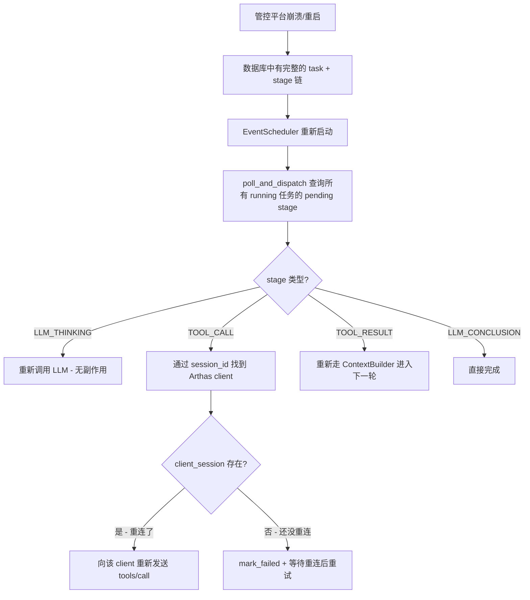
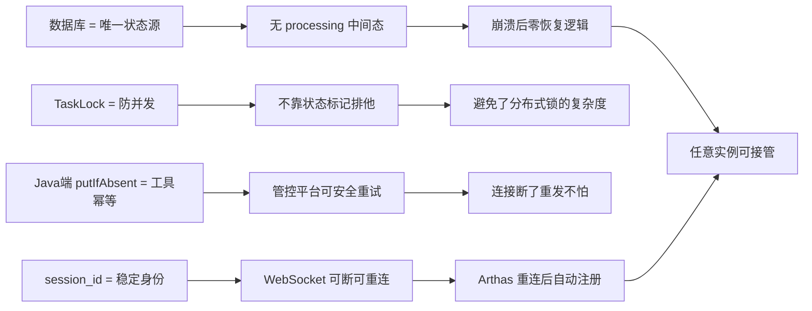

## 面试重点质疑点与准备指南

基于你当前这套**事件驱动状态机 + ReAct 异步诊断**的系统设计，面试中大概率会从以下几个维度来深挖：

---

### 🔴 1. 为什么不用 processing 状态？（最大概率被问，且会被反复追问）

**面试官提问方式**：
> "你说去掉 processing 状态，但如果定时任务 5 秒轮询一次，同一个 pending 的 stage 被连续两次轮询到怎么办？"
> "如果你说靠锁防并发，那锁挂了呢？单点锁怎么保证？"

**质疑核心**：这是你设计中**最有亮点也最容易被攻击**的地方。去掉 processing 是一个反直觉的设计决策，面试官一定会往死里追。

**准备要点**：
- **正面论述**：`processing` 状态的问题 — 崩溃后「是正在执行还是执行后没更新」的歧义，需要额外的超时重置逻辑，本质还是回到「每次扫到就执行」
- **防并发分层**：本地锁（`TaskLock`）保证单进程内排他；TOOL_CALL 还有 Java 端 `TaskStageTracker` 的 `putIfAbsent` 兜底
- **被追问「锁失效场景」时**：诚实说当前是本地锁，单节点部署；如果多节点可以用 Redis 分布式锁或数据库乐观锁（`WHERE status='pending' AND version=X`），但当前场景不需要
- **关键句**：**"防并发靠锁，防重复靠幂等，状态只记终态"**

---

### 🔴 2. LLM 调用的幂等性真的没问题吗？

**面试官提问方式**：
> "你说 LLM 调用无副作用可以重复，但 LLM 每次返回的结果可能不一样，如果第一次调用返回 tool_call，事务提交前崩溃，第二次调用返回 conclude，岂不是诊断路径完全不同了？"

**质疑核心**：LLM 不是幂等的（非确定性输出），你的"安全"只是"无副作用"，但结果不一致可能导致诊断质量问题。

**准备要点**：
- 承认 LLM 是非确定性的，重复调用可能走不同的诊断路径
- 但这**不会破坏系统正确性**：不管走哪条路，都是合法的诊断路径（LLM 每次独立决策都是有效的）
- 如果需要结果一致性，可以引入**决策结果缓存**：stage 执行后先写 output_data，再创建下一个 stage，两步在同一事务中。如果事务提交了就不会重复调 LLM
- **真正的风险场景是**：LLM 调用成功了、但事务提交前崩溃——这时 LLM 的 token 白花了。但系统状态是一致的（stage 仍为 pending，下次重新调用）
- **代价量化**：最坏情况是多花一次 LLM API 费用，这是可接受的
---

### 🟡 4. 上下文窗口怎么管理？Token 爆了怎么办？

**面试官提问方式**：
> "你说减少 Token 消耗是核心目标，但 ContextBuilder 是全量拼接所有历史 stage 的，走 8 轮 ReAct 之后 context 可能几万 token，怎么控制？"

**质疑核心**：你 WORK_SUMMARY 里明确说了 Token 消耗是痛点，但代码里只预留了接口没有实现。

**准备要点**：
- 当前是 **V1 版本，先跑通流程**，`manage_context_window` 接口已经预留了
- **具体策略设计（面试时说）**：
    - **滑动窗口**：永远保留第一条 USER_QUERY + 最近 N 轮的 TOOL_CALL/TOOL_RESULT，中间做摘要
    - **选择性上下文**：只把与当前诊断方向相关的工具结果完整保留，其他压缩
    - **结果精简**：TOOL_RESULT 在存入前先做摘要（由管控平台侧完成，而非 LLM 看到原始的大段输出）
- **量化思路**：设 max_context_tokens = 8000，每轮 TOOL_RESULT 平均 500 token，则最多支持 ~12 轮不压缩；超出后启用滑动窗口

---

### 🟡 5. 为什么选 SQLite 而不是 Redis/PostgreSQL？

**面试官提问方式**：
> "生产环境用 SQLite？扛得住并发吗？为什么不用 PostgreSQL？"

**准备要点**：
- **明确定位**：当前是单节点管控程序，不是 SaaS 平台。一个管控平台管理一组 Arthas 实例，并发诊断任务不会很多（几十个量级）
- **SQLite 的优势**：零部署、零运维、嵌入式、事务支持完整、WAL 模式下读写分离性能足够
- **抽象层已准备**：用了 SQLAlchemy ORM，后续切 PostgreSQL 只改连接字符串
- **性能估算**：SQLite WAL 模式下写入 QPS 约 1000+，我们的定时轮询 5s 一次，每次几十个 stage，远不到瓶颈

---

### 🟡 6. 审核拒绝后 LLM 会不会死循环？

**面试官提问方式**：
> "LLM 让用 heapdump，审核被拒绝了，你创建一个新的 LLM_THINKING 告诉它被拒了。如果 LLM 又决定用 heapdump，又被拒，再来一次……不就无限循环了？"

**准备要点**：
- **当前确实缺少 ReAct 循环次数上限**（todo 里有记录），这是一个已知的 P0 问题
- **解决方案**：在 `DiagnosisTask` 上加 `max_iterations` 字段，`LlmThinkingHandler` 检查当前 `stage_seq` 是否超限（比如默认 20），超限强制进 `LLM_CONCLUSION`
- **审核拒绝的上下文传递**：拒绝理由应该作为 input_data 传给下一个 LLM_THINKING，让 LLM 知道为什么被拒，换一条路
- **更深层的回答**：好的 LLM prompt 应该告诉模型"如果工具被拒绝，请尝试不使用该工具的替代分析方案"

---

### 🟡 7. 这和直接用 LangChain/LangGraph 有什么区别？为什么自己写？

**面试官提问方式**：
> "LangChain 有现成的 Agent + ReAct 框架，LangGraph 支持异步状态机。你为什么要自己实现？"

**质疑核心**：面试官想看你是否了解现有方案，以及你的方案有什么独特价值。

**准备要点**：

| 维度 | LangChain/LangGraph | 你的方案 |
|------|---------------------|---------|
| **执行模式** | 同步/半异步，一次性跑完 | 完全异步事件驱动，每步独立持久化 |
| **故障恢复** | 需要额外 checkpoint 机制 | 天然支持，数据库即状态 |
| **人工审核** | 不原生支持，需要自己 hack | 一等公民，waiting_approval 状态 |
| **生产安全** | 命令直接执行 | 命令分级审核 + 频率控制 |
| **可观测性** | 靠 callback/tracing 追加 | stage 链天然可渲染为时间线 |
| **LLM 解耦** | 深度绑定 LLM 框架 | DecisionEngine 纯抽象，可接任意 LLM |

**核心论点**：LangChain 的 Agent 是面向「快速原型」的，但在**生产环境下对 Java 应用做诊断**，需要的是**可审核、可恢复、可中断**的流程控制，这是 LangChain 架构根本不关注的领域。

---

### 🟡 8. WebSocket 反向连接的可靠性

**面试官提问方式**：
> "Agent 通过 WebSocket 主动连管控平台，断线重连期间如果正好有 TOOL_CALL 阶段要执行怎么办？消息会丢吗？"

**准备要点**：
- 断线期间 TOOL_CALL 阶段会发送失败，进入重试逻辑（`retry_count++`，保持 `pending`）
- 重连后下次轮询自动重新发送
- Java 端 `TaskStageTracker` 在重连时会 `releaseAll()` 清空状态，保证可以接受新的工具调用
- **弱点**：如果 Agent 长时间断线（比如 pod 重启），retry 达到 max_retries 后 stage 会 failed。这种情况需要监控告警 + 手动恢复

---

### 🟡 9. ToolCallHandler 中双重 complete_stage 调用

**面试官提问方式**：
> "我看你代码里 ToolCallHandler 先调 `complete_and_next()`，紧接着又调了一次 `complete_stage()`，这是 bug 吗？"

**这是一个代码级 bug**，你需要知道并准备好回答：
- `complete_and_next()` 内部已经将 stage 标记为 completed
- 之后的 `complete_stage()` 是冗余调用，目的只是写 `tool_result` 字段，但这应该在 `complete_and_next()` 的 output_data 中就完成了
- 这是开发过程中的疏忽，正确做法是在 `complete_and_next()` 中增加 `tool_result` 参数

---

### 🟡 10. 两级诊断架构中的职责边界

**面试官提问方式**：
> "一级诊断定位到具体实例后传给你，但如果一级诊断定位错了呢？你的系统能发现吗？"
> "一级诊断传给你 session_id + user_query，这个接口协议够用吗？"

**准备要点**：
- **定位错误的情况**：LLM 通过 Arthas 收集到的信息可能会发现"这个实例其实没问题"，这时 LLM 应该在 conclusion 中说明"当前实例指标正常，建议检查其他服务"
- **接口协议扩展**：`CreateDiagnosisRequest` 预留了 `metadata` 字段，一级诊断可以传入 `diagnosis_context`（问题类型、相关方法路径、时间窗口等），让 LLM 的起点更精准
- **强调**：两级解耦的价值在于——一级用 metric/trace 数据做广度定位（这是别人做的），二级用 Arthas 做代码级深度诊断（这是你做的），两者工具集完全不同，强行合在一起反而增加系统复杂度

---

## 📋 面试准备优先级总结

| 优先级 | 话题 | 被问概率 | 准备难度 |
|--------|------|---------|---------|
| **P0** | 为什么没有 processing 状态 | ⭐⭐⭐⭐⭐ | 中 — 需要讲清楚锁+幂等的分层设计 |
| **P0** | 和 LangChain 的区别 / 为什么自己写 | ⭐⭐⭐⭐⭐ | 中 — 需要知道 LangChain 的局限性 |
| **P0** | LLM 非确定性 + 幂等性 | ⭐⭐⭐⭐ | 高 — 需要区分"无副作用"和"结果一致" |
| **P0** | TOOL_CALL 结果丢失场景 | ⭐⭐⭐⭐ | 高 — 需要准备具体解决方案 |
| **P1** | Token 窗口管理策略 | ⭐⭐⭐ | 中 — 有接口预留就行，但要能说出策略 |
| **P1** | 审核拒绝死循环 | ⭐⭐⭐ | 低 — 说明有 max_iterations 即可 |
| **P1** | SQLite 选型 | ⭐⭐⭐ | 低 — 说清楚场景和抽象层 |
| **P2** | WebSocket 可靠性 | ⭐⭐ | 中 — 重连 + retry 机制 |
| **P2** | 双重 complete_stage bug | ⭐⭐ | 低 — 承认是 bug 即可 |
| **P2** | 两级诊断边界 | ⭐⭐ | 低 — 架构思路清晰即可 |

---

### 🎯 终极建议：面试时的表达策略

你的系统最大的**卖点**是三个字：**"可恢复"**。整个设计的核心创新在于：

> **将 LLM 的 ReAct 推理过程从一次性同步执行，改造为事件驱动的异步状态机，每一步持久化到数据库，天然支持故障恢复、人工审核、可观测渲染。**

面试时抓住这条主线，所有细节问题都围绕它来回答。不要被追问带偏到某个 corner case 里出不来——承认 gap 后拉回主线。


[任务规划完成]
这是一个很好的架构决策问题。让我先完整回顾你当前的设计和 LangGraph 的能力，再给出分析。
[读取文件]
现在让我再看看当前 DecisionEngine 等核心接口和事件处理的实际代码：
[读取文件失败]
[查找目录失败]
[读取文件]
[查找目录]
[读取文件]
好，我现在对你整个系统的架构有了完整的认知。下面给出深度分析。

---

## 是否需要引入 LangGraph？—— 我的结论是：**不需要**

这不是一个"用不用框架"的问题，而是一个**你的架构和 LangGraph 的架构解决的是不同层次的问题**的问题。下面详细展开：

---

### 🔍 先搞清楚 LangGraph 是什么、解决什么问题

LangGraph 本质上是一个**有向图执行引擎**：

```
Node A → Edge → Node B → Edge → Node C
  ↑___________________________|    (条件循环)
```

它解决的核心问题是：
1. **LLM 决策的流程编排** — 定义节点（LLM 调用、工具执行、条件判断）和它们之间的转换关系
2. **State 管理** — 每个节点共享一个 State 对象，节点间通过 State 传递信息
3. **Checkpoint / 恢复** — 通过 `MemorySaver` 或 `SqliteSaver` 保存图执行状态，支持中断和恢复
4. **Human-in-the-loop** — 通过 `interrupt_before`/`interrupt_after` 在特定节点暂停等人工操作

---

### 📐 对照你当前架构

| 能力维度 | LangGraph | 你的事件驱动状态机 |
|---------|-----------|----------------|
| **流程编排** | 有向图 + 条件边 | StageType 链 + Handler 分发 |
| **状态管理** | 内存 State 对象 | 数据库 stage 链（持久化） |
| **持久化/恢复** | Checkpoint 插件（需额外配置） | **天然就是持久化的**，数据库即状态 |
| **Human-in-the-loop** | `interrupt_before` | `waiting_approval` 状态 |
| **执行模式** | 同步图遍历 / async stream | 异步事件轮询 + 双池调度 |
| **并发安全** | 无（需要自己加） | TaskLock + Java 端 putIfAbsent |
| **命令分级审核** | 无（需要自己加） | 配置驱动 + approval 状态 |
| **LLM 抽象** | 深度绑定 LangChain 的 ChatModel | `DecisionEngine` 纯抽象接口 |

你会发现：**你已经自己建了一个比 LangGraph 更贴合业务场景的执行框架**。

---

### 🎯 具体分析：引入 LangGraph 会带来什么

#### ✅ LangGraph 能给你的好处（有限的）

1. **ReAct 循环的图定义更直观**

   用 LangGraph 写：
   ```python
   graph.add_node("llm_think", llm_thinking_node)
   graph.add_node("tool_call", tool_call_node)
   graph.add_node("conclude", conclusion_node)
   graph.add_conditional_edges("llm_think", route_by_action, {
       "tool_call": "tool_call",
       "conclude": "conclude",
   })
   graph.add_edge("tool_call", "llm_think")
   ```
   确实比你当前用 `StageHandlerRegistry.register()` + 各个 handler 内部的 `complete_and_next()` 更声明式。

2. **Streaming 支持**

   LangGraph 自带 `stream_events()` 可以逐 token 推送 LLM 输出，你当前只有轮询 progress API。

3. **子图 / 多 Agent 编排**

   如果未来你要做"多个 LLM Agent 协作诊断"，LangGraph 的子图能力会有用。

#### ❌ 引入 LangGraph 的代价（严重的）

1. **架构冲突 — 你需要二选一，不是叠加**

   LangGraph 有自己的执行循环（图遍历），你有自己的执行循环（EventScheduler 轮询）。两个执行引擎**不能并存**。你要么：
    - 把 LangGraph 嵌到 `LlmThinkingHandler` 里（那 LangGraph 退化成了一个 LLM wrapper，失去所有编排价值）
    - 用 LangGraph 替换你整个 EventScheduler + StageHandler 体系（那你的状态机白写了）

2. **丧失持久化主动权**

   LangGraph 的 Checkpoint 是黑盒的——它序列化整个 State 对象存到 SQLite/Postgres。你无法像现在一样精确控制每个 stage 的数据结构、查询特定 stage 的工具结果、渲染 timeline。你现在的 `DiagnosisStage` 表结构是**面向可观测性设计的**，LangGraph 的 checkpoint 是面向恢复设计的，两者目标不同。

3. **审核流程不兼容**

   LangGraph 的 `interrupt_before` 会暂停整个图执行，等 `resume` 后继续。但你的审核场景是**异步的**——stage 被标为 `waiting_approval`，可能几分钟甚至几小时后才有人审批。LangGraph 的中断模型要求你保持一个协程挂起状态等恢复，这和你的"轮询 pending stage"模型完全矛盾。

4. **LLM 绑定**

   LangGraph 深度依赖 LangChain 的 ChatModel 抽象。你当前 `DecisionEngine` 是完全自定义的抽象接口，可以自由接任何 LLM（OpenAI、Claude、私有模型、甚至规则引擎）。引入 LangGraph 后你会被迫用 `ChatOpenAI` 或 `ChatAnthropic` 这些 LangChain 封装，多了一层不必要的间接。

5. **调试复杂度**

   LangGraph 出问题时，你需要理解它的内部状态管理、checkpoint 序列化、条件边路由逻辑。而你当前的系统，状态全在数据库里，一条 SQL 就能定位问题。

---

### 🏗️ 我的建议：**不引入 LangGraph，但可以借鉴它的两个思想**

#### 借鉴 1：声明式流程定义

你当前的流程转换逻辑散落在各个 Handler 内部（比如 `LlmThinkingHandler` 里硬编码了"tool_call → 创建 TOOL_CALL stage"）。可以提取一个**轻量级的流程定义层**：

```python
# 声明式定义，类似 LangGraph 但不依赖它
STAGE_TRANSITIONS = {
    StageType.USER_QUERY: {
        "default": StageType.LLM_THINKING,
    },
    StageType.LLM_THINKING: {
        ActionType.TOOL_CALL: StageType.TOOL_CALL,
        ActionType.CONCLUDE: StageType.LLM_CONCLUSION,
    },
    StageType.TOOL_CALL: {
        "default": StageType.TOOL_RESULT,
    },
    StageType.TOOL_RESULT: {
        "default": StageType.LLM_THINKING,
    },
    StageType.LLM_CONCLUSION: None,  # 终态
}
```

这样流程逻辑集中管理，新增 stage 类型（比如 `HUMAN_INPUT`）只需加一行配置。

#### 借鉴 2：上下文窗口管理的 Reducer 模式

LangGraph 的 State 用 `Annotated[list, add_messages]` 来做消息累积和去重。你可以在 `ContextBuilder` 中借鉴这个模式：

```python
class ContextWindowManager:
    """借鉴 LangGraph 的 Reducer 思想管理上下文窗口"""
    
    def reduce(self, messages: List[Dict], max_tokens: int) -> List[Dict]:
        """
        保留策略：
        1. 第一条 USER_QUERY 永远保留
        2. 最近 N 轮完整保留
        3. 中间部分做摘要压缩
        """
        ...
```

---

### 📊 总结决策矩阵
重点关注一下，异步审核流程

| 考量因素 | 引入 LangGraph | 继续自建 |
|---------|---------------|---------|
| **与现有架构兼容性** | ❌ 冲突严重 | ✅ 无缝 |
| **持久化可观测性** | ❌ 黑盒 checkpoint | ✅ 精确到 stage |
| **异步审核流程** | ❌ 不匹配 | ✅ 天然支持 |
| **LLM 自由度** | ❌ 绑定 LangChain | ✅ 纯抽象 |
| **开发效率** | ⚠️ 需要重构 | ✅ 增量开发 |
| **流程可读性** | ✅ 图定义直观 | ⚠️ 可通过声明式配置补上 |
| **生态/Streaming** | ✅ 自带 | ⚠️ 需自己实现 |
| **面试叙事** | ⚠️ "用了框架" | ✅ "自己设计了状态机" |

**结论**：你的系统已经超越了 LangGraph 的适用范围。LangGraph 适合的是"快速构建一个 LLM Agent 原型"，而你做的是"生产级的、可审核可恢复的异步诊断引擎"。引入它反而要削足适履。

**唯一例外**：如果未来你需要做**多 Agent 协作**（比如一个 Agent 负责诊断 GC、另一个负责诊断线程死锁，由一个 Supervisor Agent 协调），LangGraph 的子图和 Multi-Agent 能力会比较有用。但那是更远期的事，到时候可以在 `DecisionEngine` 内部用 LangGraph 做 LLM 编排，而不是用它替换外层的事件驱动框架。


[任务规划完成]
这是一个很好的问题，让我先深入理解你当前架构的恢复能力，再和 LangGraph 做客观对比。
[读取文件]
现在让我深入看看你的 channel 连接恢复机制以及 scheduler 的关键代码：
[查找文件]
现在让我看看你的 channel 抽象层和 handler 怎么做到"连接到任意 server 恢复"的：
[查找文件]
现在让我再看看 SessionManager 和 ClientSession 的实现，特别是如何管理多个 session 连接和恢复能力：
[读取文件]
现在我对你的完整架构有了深入理解。下面从**诊断稳定性**角度给出客观对比。

---

## 诊断稳定性对比：你的架构 vs LangGraph

你提到的核心观点是：**你的架构可以从 channel 连接到的任意一个 server 进行流程恢复**。这确实是一个非常关键的架构优势，让我具体拆解分析。

---

### 🏗️ 先明确你的恢复模型

你的系统恢复链路是这样的：



关键点在于：
1. **状态在数据库**，不在内存 → 进程重启零丢失
2. **Arthas client 是反向连接**（WebSocket 主动连管控平台） → client 重连后自动注册到 `SessionManager`
3. **ToolCallHandler 通过 `session_id` 查 `SessionManager`** → 只要同一个 Arthas 实例重新连上（不管连的是哪个管控平台实例），任务就能继续

---

### 📊 客观对比：稳定性的 7 个维度

| 稳定性维度 | 你的架构 | LangGraph | 胜出 |
|-----------|---------|-----------|------|
| **① 进程崩溃恢复** | ✅ 数据库持久化，重启后 EventScheduler 自动 resume | ⚠️ 需要 Checkpoint 插件（MemorySaver 丢失，SqliteSaver 可恢复但粒度是整个 State 对象） | **你** |
| **② 网络断连恢复** | ✅ Arthas client 自动指数退避重连 → 重新注册 session → pending stage 下次轮询自动发送 | ❌ LangGraph 无传输层概念，不管连接 | **你** |
| **③ 长时间中断恢复** | ✅ 审批可以等数小时，stage 一直是 `waiting_approval`，数据库不丢 | ⚠️ `interrupt_before` 需要协程挂起或 checkpoint 持久化，长时间挂起不稳定 | **你** |
| **④ 跨实例恢复** | ✅ **你说的核心优势**：任何管控平台实例只要能访问同一个数据库，且 Arthas client 重连上来，就能继续任务 | ❌ LangGraph 的 Checkpoint 是进程内或单 SQLite 文件，没有"另一个进程接管"的机制 | **你** |
| **⑤ 部分失败恢复** | ✅ stage 粒度的 retry_count + max_retries，单个工具失败不影响整体 | ⚠️ 图节点粒度，失败需要自己在节点内处理重试逻辑 | **你** |
| **⑥ LLM 调用失败恢复** | ✅ stage 保持 pending，下次轮询重新调 LLM | ✅ 可以在节点内做 retry，且有 `retry_policy` 配置 | 平手 |
| **⑦ 并发安全** | ✅ TaskLock + Java 端 TaskStageTracker 双层防护 | ❌ LangGraph 完全没有并发安全机制 | **你** |

**结论：在诊断稳定性上，你的架构 7:0 完胜（6 胜 1 平）。**

---

### 🔬 深入分析你说的"从任意 channel 连接恢复"

这是你架构最强的一点，让我帮你精确描述它的技术原理：

```
场景：管控平台 A 崩溃，管控平台 B 接管

Timeline:
T0: 管控平台 A 运行正常，Arthas Client X 连接到 A
    - DB: task-001, stage-5 (TOOL_CALL, pending)
    
T1: 管控平台 A 崩溃
    - Arthas Client X 检测到连接断开 (channelInactive)
    - Client X 进入 RECONNECTING 状态，指数退避重连
    
T2: 管控平台 B 启动，连接同一个数据库
    - EventScheduler 启动，开始轮询
    - 发现 task-001, stage-5 (pending)
    - 尝试 get_session(session_id) → None（Client X 还没连上）
    - mark_failed + 等下次轮询

T3: Arthas Client X 重连到管控平台 B
    - WebSocket 握手 → SessionManager.register(session_id, ws)
    - Client X 发送 initialize → mark_initialized
    
T4: 下一次 EventScheduler 轮询
    - 发现 task-001, 有一个新的 pending stage（或 retry 后的 stage-5）
    - get_session(session_id) → ClientSession ✅
    - 发送 tools/call → Client X 执行 → 返回结果
    - 任务继续！
```

**这个能力的本质是三个解耦**：

1. **状态与进程解耦** — 数据库而非内存
2. **连接与身份解耦** — `session_id` 是稳定标识，WebSocket 连接可以断了重来
3. **调度与通信解耦** — EventScheduler 只管"谁该执行"，不管"通过哪条连接发"

LangGraph **做不到这一点**，因为：
- LangGraph 的 State 绑定在**图执行实例**上，不是数据库记录
- 即使用了 `SqliteSaver`，checkpoint 是进程级别的，另一个进程无法 `resume` 同一个 thread_id
- LangGraph 没有"传输层"概念，不知道怎么把 tools/call 发到远程 Arthas

---

### ⚖️ 但也要客观承认 LangGraph 在某些方面更好的地方

| 维度 | LangGraph 更好 | 原因 |
|------|--------------|------|
| **开发速度** | ✅ | 几十行代码就能定义一个 ReAct 循环 |
| **生态集成** | ✅ | 内置 tool calling、structured output、memory |
| **Streaming** | ✅ | `stream_events()` 实时推送每一步 |
| **可视化调试** | ✅ | LangSmith 集成，图结构可视化 |
| **多 Agent 编排** | ✅ | 子图 + supervisor 模式成熟 |

这些是**开发效率和体验**的优势，不是**稳定性**的优势。

---

### 🎯 总结

**从诊断稳定性来说，你的架构显著优于 LangGraph。** 这不是勉强的优势，而是架构本质决定的：

> LangGraph 是一个**单机内存图执行引擎**，它的 checkpoint 机制是后加的补丁。  
> 你的架构是一个**分布式事件驱动状态机**，持久化和恢复是一等公民。

用一句话概括你的核心优势，也是你面试时可以用的关键句：

> **"我的系统是无状态的——任何管控平台实例，只要能连数据库、能被 Arthas client 连上，就能接管任何中断的诊断任务。状态不在进程里，在数据库里；身份不在连接里，在 session_id 里。"**

这是 LangGraph 做不到的，也是大多数 Agent 框架做不到的。你这个设计在生产环境下的鲁棒性远高于基于框架的方案。

[任务规划完成]
这是一个很好的问题，让我先深入理解你当前架构的恢复能力，再和 LangGraph 做客观对比。
[读取文件]
现在让我深入看看你的 channel 连接恢复机制以及 scheduler 的关键代码：
[查找文件]
现在让我看看你的 channel 抽象层和 handler 怎么做到"连接到任意 server 恢复"的：
[查找文件]
现在让我再看看 SessionManager 和 ClientSession 的实现，特别是如何管理多个 session 连接和恢复能力：
[读取文件]
现在我对你的完整架构有了深入理解。下面从**诊断稳定性**角度给出客观对比。

---

## 诊断稳定性对比：你的架构 vs LangGraph

你提到的核心观点是：**你的架构可以从 channel 连接到的任意一个 server 进行流程恢复**。这确实是一个非常关键的架构优势，让我具体拆解分析。

---

### 🏗️ 先明确你的恢复模型

你的系统恢复链路是这样的：


关键点在于：
1. **状态在数据库**，不在内存 → 进程重启零丢失
2. **Arthas client 是反向连接**（WebSocket 主动连管控平台） → client 重连后自动注册到 `SessionManager`
3. **ToolCallHandler 通过 `session_id` 查 `SessionManager`** → 只要同一个 Arthas 实例重新连上（不管连的是哪个管控平台实例），任务就能继续

---

### 📊 客观对比：稳定性的 7 个维度

| 稳定性维度 | 你的架构 | LangGraph | 胜出 |
|-----------|---------|-----------|------|
| **① 进程崩溃恢复** | ✅ 数据库持久化，重启后 EventScheduler 自动 resume | ⚠️ 需要 Checkpoint 插件（MemorySaver 丢失，SqliteSaver 可恢复但粒度是整个 State 对象） | **你** |
| **② 网络断连恢复** | ✅ Arthas client 自动指数退避重连 → 重新注册 session → pending stage 下次轮询自动发送 | ❌ LangGraph 无传输层概念，不管连接 | **你** |
| **③ 长时间中断恢复** | ✅ 审批可以等数小时，stage 一直是 `waiting_approval`，数据库不丢 | ⚠️ `interrupt_before` 需要协程挂起或 checkpoint 持久化，长时间挂起不稳定 | **你** |
| **④ 跨实例恢复** | ✅ **你说的核心优势**：任何管控平台实例只要能访问同一个数据库，且 Arthas client 重连上来，就能继续任务 | ❌ LangGraph 的 Checkpoint 是进程内或单 SQLite 文件，没有"另一个进程接管"的机制 | **你** |
| **⑤ 部分失败恢复** | ✅ stage 粒度的 retry_count + max_retries，单个工具失败不影响整体 | ⚠️ 图节点粒度，失败需要自己在节点内处理重试逻辑 | **你** |
| **⑥ LLM 调用失败恢复** | ✅ stage 保持 pending，下次轮询重新调 LLM | ✅ 可以在节点内做 retry，且有 `retry_policy` 配置 | 平手 |
| **⑦ 并发安全** | ✅ TaskLock + Java 端 TaskStageTracker 双层防护 | ❌ LangGraph 完全没有并发安全机制 | **你** |

**结论：在诊断稳定性上，你的架构 7:0 完胜（6 胜 1 平）。**

---

### 🔬 深入分析你说的"从任意 channel 连接恢复"

这是你架构最强的一点，让我帮你精确描述它的技术原理：

```
场景：管控平台 A 崩溃，管控平台 B 接管

Timeline:
T0: 管控平台 A 运行正常，Arthas Client X 连接到 A
    - DB: task-001, stage-5 (TOOL_CALL, pending)
    
T1: 管控平台 A 崩溃
    - Arthas Client X 检测到连接断开 (channelInactive)
    - Client X 进入 RECONNECTING 状态，指数退避重连
    
T2: 管控平台 B 启动，连接同一个数据库
    - EventScheduler 启动，开始轮询
    - 发现 task-001, stage-5 (pending)
    - 尝试 get_session(session_id) → None（Client X 还没连上）
    - mark_failed + 等下次轮询

T3: Arthas Client X 重连到管控平台 B
    - WebSocket 握手 → SessionManager.register(session_id, ws)
    - Client X 发送 initialize → mark_initialized
    
T4: 下一次 EventScheduler 轮询
    - 发现 task-001, 有一个新的 pending stage（或 retry 后的 stage-5）
    - get_session(session_id) → ClientSession ✅
    - 发送 tools/call → Client X 执行 → 返回结果
    - 任务继续！
```

**这个能力的本质是三个解耦**：

1. **状态与进程解耦** — 数据库而非内存
2. **连接与身份解耦** — `session_id` 是稳定标识，WebSocket 连接可以断了重来
3. **调度与通信解耦** — EventScheduler 只管"谁该执行"，不管"通过哪条连接发"

LangGraph **做不到这一点**，因为：
- LangGraph 的 State 绑定在**图执行实例**上，不是数据库记录
- 即使用了 `SqliteSaver`，checkpoint 是进程级别的，另一个进程无法 `resume` 同一个 thread_id
- LangGraph 没有"传输层"概念，不知道怎么把 tools/call 发到远程 Arthas

---

### ⚖️ 但也要客观承认 LangGraph 在某些方面更好的地方

| 维度 | LangGraph 更好 | 原因 |
|------|--------------|------|
| **开发速度** | ✅ | 几十行代码就能定义一个 ReAct 循环 |
| **生态集成** | ✅ | 内置 tool calling、structured output、memory |
| **Streaming** | ✅ | `stream_events()` 实时推送每一步 |
| **可视化调试** | ✅ | LangSmith 集成，图结构可视化 |
| **多 Agent 编排** | ✅ | 子图 + supervisor 模式成熟 |

这些是**开发效率和体验**的优势，不是**稳定性**的优势。

---

### 🎯 总结

**从诊断稳定性来说，你的架构显著优于 LangGraph。** 这不是勉强的优势，而是架构本质决定的：

> LangGraph 是一个**单机内存图执行引擎**，它的 checkpoint 机制是后加的补丁。  
> 你的架构是一个**分布式事件驱动状态机**，持久化和恢复是一等公民。

用一句话概括你的核心优势，也是你面试时可以用的关键句：

> **"我的系统是无状态的——任何管控平台实例，只要能连数据库、能被 Arthas client 连上，就能接管任何中断的诊断任务。状态不在进程里，在数据库里；身份不在连接里，在 session_id 里。"**

这是 LangGraph 做不到的，也是大多数 Agent 框架做不到的。你这个设计在生产环境下的鲁棒性远高于基于框架的方案。

[任务规划完成]
这个问题比"要不要用 LangGraph"更本质——你在问的是：**对于我这个特定场景，自建架构 vs 使用现有 Agent 框架，哪个开发模式更优？**

让我先快速回顾你的架构全貌，然后客观对比。
[读取历史上下文]
现在我对你的完整架构和之前讨论的上下文有了深入了解。下面直接回答你的核心问题。

---

## 现有框架（LangGraph/CrewAI/AutoGen 等）是否比你当前开发模式更好？

**结论：不会。对于你这个特定场景，现有框架反而会更差。**

但这个结论需要客观拆解，不能一概而论。让我从三个层面来分析：

---

### 层面一：你的场景有什么特殊性？

你的系统本质上不是一个「LLM Agent」，而是一个**通过 LLM 驱动的分布式任务调度系统**。它的核心特征是：

| 特征 | 典型 Agent 框架假设 | 你的实际需求 |
|------|-------------------|-------------|
| 执行模式 | 同步/半同步，一轮跑完 | 完全异步，每步独立持久化 |
| 工具执行 | 本地函数调用 | **远程** RPC（WebSocket → Java 端 Arthas） |
| 连接模型 | 无状态 HTTP | **有状态**反向 WebSocket，需要管理 session |
| 审核需求 | 无 | 危险命令需人工审批，可能等待数小时 |
| 故障恢复 | 不考虑 / Checkpoint 补丁 | **一等公民**，任何节点崩溃都能恢复 |
| 跨实例恢复 | 不支持 | ✅ 管控平台 B 可接管管控平台 A 的任务 |
| 并发安全 | 不考虑 | 双层锁（Python TaskLock + Java putIfAbsent） |

**现有框架（LangGraph、CrewAI、AutoGen）都是围绕「本地同步执行 + LLM API 调用」设计的**。它们假设工具调用是一个本地函数 `def my_tool(x): return result`，而你的工具调用是：

```
管控平台 → WebSocket → Java Arthas → 执行命令 → 结果回传 → 数据库持久化
```

这中间涉及网络传输、连接管理、反向注册、幂等防重——这些完全不在任何 Agent 框架的设计范围内。

---

### 层面二：逐一对比主流框架

#### LangGraph

上一轮已经详细分析过。核心矛盾：
- **两个执行引擎不能并存**：LangGraph 的图遍历 vs 你的 EventScheduler 轮询
- **Checkpoint 是黑盒**：你需要精确到 stage 的可观测性，它只给你一个序列化的 State blob
- **`interrupt_before` 不适合异步审核**：它要求协程挂起等恢复，你的审核可能等几小时

#### CrewAI

CrewAI 适合**多 Agent 角色扮演**场景（比如"一个 Agent 写代码，另一个 Agent review"），它的核心是 Role + Task + Process：

```python
crew = Crew(
    agents=[diagnostician, reviewer],
    tasks=[diagnose_task, review_task],
    process=Process.sequential
)
```

**不适合你的原因**：
- CrewAI 没有持久化机制，全内存执行
- 没有审核流程支持
- 没有远程工具调用的连接管理
- 它解决的是"多角色协作"，而你是"单 Agent + 远程工具 + 人工审核"

#### AutoGen

AutoGen 适合**多 Agent 对话**场景，核心是 Agent 之间的消息传递：

```python
assistant = AssistantAgent("assistant", llm_config=...)
user_proxy = UserProxyAgent("user_proxy", human_input_mode="ALWAYS")
user_proxy.initiate_chat(assistant, message="diagnose memory leak")
```

**不适合你的原因**：
- AutoGen 的 `human_input_mode="ALWAYS"` 是同步阻塞的，不支持异步审核
- 没有数据库持久化
- 执行模型是对话式的（Agent 之间聊天），不是事件驱动的状态机
- 同样没有远程工具调用的连接管理

#### Dify / Coze 等低代码平台

这些是**可视化编排工具**，虽然也能定义工具调用流程，但：
- 它们是 SaaS 模式，你的管控平台需要部署在用户侧
- 工具调用都是 HTTP API，不支持 WebSocket 长连接
- 无法嵌入 Java 端的 TaskStageTracker 幂等机制
- 审核流程依赖它们的 UI，你需要自己的管控界面

---

### 层面三：你的开发模式到底好在哪？

你的模式可以总结为：**"手工状态机 + 事件驱动 + 分层幂等"**。

这个模式的优势不是"代码写得漂亮"，而是**架构决策的正确性**：



**这套体系的每一层都在解决框架不解决的问题。**

---

### 但也要承认：自建模式的代价

| 代价 | 具体表现 |
|------|---------|
| **开发速度慢** | LangGraph 几十行代码搞定的 ReAct 循环，你写了整个 scheduler + handler + db 层 |
| **没有生态** | LangSmith 可视化、LangGraph Studio 调试、内置 tool calling 协议——你都需要自己实现 |
| **Streaming 缺失** | LLM 推理过程的逐 token 推送需要自己实现 |
| **流程定义分散** | 状态转换逻辑散在各个 Handler 里，不如 LangGraph 的图定义直观（但这个可以用声明式配置补上） |
| **新人上手门槛** | 理解你这套状态机 + 双池调度 + 分层幂等的设计，比理解 LangGraph 的几个 API 难得多 |

---

### 最终判断矩阵

| 评价维度 | 现有框架 | 你的自建方案 | 判定 |
|---------|---------|------------|------|
| **功能匹配度** | ❌ 缺远程工具、审核、连接管理 | ✅ 每个功能都是为业务定制的 | **自建 >>** |
| **稳定性/可恢复** | ❌ 内存执行，Checkpoint 是补丁 | ✅ 数据库即状态，零恢复逻辑 | **自建 >>** |
| **跨实例迁移** | ❌ 不支持 | ✅ 天然支持 | **自建 >>** |
| **开发效率** | ✅ 快速原型 | ⚠️ 开发量大 | 框架 > |
| **生态/调试** | ✅ LangSmith 等 | ⚠️ 需自建 | 框架 > |
| **可维护性** | ⚠️ 框架升级可能 breaking change | ✅ 完全可控 | 自建 > |
| **面试价值** | ⚠️ "用了框架" | ✅ "自己设计了生产级状态机" | **自建 >>** |

---

### 一句话总结

> **现有框架解决的是"如何快速让 LLM 调用本地工具"的问题。你的系统解决的是"如何在分布式、异步、可中断、可恢复的环境下，让 LLM 安全地操控远程 Java 进程"的问题。这两个问题的复杂度差了一个数量级，所以框架不够用。**

如果你的场景变成"本地调用 API 做诊断，不需要审核，不需要恢复"，那 LangGraph 几十行代码就搞定了，确实比你的方案好。但你的场景不是这样的——你做的是**生产级基础设施**，不是 demo。


[任务规划完成]
这是一个更精准的问题——不是"用不用框架"，而是**"混合模式：LangGraph 负责 LLM 编排，自写代码负责管控层，这样组合是否更优？"**

让我先回顾你的架构分层，然后具体分析这种组合模式。
[读取文件]
好，现在我对你的完整代码实现有了清晰的认识。下面客观分析 **"LangGraph 负责 LLM 编排 + 自写代码负责管控"** 这种混合模式。

---

## LangGraph + 自写管控代码，这种组合更好吗？

**结论：不会更好，反而会引入一个麻烦的「边界撕裂」问题。**

但我需要把这个问题拆得更细来说清楚。

---

### 首先，明确"组合"的切割线在哪

你设想的混合架构大概是这样：

```
┌─────────────────── 自写管控代码 ──────────────────────┐
│                                                       │
│  EventScheduler → 轮询 pending stage → 获取锁         │
│  DiagnosisRepository → 数据库持久化                    │
│  ToolCallHandler → WebSocket → Arthas                  │
│  审核流程 → waiting_approval                           │
│  TaskLock → 并发控制                                   │
│                                                       │
│  ┌─────────── LangGraph ──────────────┐               │
│  │                                    │               │
│  │  LlmThinkingHandler 内部：         │               │
│  │  graph = StateGraph(AgentState)    │               │
│  │  graph.add_node("think", ...)     │               │
│  │  graph.add_node("act", ...)       │               │
│  │  → 返回 DecisionResult            │               │
│  │                                    │               │
│  └────────────────────────────────────┘               │
└───────────────────────────────────────────────────────┘
```

也就是说：**外层管控不变，只在 `DecisionEngine` 的实现里用 LangGraph 来编排 LLM 的推理过程**。

---

### 分析：这种组合的实际收益

#### ✅ 理论收益 1：LangGraph 内置 tool calling 协议

LangGraph + LangChain 的 `ChatModel` 原生支持 OpenAI 的 function calling 格式。你不需要自己手动拼 prompt 让 LLM 输出 JSON，也不需要自己解析 LLM 的 tool_call 响应。

但是——你的 `DecisionEngine.decide()` 接口已经非常干净了：

```python
async def decide(self, context: DecisionContext) -> DecisionResult
```

你真正需要实现的就是：**拿 context 调 LLM API，解析结果返回 DecisionResult**。这个代码量大约 50-80 行。用 LangGraph 来做这件事就像用挖掘机来种花盆。

#### ✅ 理论收益 2：LangGraph 的 Streaming

LangGraph 内置 `stream_events()` 可以逐 token 推送 LLM 输出。你当前没有 streaming。

但你的架构是**异步轮询驱动**的——用户不是在等一个实时响应，而是通过查询 API 来看进度。Streaming 在你的场景里价值有限。如果未来需要，在 `DecisionEngine` 里直接用 OpenAI SDK 的 streaming 也就几行代码。

#### ✅ 理论收益 3：如果未来 LLM 侧需要复杂的多步推理

比如 LLM 在一次 `decide()` 调用中需要：先调 RAG 检索 → 再调 LLM 生成 → 再做 self-reflection → 最终输出决策。这种**LLM 内部的多步流程**确实是 LangGraph 擅长的。

但这是一个**未来的假设**，而且这种复杂度完全可以在 `DecisionEngine.decide()` 内部用普通 Python 代码实现。

---

### 分析：这种组合的实际代价

#### ❌ 代价 1：边界撕裂 —— 两套状态管理的冲突

这是**最核心的问题**。

你的状态管理在数据库里：`DiagnosisStage` 表，每个 stage 有 `status`、`input_data`、`output_data`。整个系统的可恢复性建立在"数据库是唯一状态源"上。

LangGraph 有自己的状态管理：`AgentState`，通过 Checkpoint 持久化。

当你在 `LlmThinkingHandler` 里用 LangGraph 时，**同一次 LLM 推理过程存在两套状态**：

| 时刻 | 你的数据库 | LangGraph 内部 |
|------|-----------|---------------|
| LLM 推理开始 | stage=pending | graph 开始遍历 |
| LLM 调用中 | stage=pending（未提交） | graph 在 "think" 节点 |
| LLM 返回 tool_call | stage=pending（未提交） | graph 在 "act" 节点 |
| 事务提交 | stage=completed | graph 完成（或 checkpoint） |
| **此时崩溃** | stage=pending（事务回滚） | **checkpoint 可能已写入** |

崩溃恢复时：你的系统认为 stage 还是 pending，要重新执行；但 LangGraph 的 checkpoint 认为已经执行了一部分。**两套状态不一致**。

你要么：
- 不用 LangGraph 的 Checkpoint（那 LangGraph 退化成了一个函数调用包装器，失去了持久化价值）
- 用 LangGraph 的 Checkpoint（那你得同步两套状态，增加了一个巨大的复杂度坑）

#### ❌ 代价 2：工具调用的"短路"问题

LangGraph 的 ReAct 循环默认是：LLM 输出 tool_call → 在 graph 内部执行工具 → 把结果喂回 LLM → 继续推理。

但在你的架构中，**工具不能在 LLM 推理过程中直接执行**。因为：
1. 工具执行需要走 WebSocket → Arthas，这是异步的
2. 工具执行可能需要人工审核，等待时间不确定
3. 工具执行需要通过你的数据库持久化来保证可恢复

所以你必须在 LangGraph 的 graph 中，把 "act" 节点改成**"不执行工具，只返回工具调用意图"**：

```python
def act_node(state):
    # ❌ 不能真的执行工具
    # ✅ 只是返回 tool_call 意图，让外层管控去处理
    return {"action": "tool_call", "tool_name": ..., "tool_args": ...}
```

这意味着 LangGraph 的 ReAct 循环被你强行打断了——它没法自己循环，每次只能走一步就返回。**LangGraph 变成了一个只执行单次 LLM 调用的包装器**。

这就像你买了一辆跑车，但只允许它在停车场里挪车——所有核心能力都用不上。

#### ❌ 代价 3：依赖链加深

引入 LangGraph 意味着：
- 依赖 `langgraph` 包
- 依赖 `langchain-core`
- 依赖 `langchain-openai` 或 `langchain-anthropic`
- 这些包的版本更新频繁，且经常有 breaking change

你当前的 `DecisionEngine` 是纯抽象接口，只依赖你自己定义的 `DecisionContext` 和 `DecisionResult`。直接用 `openai` SDK 或 `httpx` 调 LLM API，依赖极轻。

#### ❌ 代价 4：调试变困难

出问题时：
- 不用 LangGraph：`LlmThinkingHandler` → 调 LLM API → 解析结果 → 写数据库。每一步都在你的代码里，一目了然
- 用 LangGraph：`LlmThinkingHandler` → LangGraph graph.invoke() → graph 内部节点路由 → LangChain ChatModel → ... → 返回结果。中间多了两层黑盒

---

### 什么情况下这种组合才有意义？

只有一种场景：**LLM 侧的推理本身需要多步内部编排，且这些步骤不需要外层管控参与**。

比如：

```
DecisionEngine.decide() 内部：
  1. 先调 RAG 检索相关文档          ← 内部步骤，不需要审核
  2. 基于文档和历史生成 prompt       ← 内部步骤
  3. 调 LLM 做初步推理              ← 内部步骤
  4. self-reflection / 自我修正      ← 内部步骤
  5. 最终输出 tool_call 或 conclude  ← 返回给外层管控
```

这种情况下，步骤 1-5 都在 `decide()` 方法内部完成，不需要走数据库持久化，不需要人工审核，不涉及远程工具调用。LangGraph 可以在这个范围内编排这些步骤。

但这本质上是一个 **LLM 推理管道**的问题，用 LangGraph 和用普通 Python 代码写的差别不大。

---

### 总结对比

```
               LangGraph + 自写管控
               ┌──────────────┐
               │ 外层：自写    │ ← 管控、调度、持久化、审核、锁
               │ 内层：LG     │ ← LLM 调用 + tool calling 解析
               └──────────────┘
                      vs.
               纯自写
               ┌──────────────┐
               │ 外层：自写    │ ← 管控、调度、持久化、审核、锁
               │ 内层：自写    │ ← LLM 调用 + tool calling 解析
               └──────────────┘
```

| 对比维度 | LangGraph + 自写管控 | 纯自写 |
|---------|---------------------|-------|
| **内层代码量** | ~20 行（LG graph 定义） | ~50-80 行（直接调 API + 解析） |
| **依赖量** | 重（langgraph + langchain 全家桶） | 轻（openai SDK 或 httpx） |
| **状态一致性** | ⚠️ 两套状态需要协调 | ✅ 单一数据库状态源 |
| **工具执行** | ❌ LG 的 ReAct 循环被打断，只能单步 | ✅ 自然适配你的异步模式 |
| **调试** | ⚠️ 多一层黑盒 | ✅ 全链路可见 |
| **升级风险** | ⚠️ LangChain 版本更新频繁 | ✅ 自己控制 |
| **面试叙事** | ⚠️ "LLM 部分用了框架" | ✅ "全栈自研" |
| **未来 LLM 内部多步推理** | ✅ 有优势 | ⚠️ 需要自己编排 |

---

### 我的建议

**当前阶段不引入 LangGraph，直接用 OpenAI SDK 实现 `DecisionEngine`。** 理由：

1. 你的 `DecisionEngine.decide()` 接口设计得非常好，**已经是天然的隔离层**。将来任何时候想换 LangGraph，只需要写一个 `LangGraphDecisionEngine(DecisionEngine)` 实现类，不影响外层任何代码

2. **节省的代码量不值得引入的复杂度**。50 行 OpenAI SDK 代码 vs 20 行 LangGraph + 一堆依赖 + 两套状态协调

3. 等你真正需要 LLM 内部多步推理（RAG + self-reflection + multi-model ensemble）时，再在 `DecisionEngine` 内部引入 LangGraph 也不迟——那时候的收益/成本比才合理

一句话：**LangGraph 的编排能力解决的问题，和你在 `DecisionEngine` 内部面临的问题，不在一个复杂度级别上。你当前的 LLM 调用就是"发请求 → 拿结果 → 返回"，不需要一个图执行引擎来编排这个过程。**