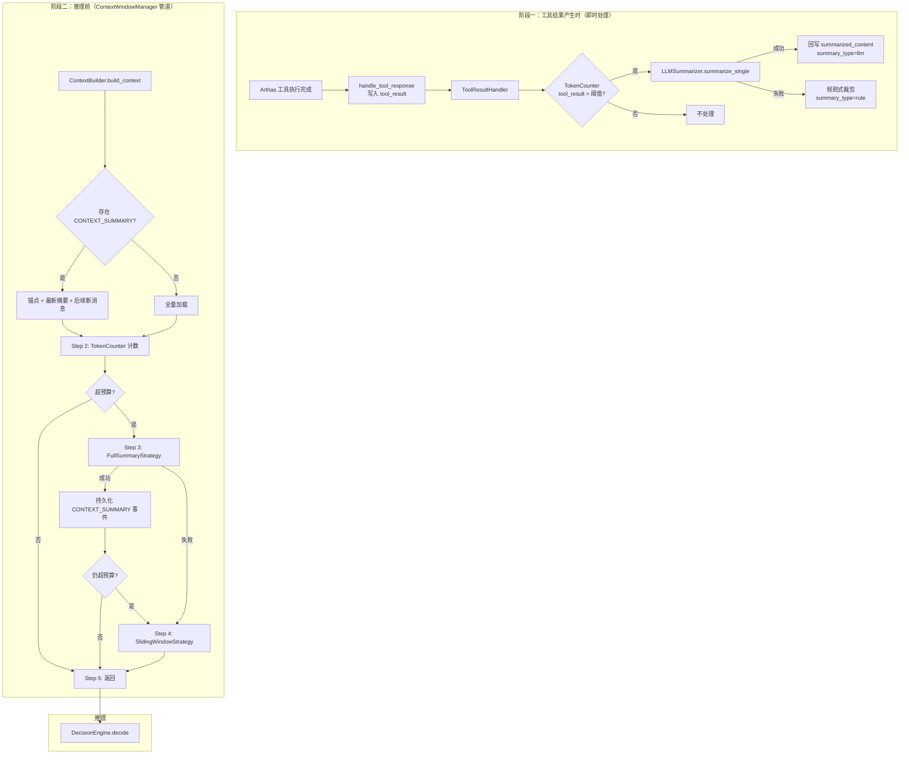
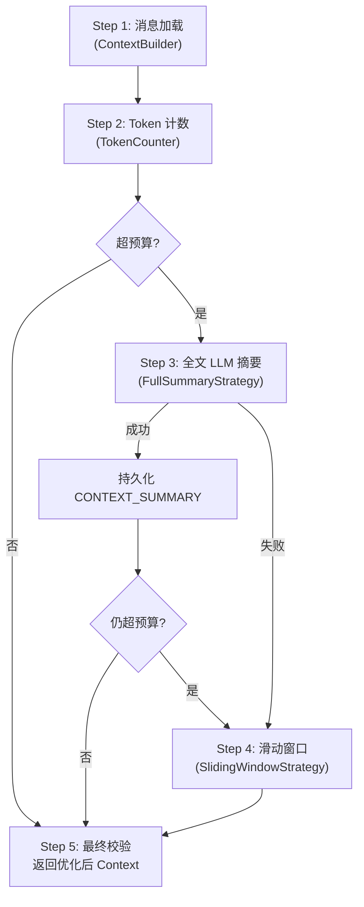

# 上下文管理（Context Management）设计文档

## 架构总览



## 两阶段策略说明

### 阶段一：工具结果即时摘要

**时机**：工具结果产生后立即执行（在 `ToolResultHandler.handle()` 中）

**策略**：
- **单条 LLM 摘要**：`LLMSummarizer.summarize_single()` —— 保留异常堆栈、错误码、关键指标
- **规则式裁剪（Fallback）**：保留前 500 + 尾部 200 tokens + 中间占位符

**触发条件**：`TokenCounter.count_text(tool_result) > tool_result_summary_threshold`

**持久化**：摘要结果直接写入 `DiagnosisStage.summarized_content` 字段

### 阶段二：推理前上下文管道

**时机**：`ContextBuilder.build_context()` 完成后、`DecisionEngine.decide()` 调用前

**策略层级**：
1. **全文 LLM 摘要**（主策略）：对压缩区调用 LLM 智能压缩，持久化为 `CONTEXT_SUMMARY` 事件
2. **滑动窗口硬裁剪**（Fallback）：直接丢弃中间消息，信息损失最大

## 管道流程（Step 1~5）



## 各组件职责

| 组件 | 职责 | 文件 |
|------|------|------|
| **TokenCounter** | 基于 tiktoken 的 token 计数，预算管理 | `context_management/token_counter.py` |
| **LLMSummarizer** | LLM 摘要服务，提供单条/全文两种接口 | `context_management/llm_summarizer.py` |
| **ToolResultSummarizer** | 工具结果即时摘要封装 | `context_management/tool_result_summarizer.py` |
| **SlidingWindowStrategy** | 滑动窗口硬裁剪（Fallback） | `context_management/sliding_window.py` |
| **FullSummaryStrategy** | 全文 LLM 摘要 + CONTEXT_SUMMARY 持久化 | `context_management/full_summary.py` |
| **ContextWindowManager** | 统一编排管道（Step 1~5） | `context_management/manager.py` |

## CONTEXT_SUMMARY 事件机制

### 事件数据结构

存储在 `DiagnosisStage` 表中：

| 字段 | 内容 |
|------|------|
| `stage_type` | `"CONTEXT_SUMMARY"` |
| `status` | `"completed"` |
| `stage_seq` | 当前 task 最新 seq + 1 |
| `input_data` | `{"from_stage_seq": N, "to_stage_seq": M, "original_message_count": X, "original_tokens": Y, "user_query": "..."}` |
| `output_data` | `{"summary": "结构化摘要...", "summary_tokens": K, "summary_model": "..."}` |

### ContextBuilder 加载逻辑

```
IF 存在 CONTEXT_SUMMARY 事件：
  找到最新的 CONTEXT_SUMMARY (latest_summary)
  加载 = [锚点(seq=1)] + [latest_summary] + [latest_summary 之后的新消息]
ELSE：
  全量加载
```

### 增量摘要流程

当已存在摘要事件后，再次超预算时：
1. 压缩区 = 旧摘要消息 + 后续中间消息
2. `from_stage_seq` 从旧摘要覆盖的起始开始，`to_stage_seq` 延伸到新的末尾
3. 新事件覆盖范围递增扩大

## 超预算判断逻辑

所有判断都基于 **当前全部已加载消息的 token 总量**：

```
available_budget = context_max_tokens - context_reserved_tokens
total_tokens = TokenCounter.count_messages(当前全部消息)
over_budget = total_tokens > available_budget
```

- **场景 A（无摘要事件）**：全量消息 token 总量 vs 预算
- **场景 B（有摘要事件）**：锚点 + 最新摘要 + 后续新消息 token 总量 vs 预算

## 摘要持久化机制

### 单条摘要

- **存储位置**：`DiagnosisStage` 表的新增字段
- **写入时机**：工具结果产生时即时写入
- **字段**：`summarized_content`（摘要内容）、`summary_tokens`、`original_tokens`、`summary_type`（"llm"/"rule"）
- **读取**：`ContextBuilder` 加载 stage 时优先使用 `summarized_content`

### 全文摘要

- **存储位置**：`DiagnosisStage` 表新增一条 `CONTEXT_SUMMARY` 类型记录
- **写入时机**：推理前管道中全文摘要成功后
- **读取**：`ContextBuilder` 检测到事件后切换分支加载

## 配置项速查表

| 配置项 | 类型 | 默认值 | 环境变量 | 说明 |
|--------|------|--------|----------|------|
| `context_max_tokens` | int | 60000 | `CP_CONTEXT_MAX_TOKENS` | 输入上下文 token 预算上限 |
| `context_reserved_tokens` | int | 4000 | `CP_CONTEXT_RESERVED_TOKENS` | system prompt + tools schema 预留开销 |
| `tool_result_summary_threshold` | int | 2000 | `CP_TOOL_RESULT_SUMMARY_THRESHOLD` | 单条工具结果触发摘要的 token 阈值 |
| `sliding_window_keep_recent` | int | 6 | `CP_SLIDING_WINDOW_KEEP_RECENT` | 滑动窗口保留的最近消息数 |
| `summary_model` | str | "" | `CP_SUMMARY_MODEL` | 摘要专用模型，空则使用主模型 |
| `summary_timeout` | float | 15.0 | `CP_SUMMARY_TIMEOUT` | LLM 摘要调用超时秒数 |
| `enable_tool_result_summary` | bool | True | `CP_ENABLE_TOOL_RESULT_SUMMARY` | 是否启用工具结果即时摘要 |

## LLM 摘要 Prompt 设计

### 单条摘要 Prompt

- **系统角色**：诊断信息摘要助手
- **必须保留**：异常堆栈、错误码、关键指标数值、异常线程名称和状态、死锁信息
- **可以精简**：重复的正常线程堆栈、大量相似的日志行
- **上下文提示**：通过 `context_hint` 传入工具名称和用户问题

### 全文摘要 Prompt

- **系统角色**：诊断对话摘要助手
- **输出结构**：已执行的工具 → 关键发现 → 当前诊断阶段 → 待验证假设
- **规则**：保留所有工具执行记录、关键异常信息和指标数据

## Fallback 降级路径

```
单条 LLM 摘要失败
  → 规则式裁剪（保留前500 + 尾部200 tokens + 占位符）
  → 结果写入 summarized_content，标记 summary_type="rule"

全文 LLM 摘要失败
  → 滑动窗口硬裁剪（保留锚点 + 最近 N 条 + 中间占位消息）
  → 不生成 CONTEXT_SUMMARY 事件
  → 纯内存操作，不影响数据库

全文摘要成功但仍超预算（极端场景）
  → 滑动窗口硬裁剪兜底
```
