[任务规划完成]
好的，让我先全面了解你当前的上下文管理相关代码，然后做系统性的评估。
[查找文件]
现在让我深入阅读所有核心组件的源码，全面了解实现细节。
[读取文件]
现在让我再读取剩余的关键组件。
[读取文件]
最后让我再看一下 system prompt 的构建和 handler 中的使用场景，确保评估完整。
[查找文件]
让我再看看 handler 中的持久化决策逻辑和 OpenAI Engine 中的 decide 方法。
[查找文件失败]
[查找文件]
现在我已经完整审阅了你的上下文管理模块的全部代码。下面给你一个系统性的评估。

---

## 上下文管理（Context Management）系统评估

### 📐 架构总览

你的上下文管理体系由以下核心组件构成：

```mermaid
graph TB
    subgraph "数据层"
        DB["DiagnosisStage 表<br/>(stage 链 + 摘要字段)"]
    end

    subgraph "构建层"
        CB["ContextBuilder<br/>stage → messages 转换<br/>CONTEXT_SUMMARY 分支加载<br/>RAG 检索注入"]
    end

    subgraph "优化层 (context_management)"
        TC["TokenCounter<br/>tiktoken 精确计数<br/>预算管理"]
        TRS["ToolResultSummarizer<br/>工具结果即时摘要<br/>LLM摘要 + 规则裁剪"]
        FS["FullSummaryStrategy<br/>全文LLM摘要<br/>增量摘要 + 延迟持久化"]
        SW["SlidingWindowStrategy<br/>滑动窗口硬裁剪<br/>保留锚点+最近N条"]
        CWM["ContextWindowManager<br/>统一编排管道 (Step 1~5)"]
    end

    subgraph "消费层"
        OE["OpenAIDecisionEngine<br/>decide() → optimize() → LLM API"]
        PB["build_system_prompt<br/>角色 + RAG + ReAct + 工具列表"]
    end

    subgraph "调度层"
        LTH["LlmThinkingHandler<br/>延迟持久化决策<br/>tool_call→持久化 / conclude→丢弃"]
    end

    DB --> CB --> CWM --> OE --> LTH
    TC -.-> CWM
    TRS -.-> |"工具结果产生时"| DB
    FS -.-> CWM
    SW -.-> CWM
    PB -.-> OE
    LTH --> |"pending_summary"| DB
```



---

### ✅ 做得很好的地方

| 维度 | 评价 | 具体表现 |
|------|------|---------|
| **两阶段架构** | ⭐⭐⭐⭐⭐ | 即时摘要（工具结果产生时）+ 推理前管道（全局优化），分层处理非常合理 |
| **三层降级链** | ⭐⭐⭐⭐⭐ | LLM全文摘要 → 滑动窗口裁剪 → 规则式裁剪，每层都有 fallback，鲁棒性极强 |
| **精确 Token 计数** | ⭐⭐⭐⭐⭐ | 基于 tiktoken + 模型自适应编码器，而不是粗糙的字符估算。`_MESSAGE_OVERHEAD` 和 `_REPLY_OVERHEAD` 的考虑非常细致 |
| **延迟持久化机制** | ⭐⭐⭐⭐⭐ | `pending_summary` 由 handler 根据 LLM 决策结果决定是否写入 DB，避免了 conclude 时无意义的摘要持久化和 stage_seq 污染，这个设计非常精巧 |
| **CONTEXT_SUMMARY 增量摘要** | ⭐⭐⭐⭐ | 检测旧摘要事件后，将旧摘要纳入压缩区重新摘要，`from_stage_seq` 继承旧覆盖范围，增量压缩逻辑正确 |
| **function_call 去重计数** | ⭐⭐⭐⭐ | 在 `optimize()` 中过滤 `role="function_call"` 消息避免重复计入 token，说明对 OpenAI 消息格式的理解很到位 |
| **不可变 Context** | ⭐⭐⭐⭐ | `optimize()` 返回新的 `DecisionContext`，不修改原实例，避免副作用 |
| **边界对齐** | ⭐⭐⭐⭐ | `_split_zones()` 和 `SlidingWindowStrategy.apply()` 都做了工具调用组（assistant+function_call+function_result）的边界对齐，不会拆散配对消息 |
| **摘要 Prompt 设计** | ⭐⭐⭐⭐ | 单条摘要保留异常堆栈/错误码/关键指标，全文摘要输出结构化格式（已执行工具→关键发现→当前阶段→待验证假设），实用性强 |
| **RAG 预算集成** | ⭐⭐⭐⭐ | RAG token 从可用预算中扣除，确保 RAG 知识不挤压历史对话空间 |
| **完整的配置化** | ⭐⭐⭐⭐ | 所有关键参数（预算、阈值、窗口大小、超时、模型）均可通过环境变量覆盖 |
| **依赖注入** | ⭐⭐⭐⭐ | `ContextWindowManager`、`FullSummaryStrategy` 均通过构造函数注入依赖，可测试性好 |

---

### ⚠️ 存在差距或可改进的地方

#### 1. 🔴 **单锚点假设在多轮对话下失效**

当前的消息分区模型是：

```
[锚点: stage_seq=1 的 USER_QUERY] + [压缩区] + [保留窗口: 最近N条]
```

这在 **单轮 ReAct 循环** 下完美工作。但如果后续扩展到多轮对话（用户追问），`USER_FOLLOWUP` 和 `LLM_CONCLUSION` 等关键意图消息会被塞进压缩区甚至被滑动窗口丢弃，导致 **用户意图丢失**。

你在 [muliti.md](/Users/songji/Code/Java/arthas/arthas-mcp-server/py/docs/muliti.md) 中已经识别了这个问题，设计了"受保护消息"方案，但尚未实现。

**当前状态**：设计已完成，实现 pending。

**影响范围**：
- `ContextBuilder._stages_to_messages()` — 分支加载逻辑
- `FullSummaryStrategy._split_zones()` — 压缩区划分
- `SlidingWindowStrategy.apply()` — 丢弃策略

---

#### 2. 🟡 **System Prompt 的 Token 没有纳入预算计算**

在 `ContextWindowManager.optimize()` 中：
```python
available_budget = self._token_counter.get_available_budget()
# = context_max_tokens(128000) - context_reserved_tokens(8192) = 119808
```

`context_reserved_tokens=8192` 是一个 **静态估算值**，用于预留 system prompt + tools schema 的开销。但实际上：

- system prompt 的长度是 **动态的**（取决于工具数量 + RAG 注入内容）
- tools schema 的长度取决于连接的 Arthas 客户端暴露了多少工具

如果实际 system prompt 超过 8192 tokens（比如 RAG 返回了大量知识片段 + 工具列表很长），预留空间不够，会导致实际发给 LLM 的总 token 超限。

> **主流做法**：在 `optimize()` 中先构建 system_prompt，精确计算其 token 数，然后用 `context_max_tokens - actual_system_prompt_tokens` 作为消息区的可用预算。

**当前影响**：你设了 `rag_max_tokens=2048`，加上 system prompt 本身约 1000-2000 tokens + 工具列表，总共大约 4000-6000 tokens，和 `context_reserved_tokens=8192` 差距不大，目前不太会出问题。但如果后续增加更多工具或 RAG 知识，这个静态值就不够了。

**建议优先级**：🟡 中

---

#### 3. 🟡 **缺少对 System Prompt 和 RAG token 的联合预算协调**

当前 RAG token 在两个地方被"花费"：

1. `build_system_prompt()` 中，RAG 知识被注入到 system prompt
2. `ContextWindowManager.optimize()` 中，`rag_tokens` 从 `available_budget` 中扣除

这意味着 RAG token 被 **双重计算** 了 — 一次是通过 `context_reserved_tokens` 的静态预留（system prompt 的一部分），另一次是通过 `available_budget - rag_tokens` 的显式扣除。

虽然这会让预算更"保守"（不太会超限），但也意味着可用预算被不必要地压缩了。

**建议**：要么把 RAG token 从 `context_reserved_tokens` 的职责中移除（只预留 role prompt + ReAct prompt + tools），要么在 `optimize()` 中不再单独扣除 rag_tokens，而是让 system prompt 的精确计数来统一处理。

**建议优先级**：🟢 低（保守策略不会出错，只是浪费了一些预算空间）

---

#### 4. 🟡 **规则式裁剪的字符-Token 映射偏粗糙**

在 `ToolResultSummarizer._rule_based_trim()` 中：
```python
char_per_token = 3.5  # 近似估算：1 token ≈ 3.5 个字符（中英文混合场景）
head_chars = int(self.RULE_HEAD_TOKENS * char_per_token)
```

这个比例在纯英文场景下偏高（英文约 1 token ≈ 4 字符），在纯中文场景下偏低（中文约 1 token ≈ 1.5~2 字符）。对于 Arthas 的工具输出（主要是英文 Java 堆栈），实际保留的 token 数可能和预期有偏差。

**改进方向**：既然你已经有了 `TokenCounter`，可以用 tiktoken 精确定位裁剪边界（对 content 做 encode → 截取 token 列表 → decode 回文本），而不是用字符估算。

**建议优先级**：🟡 中

---

#### 5. 🟡 **全文摘要的压缩区选取可能不够智能**

在 `FullSummaryStrategy._split_zones()` 中：
```python
anchor = messages[0]  # 锚点：第一条
keep_zone = messages[split_idx:]  # 保留窗口：最近 N 条
compress_zone = messages[1:split_idx]  # 压缩区：中间所有
```

这是一个简单的 **位置式分区**。问题在于：
- 如果最近的一次工具调用返回了非常大的结果（即使已经做过即时摘要），它在保留窗口中占比很大
- 而压缩区中可能有已经很精简的旧消息（已经被即时摘要处理过的），再次做全文摘要的信息损失比新消息更大

> **主流做法**：基于 **信息密度** 而非 **时间位置** 来选择压缩目标 — 优先压缩 token 量大但信息密度低的消息（如已摘要过的工具结果），保留 token 量小但信息密度高的消息（如用户追问、LLM 思考）。

**当前影响**：在你的单轮诊断场景下影响不大（ReAct 循环通常 3-5 轮），但多轮对话后会变得更重要。

**建议优先级**：🟡 中

---

#### 6. 🟡 **摘要质量没有验证/评估机制**

当前摘要流程中：
- LLM 摘要 → 直接使用，没有验证摘要是否遗漏了关键信息
- 规则式裁剪 → 直接截断，没有检查截断点是否在语义边界上

> **主流做法**：
> - **摘要后对比**：对比摘要前后的关键实体（异常类名、指标数值、线程名）是否被保留
> - **摘要评估指标**：通过 ROUGE/BERTScore 等评估摘要覆盖度
> - **保护列表机制**：定义一组正则模式（如 `Exception`、`ERROR`、`OutOfMemory`），在摘要后检查这些模式是否仍存在

**建议优先级**：🟡 中 — 当前阶段可以先在日志中记录摘要前后的关键实体对比。

---

#### 7. 🟢 **摘要模型与推理模型共用时的延迟影响**

当 `summary_model` 为空时，摘要和推理用同一个模型，意味着：
- `ToolResultSummarizer` 的即时摘要会在工具结果返回时额外增加一次 LLM 调用
- `FullSummaryStrategy` 的全文摘要在推理前增加一次 LLM 调用

两次摘要 + 一次推理 = **单步 ReAct 循环中可能有 3 次 LLM 调用**，延迟和成本都会增加。

> **主流做法**：摘要用小模型（如 GPT-3.5 / DeepSeek-V2-Lite），推理用大模型。

**当前影响**：你已经预留了 `summary_model` 配置项，支持配置独立摘要模型，只是默认值为空（复用主模型）。这个设计是对的，只需要在部署时配置一下就好。

**建议优先级**：🟢 低（配置层面的问题）

---

#### 8. 🟢 **摘要 Prompt 缺少 Few-Shot 示例**

当前的 `SINGLE_SUMMARY_SYSTEM_PROMPT` 和 `FULL_SUMMARY_SYSTEM_PROMPT` 只有规则描述，没有提供 few-shot 示例（一个好的输入→输出样本）。

> **主流做法**：在 system prompt 中加入 1-2 个 "模范摘要" 示例，引导 LLM 生成质量更稳定的摘要。

**建议优先级**：🟢 低（当前的结构化输出要求已经够明确）

---

#### 9. 🟢 **缺少摘要缓存**

如果同一个 task 在短时间内被多次触发推理（比如工具调用很快完成，连续进入下一轮 ReAct），每次都会重新运行 `optimize()` 管道。如果上一次刚做过全文摘要且上下文没有新增消息，理论上可以直接复用上次的优化结果。

**当前影响**：由于 `CONTEXT_SUMMARY` 会被持久化到 DB，`ContextBuilder` 在下次加载时会读取摘要事件，实际上已经有了一种"隐式缓存"效果。但 `optimize()` 仍会重新做 token 计数和预算判断，有少量重复计算。

**建议优先级**：🟢 低（影响很小）

---

### 📊 差距总览

```
┌──────────────────────────────────────────┬──────────┬──────────────┬──────────────────────┐
│              能力维度                      │  当前状态  │ 主流生产水平  │    建议优先级         │
├──────────────────────────────────────────┼──────────┼──────────────┼──────────────────────┤
│ 两阶段架构（即时+管道）                     │  ✅ 优     │  ✅          │  —                   │
│ 三层降级链（LLM→滑动窗口→规则裁剪）         │  ✅ 优     │  ✅          │  —                   │
│ 精确 Token 计数（tiktoken）                │  ✅ 优     │  ✅          │  —                   │
│ 延迟持久化（pending_summary）              │  ✅ 优     │  ✅+         │  —                   │
│ CONTEXT_SUMMARY 增量摘要                   │  ✅ 良     │  ✅          │  —                   │
│ 消息组边界对齐                              │  ✅ 良     │  ✅          │  —                   │
│ 不可变 Context / 依赖注入                   │  ✅ 良     │  ✅          │  —                   │
│ 多轮对话锚点保护（多锚点分区）               │  ⚠️ 设计完   │  ✅          │  🔴 高（扩展必须）    │
│ System Prompt 精确预算                     │  ⚠️ 静态估算 │  ✅ 动态计算  │  🟡 中               │
│ RAG+Prompt 联合预算协调                    │  ⚠️ 双重计算 │  ✅ 统一管理  │  🟢 低（保守不出错）  │
│ 规则裁剪精度（token级截断）                  │  ⚠️ 字符估算 │  ✅ token级   │  🟡 中               │
│ 信息密度感知的压缩区选取                     │  ❌ 缺失    │  ✅          │  🟡 中               │
│ 摘要质量验证/评估                           │  ❌ 缺失    │  ✅          │  🟡 中               │
│ 摘要 Prompt Few-Shot 示例                  │  ❌ 缺失    │  ✅          │  🟢 低               │
│ 摘要专用小模型配置                           │  ✅ 预留    │  ✅          │  🟢 低（部署时配置）  │
└──────────────────────────────────────────┴──────────┴──────────────┴──────────────────────┘
```

---

### 🎯 总结

你的上下文管理体系在 **单轮 ReAct 诊断** 场景下已经是一个 **非常成熟的设计**，特别是：

1. **两阶段架构**（即时 + 管道）是业界推荐的最佳实践
2. **三层降级链** 的鲁棒性在大多数开源 Agent 框架中都看不到（LangChain / AutoGPT 等通常只有一层策略）
3. **延迟持久化 + CONTEXT_SUMMARY 增量摘要** 的设计非常精巧，兼顾了性能和正确性
4. **function_call 去重计数** 和 **消息组边界对齐** 这些细节体现了对 OpenAI 协议的深入理解

如果给一个评分：**架构设计 9/10，当前实现 8/10**。

最大的短板是 **多轮对话的锚点保护尚未实现**（你已经设计好了方案在 muliti.md 中），以及 **system prompt 的精确预算管理** 还用的是静态估算。这两个点补上后，这个上下文管理系统就可以称得上是生产级的了。