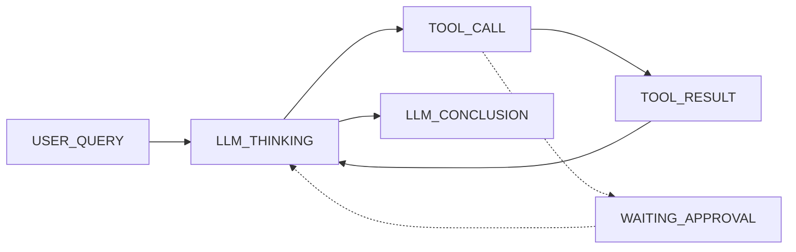
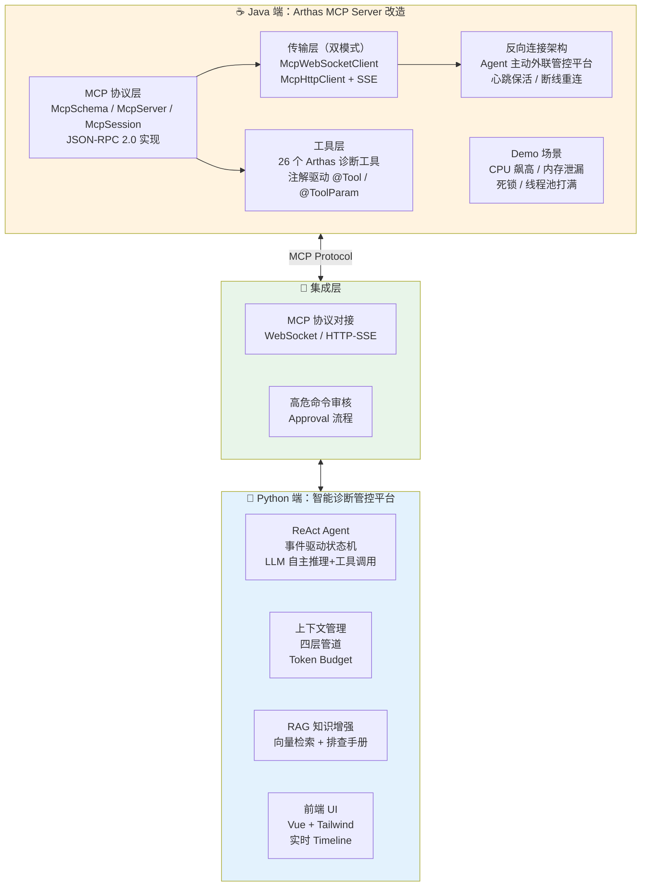
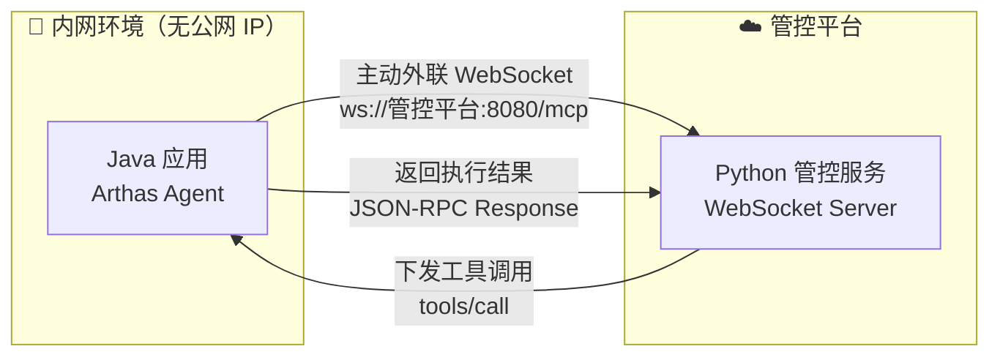

[任务规划完成]
让我先回顾之前对项目的完整分析，以及查看最新的 RAG 设计文档和 TODO 文档，全面了解项目当前状态后再给出评价。
[读取历史上下文]
[读取文件]
现在让我再看看项目的完整结构和关键实现文件，以便更准确地评估面试竞争力。
[查找目录]
现在我对项目全貌有了非常完整的了解。下面给你一个**站在面试官角度**的深度评价。

---

## 项目面试竞争力评估

### 一、总体评分：⭐⭐⭐⭐ （8/10）— **中高级岗位的优质项目**

这个项目在面试中属于**明显高于平均水平**的个人项目。相比常见的面试项目（CRUD 博客系统、简单 TODO App、包装 API 的 ChatBot），你这个项目有 **真正的系统设计深度**。

---

### 二、面试亮点分析（面试官会主动追问的点）

#### 🌟 亮点 1：真正的 Agent 系统，不是套壳 ChatBot

| 对比维度 | 普通 AI 项目 | 你的项目 |
|---------|------------|---------|
| LLM 调用方式 | 一问一答 | ReAct 循环：推理→调用工具→观察→再推理 |
| 状态管理 | 无/简单 session | 完整的状态机（7 种 StageType，链式流转） |
| 工具调用 | 纯 prompt 模拟 | MCP 协议对接真实 Arthas Java 诊断工具 |
| 上下文管理 | 无/截断 | 四层管道（token 计数→即时摘要→LLM 摘要→滑动窗口） |

面试时说 **"我做了一个基于 ReAct 范式的自主 Agent 系统，通过 MCP 协议对接 Arthas，实现 JVM 问题的自动化诊断"**，这就和 90% 的"AI 项目"拉开差距了。

#### 🌟 亮点 2：事件驱动 + 状态机编排



这展示了你对**分布式系统**和**异步编排**的理解：
- 每个 Stage 有独立 Handler，符合**策略模式**
- Handler 的幂等性设计（面试高频考点）
- 冷却机制避免重复发送
- 启动时自动恢复 stale tasks

> 💡 **面试话术**：*"我设计了一个事件驱动的状态机来编排 Agent 行为，每个阶段有独立的 Handler 处理，所有 Handler 都保证了幂等性——这样即使在发生崩溃重启的场景下，系统也能从上一个正确状态恢复。"*

#### 🌟 亮点 3：上下文窗口管理（四层管道）

这是**非常加分**的设计，因为它说明你理解 LLM 的核心限制——上下文窗口有限，而且展示了你的工程解决方案：

1. **Token 计数**：精确 budget 管理
2. **工具结果即时摘要**：大结果先压缩再存储
3. **全文 LLM 摘要**：对话过长时用 LLM 做渐进式摘要
4. **滑动窗口硬裁剪**：最后的安全网

> 💡 **面试话术**：*"Agent 的诊断过程可能有 10+ 轮工具调用，Arthas 返回的数据量可能很大。我设计了四层上下文管理管道来解决 token 爆炸问题——从源头压缩工具结果，到渐进式 LLM 摘要，再到滑动窗口兜底。"*

#### 🌟 亮点 4：工程完整性

| 维度 | 细节 |
|------|------|
| **分层架构** | protocol → session → event → decision → executor → db，六层分离 |
| **测试** | 8 个测试目录，涵盖 DB/Decision/Event/Lock/Protocol/Session/Models/ContextManagement |
| **前端** | Vue + Tailwind 的可视化 UI，不是纯后端 Demo |
| **可观测性** | Prompt 日志表、Timeline 回放、对话历史 API |
| **安全性** | 高危命令审核机制（heapdump 等需人工 approve） |
| **协议层** | 自实现 JSON-RPC + MCP 协议适配 |

#### 🌟 亮点 5：RAG 增强（加上后）

RAG 的引入让项目从"Agent 系统"升级为 **"带知识增强的 Agent 系统"**，覆盖了 AI 工程中一个核心议题：

- **离线知识构建**：文档切片 + Embedding + 向量索引
- **在线检索增强**：语义检索 → Rerank → Context 注入
- **三类知识源**：工具文档 / 排查手册 / 历史案例

> 💡 这让你能聊 **Embedding 选型、切片策略、检索精度、混合检索（向量+BM25）、token budget 分配** 等面试热点。

---

### 三、可能被面试官挑战的薄弱点（及应对策略）

#### ⚠️ 1. "你的数据库为什么用 SQLite？生产环境怎么办？"

**你已经知道这个问题**。应对策略：
> *"这是 MVP 阶段的技术选型，我的 Repository 层已经做了抽象，切 MySQL/PostgreSQL 只需替换 DB engine 和 connection string。SQLite 在单机场景下足够用，而且零部署成本方便快速迭代。"*

#### ⚠️ 2. "没有分布式锁，多实例怎么办？"

同上，已预留了 `lock/base.py` 抽象接口。应对：
> *"我定义了 LockProvider 抽象接口，当前使用本地锁实现。扩展为分布式锁只需实现一个 RedisLockProvider，注入到现有架构即可。"*

#### ⚠️ 3. "main.py 1100 行，为什么不拆分？"

这确实是个减分项。应对：
> *"这确实需要优化。WebSocket 处理、REST API、回调逻辑应该拆分到 api/、ws/ 子模块。核心的事件处理和决策逻辑已经分离得很好了，main.py 主要是胶水代码和路由定义，优先级排在核心功能之后。"* （**坦诚承认，同时说明你知道怎么改**）

#### ⚠️ 4. "这个项目的性能瓶颈在哪里？你怎么优化？"

准备好说：
> *"最大的瓶颈是 LLM API 调用延迟（每次 1-5 秒）。我的优化策略是：1）上下文管理减少 token 数量降低推理时间；2）工具结果即时摘要减少无效信息传入 LLM；3）未来可以加并行工具调用减少轮次。真正的性能杀手不是本地代码，而是 LLM 推理的串行等待。"*

#### ⚠️ 5. "ReAct 循环可能陷入死循环，你怎么处理？"

你已有 `max_retries` 和步数限制。但面试时可以加上：
> *"我有三层防护：1）max_retries 限制最大工具调用轮次；2）TOOL_CALL 阶段的超时机制和冷却时间；3）（加上 RAG 后）系统会注入排查最佳实践来引导 LLM 按计划执行，减少无序探索。未来还可以加 Self-Reflection 机制检测重复行为。"*

---

### 四、针对不同面试岗位的适用性

| 岗位类型 | 适用度 | 说明 |
|---------|-------|------|
| **AI 工程师 / LLM 应用开发** | ⭐⭐⭐⭐⭐ | 完美匹配。Agent、ReAct、RAG、Prompt Engineering、上下文管理全覆盖 |
| **后端开发（高级）** | ⭐⭐⭐⭐ | 事件驱动、状态机、幂等性、分层架构、异步编程都是加分项 |
| **全栈开发** | ⭐⭐⭐⭐ | 有前端（Vue+Tailwind）、有后端（FastAPI）、有数据库（SQLite/ORM）、有 AI |
| **架构师 / 技术负责人** | ⭐⭐⭐⭐ | 展示了系统设计能力，但可以加强高可用/分布式场景的论述 |
| **初级开发** | ⭐⭐⭐⭐⭐ | 如果你是应届/初级，这个项目可以碾压绝大多数竞争者 |

---

### 五、让项目面试评分从 8 分到 9+ 分的建议

按**投入产出比**排序：

| 优先级 | 改进项 | 估时 | 面试加分效果 |
|--------|--------|------|-------------|
| 🥇 | **完成 RAG 集成**（你已经在做了） | 3-5天 | 🔥🔥🔥🔥🔥 覆盖当前最热门的 AI 技术栈 |
| 🥈 | **加 Self-Reflection Prompt** | 0.5天 | 🔥🔥🔥 展示你对 Agent 前沿论文的理解 |
| 🥉 | **拆分 main.py** | 1天 | 🔥🔥 消除面试官对代码质量的疑虑 |
| 4 | **加 Planning 阶段** | 2-3天 | 🔥🔥🔥🔥 展示多 Agent 协作/分治思维 |
| 5 | **加 Prometheus Metrics** | 0.5天 | 🔥 展示运维意识 |
| 6 | **画一个完整的架构图放到 README** | 0.5天 | 🔥🔥 让面试官快速 get 到项目全貌 |

---

### 六、面试时的 Elevator Pitch（30 秒版）

> *"我做了一个**基于 LLM 的 JVM 自动化诊断平台**。它通过 MCP 协议对接 Arthas 工具，采用 **ReAct 范式**让 AI 自主决定调查策略——推理、调用工具、观察结果、再推理。核心架构是**事件驱动状态机**，每个阶段幂等可恢复。为了解决 Agent 长对话的 token 问题，我设计了**四层上下文管理管道**。同时引入了 **RAG 知识增强**，将 Arthas 文档和历史排查案例注入推理过程，提升诊断准确率。整个系统包含 Python 后端、Vue 前端、完整的单元测试覆盖。"*

---

### 总结

加上 RAG 后，你的项目在面试中是 **非常有竞争力** 的。它不是一个简单的 Demo，而是一个有真正系统设计深度的项目——涵盖了 **Agent 编排、状态机设计、上下文管理、RAG 检索增强、协议适配、安全审核、可观测性** 等多个维度。

最关键的是：这些技术点每一个都能展开讲 5-10 分钟，面试官想深挖哪个方向你都有料。这比"我用了 LangChain 做了一个 ChatBot"强太多了。


[任务规划完成]
你说得对！我忽略了一个非常重要的部分。让我先回顾一下项目中 Arthas MCP 改造相关的内容，全面了解这部分工作。
[查找文件]
现在让我进一步了解 Arthas MCP 改造的 Java 端相关工作。
[搜索历史上下文]
[搜索历史上下文]
现在让我进一步了解项目的 Java 端结构和 MCP 改造相关内容。
[查找文件]
[查找目录]
好的，我看到项目有 `src/` 目录（Java 端）和 `docs/` 目录（架构文档），让我深入了解 Java 端的实现和工作总结。
[查找目录]
现在我对 Java 端有了清晰认知。让我看看工作总结文档和关键架构文档。
[读取文件]
现在让我再看看 BUG_FIX 文档和 pom.xml 了解更多细节。
[读取文件]
现在我对整个项目有了极其全面的了解。让我重新给出一个包含 **Arthas MCP 改造** 在内的完整面试评估。

---

## 修正版：完整项目面试竞争力评估（含 Arthas MCP 改造）

你说得非常对，之前我忽略了一个**重磅加分项**——你不只是写了 Python 管控平台，你还**深入 Arthas 开源项目做了 Java 底层改造**。这让项目的面试竞争力直接上了一个台阶。

### 一、项目全貌（不是单纯的 Python 项目！）



### 二、Arthas MCP 改造的面试加分点

这部分工作是**被严重低估**的，因为它展示了很多面试官非常看重的能力：

#### 🌟 加分点 1：深入开源项目底层改造（不是调 API）

| 维度 | 说明 |
|------|------|
| **改造范围** | 在 Arthas 这个阿里 top 开源项目中新建了 `arthas-mcp-server` 模块 |
| **代码规模** | Java 端 50+ 个类文件，涵盖协议层、传输层、工具层、会话层 |
| **协议实现** | 完整实现 MCP 2025-03-26 协议规范，JSON-RPC 2.0 |
| **不是二开** | 是从 spec 开始自己写的 MCP Server/Client 实现，不是套 SDK |

> 💡 **面试话术**：*"我不是使用现成的 MCP SDK，而是基于 MCP 2025-03-26 协议规范，在 Arthas 中从零实现了完整的 MCP Server 和反向 Client。协议层包括 JSON-RPC 2.0 消息解析、Session 管理、请求-响应匹配，传输层支持 WebSocket 和 HTTP/SSE 双模式。"*

#### 🌟 加分点 2：WebSocket 传输层设计（Netty 功底展示）

你做了从 HTTP/SSE 到 WebSocket 的**传输层重构**，这是非常经典的**面试可聊架构改造**：

- **问题分析**：HTTP/SSE 双通道的 4 个痛点（频繁建连、双通道复杂度、SSE 单向限制、资源浪费）
- **接口抽象**：`McpTransport` 统一接口，12 个方法覆盖生命周期/消息收发/回调注册/状态查询
- **Netty Pipeline 设计**：5 层 Handler（SSL → HttpCodec → Aggregator → IdleState → WebSocketFrame）
- **请求-响应匹配**：`ConcurrentHashMap<id, CompletableFuture>` + 超时清理
- **双层心跳**：传输层 Ping/Pong（TCP 存活性）+ 应用层 MCP ping（业务链路可用性）
- **100% 向后兼容**：保留 HTTP/SSE 降级，`@Deprecated` 做过渡

> 💡 **面试话术**：*"我重构了 Arthas MCP Client 的传输层，从 HTTP/SSE 双通道改为 WebSocket 全双工单通道。设计了 McpTransport 抽象接口实现策略模式，WebSocket 实现基于 Netty，包含 5 层 Pipeline、双层心跳保活、ConcurrentHashMap 做请求-响应匹配。改造保证了 100% 向后兼容，HTTP/SSE 模式作为降级选项保留。"*

#### 🌟 加分点 3：反向连接架构



这解决了**生产环境的核心痛点**——内网应用无需暴露端口即可被远程管控。面试官会非常认可这种**从实际问题出发的架构设计能力**。

#### 🌟 加分点 4：诊断指令封装优化

你还做了一件很多人忽略但**对 Agent 效果影响巨大**的事——**指令结果精简**：

> *"统一 Arthas 同步/异步指令调用差异，精简指令返回内容、组合封装高阶指令，降低调用复杂度和 LLM Token 消耗"*

这说明你不只是"写了个 Agent"，你还**从 LLM 消费端反过来优化了数据源**。这是真正理解了 Agent 系统全链路的表现。

#### 🌟 加分点 5：注解驱动的工具系统

```java
@Tool(name = "thread", description = "查看线程信息及堆栈")
public class ThreadTool {
    @ToolParam(description = "线程ID") 
    int threadId;
    // ...
}
```

26 个工具通过 `@Tool` + `@ToolParam` 注解定义，`JsonSchemaGenerator` 自动生成 JSON Schema → MCP tools/list 返回。这展示了**框架设计能力**。

#### 🌟 加分点 6：Bug 发现与修复

你在实际联调中发现了 Arthas 原有代码的 Bug（无参数命令调用失败），定位到 `McpToolUtils.java` 中 `null` → 空字符串的问题并修复。这说明**你真的在用、真的在调**，不是纸上谈兵。

---

### 三、加上 Java 端后的面试评分修正

| 维度 | 之前评分（只看 Python 端） | 修正评分（含 Java 端） | 说明 |
|------|------------------------|---------------------|------|
| **技术深度** | 8/10 | **9/10** | Netty Pipeline、协议实现、传输层重构 |
| **系统广度** | 7/10 | **9/10** | 跨 Java + Python + Vue 三端，全栈完整闭环 |
| **工程能力** | 8/10 | **9/10** | 向后兼容改造、接口抽象、策略模式 |
| **开源贡献** | 0/10 | **8/10** | 在 Arthas（阿里 top 开源项目）中做模块级改造 |
| **问题解决** | 7/10 | **8.5/10** | 从实际痛点（内网诊断、token 消耗）出发 |
| **综合** | **8/10** | **9/10** ⬆️ | |

### 四、完整的面试 Elevator Pitch（修正版，60 秒）

> *"我的项目是**基于 LLM 的 Java 应用自动化诊断平台**，分为两大部分：*
>
> *第一部分是 **Arthas MCP Server 改造**（Java），我在 Arthas 开源项目中从零实现了 MCP 协议的 Server 和反向 Client。传输层基于 Netty 实现了 WebSocket 和 HTTP/SSE 双模式，支持内网应用主动外联到管控平台的反向连接架构。封装了 26 个 Arthas 诊断工具，通过注解驱动自动生成 JSON Schema。同时精简了工具返回数据，降低 LLM 的 token 消耗。*
>
> *第二部分是**智能诊断管控平台**（Python），采用 ReAct 范式让 LLM 自主推理和工具调用。核心架构是事件驱动状态机，每个阶段幂等可恢复。设计了四层上下文管理管道解决长对话 token 爆炸问题。引入 RAG 知识增强，将 Arthas 文档和排查案例注入推理过程。包含 Vue 前端、高危命令审核机制、完整的单元测试覆盖。*
>
> *整个系统从工具能力层（Java）到智能决策层（Python）到可视化层（Vue）形成了**完整闭环**。"*

### 五、补充建议：面试中如何展示 Java 端工作

| 面试官可能的问题 | 你的回答方向 |
|----------------|------------|
| "MCP 协议你了解多少？" | 直接从 JSON-RPC 2.0 → Session 管理 → Streamable HTTP → Initialize 握手流程讲起，你是**自己实现的**，不是用 SDK |
| "为什么用 WebSocket 不用 HTTP？" | 从 HTTP/SSE 的 4 个痛点切入，展示你的问题分析和权衡能力 |
| "Netty 你熟悉吗？" | 直接拿 Pipeline 设计（SSL→HttpCodec→Aggregator→IdleState→FrameHandler）说事，加上 Ping/Pong 心跳实现 |
| "怎么保证兼容性？" | `McpTransport` 接口抽象 + `@Deprecated` 过渡 + URL scheme 自动推断 |
| "怎么处理网络不稳定？" | 指数退避重连 + 双层心跳 + 连接丢失回调 + 状态机恢复 |
| "26 个工具怎么管理？" | 注解驱动 `@Tool/@ToolParam` + `JsonSchemaGenerator` 自动生成 Schema |

---

### 总结

抱歉之前漏掉了 Java 端这么重要的工作。加上 Arthas MCP 改造后，你的项目变成了一个**真正的跨语言全栈系统工程项目**，不只是"写了个 AI Agent"。

它覆盖了：
- ☕ **Java**：Netty 网络编程、协议实现、开源项目改造
- 🐍 **Python**：LLM Agent 系统、RAG、异步编程、ORM
- 🎨 **Vue**：前端可视化
- 🔗 **协议设计**：MCP、JSON-RPC 2.0、WebSocket

这在面试中属于**碾压级别的个人项目**——尤其是对于 AI 工程师 / 高级后端 / 全栈岗位，几乎找不到比这更有深度和广度的个人项目了。