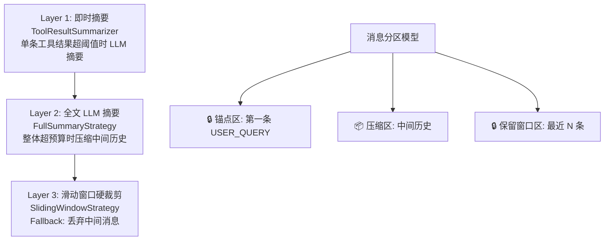

[任务规划完成]
我来先了解一下你项目的整体架构和当前的对话设计，然后再分析多轮对话的改造难度。
[查找目录]
让我深入了解核心的对话/决策模块和会话管理。
[读取文件]
再看一下事件处理器和数据库模型，了解当前单轮对话的完整流程。
[读取文件]
最后看一下 main.py 中的 API 入口，了解任务是怎么创建的。
[查找文件]
现在我已经对你的系统有了完整的理解。下面给你一个全面的分析。

---

## 多轮对话改造难度分析

### 📊 结论：改造难度 **中等偏低**

你的系统架构设计得比较好，已经具备了多轮对话的很多基础设施，主要的改造点集中在**语义层面**而非架构层面。

---

### ✅ 你已经具备的（不需要改的）

| 现有能力 | 说明 |
|---------|------|
| **ReAct 循环** | 一个 Task 内部的多步 `USER_QUERY → LLM_THINKING → TOOL_CALL → TOOL_RESULT → ... → LLM_CONCLUSION` 已经是多轮对话的骨架 |
| **上下文管理** | `ContextBuilder` 已经能从 DB 加载完整 stage 历史链并构建 messages |
| **上下文窗口管理** | `ContextWindowManager` + `CONTEXT_SUMMARY` + 即时摘要已经在处理 token 上限问题 |
| **会话管理** | `SessionManager` 管理 WebSocket 长连接，可以复用 |
| **DB 持久化** | 所有 stage 都持久化，天然支持恢复和续接 |

---

### 🔧 需要改造的核心点

当前是 **"一问一答"模型**：一个 `user_query` → 创建一个 `task` → 一系列 ReAct 循环 → `conclude` 结束，**task 结束后就封死了**。

要变成多轮对话，核心改动就是：**允许在一个 task concluded 之后，用户可以继续追问，追问内容追加到同一个 task 的 stage 链上，继续 ReAct 循环。**

#### 需要改动的 3 个点：

1. **新增 API 端点：追问/继续对话**（新增，不影响现有）
2. **修改 Task 状态机**：`completed` 状态下允许重新变为 `running`
3. **修改 System Prompt**：让 LLM 知道这是多轮对话的后续追问

---

### 📝 多轮对话上下文示例

假设用户第一轮问："帮我看看 CPU 为什么飙高"，系统走完了 ReAct 循环给出了结论。然后用户追问："那线程死锁的情况呢？"

以下是多轮对话场景下，发送给 LLM 的 **chat messages 上下文**大概长什么样：

```json
[
  // ===== system prompt（不变） =====
  {
    "role": "system",
    "content": "你是 Arthas 智能诊断助手...（角色设定 + ReAct指令 + 工具列表）"
  },

  // ===== 第一轮对话 =====
  {
    "role": "user",
    "content": "帮我看看 CPU 为什么飙高"
  },
  {
    "role": "assistant",
    "content": "CPU 飙高可能是热点线程导致的，我先用 thread 命令查看线程状态。",
    "tool_calls": [{
      "id": "call_2",
      "type": "function",
      "function": {
        "name": "thread",
        "arguments": "{\"n\": 3}"
      }
    }]
  },
  {
    "role": "tool",
    "tool_call_id": "call_2",
    "content": "ID   NAME              CPU%  STATE\n12   http-handler-3    89.2% RUNNABLE\n..."
  },
  {
    "role": "assistant",
    "content": "发现线程 http-handler-3 占用 89% CPU，我用 thread 查看它的堆栈...",
    "tool_calls": [{
      "id": "call_4",
      "type": "function",
      "function": {
        "name": "thread",
        "arguments": "{\"id\": 12}"
      }
    }]
  },
  {
    "role": "tool",
    "tool_call_id": "call_4",
    "content": "at com.example.service.UserService.queryAll(UserService.java:45)\nat ..."
  },
  // 第一轮结论（注意：这里不再是终止，而是一条普通 assistant 消息）
  {
    "role": "assistant",
    "content": "## 诊断结论\n\nCPU 飙高是由 UserService.queryAll() 方法导致的...建议优化数据库查询..."
  },

  // ===== 第二轮对话（用户追问） =====
  {
    "role": "user",
    "content": "那线程死锁的情况呢？帮我也看看"
  }
  // → LLM 基于上面完整的上下文继续推理...
]
```

---

### 🔄 与当前架构的对比

```
当前（单轮）：
  Task A: USER_QUERY → LLM_THINKING → TOOL_CALL → TOOL_RESULT → LLM_THINKING → LLM_CONCLUSION ✅ 结束

多轮对话：
  Task A: USER_QUERY → LLM_THINKING → TOOL_CALL → TOOL_RESULT → LLM_THINKING → LLM_CONCLUSION
          → USER_FOLLOWUP → LLM_THINKING → TOOL_CALL → TOOL_RESULT → LLM_THINKING → LLM_CONCLUSION
          → USER_FOLLOWUP → LLM_THINKING → LLM_CONCLUSION ✅ 真正结束（或永不结束，直到用户停止）
```

对应到数据库 stage 链：

| stage_seq | stage_type | 内容 |
|-----------|-----------|------|
| 1 | USER_QUERY | "帮我看看 CPU 为什么飙高" |
| 2 | LLM_THINKING | thinking + tool_call(thread) |
| 3 | TOOL_CALL | thread -n 3 |
| 4 | TOOL_RESULT | 线程列表... |
| 5 | LLM_THINKING | thinking + tool_call(thread 12) |
| 6 | TOOL_CALL | thread --id 12 |
| 7 | TOOL_RESULT | 堆栈信息... |
| 8 | LLM_THINKING | thinking + conclude |
| 9 | LLM_CONCLUSION | "CPU 飙高是由..." |
| **10** | **USER_FOLLOWUP** | **"那线程死锁的情况呢？"** ← 新增的 stage type |
| 11 | LLM_THINKING | thinking + tool_call(thread -b) |
| 12 | TOOL_CALL | thread -b |
| 13 | TOOL_RESULT | 死锁信息... |
| 14 | LLM_THINKING | thinking + conclude |
| 15 | LLM_CONCLUSION | "未发现死锁..." |

---

### 💻 关键代码改动估算

| 改动项 | 涉及文件 | 工作量 |
|--------|---------|--------|
| 新增 `StageType.USER_FOLLOWUP` | `db/models.py` | 1行 |
| 新增追问 API `POST /api/diagnosis/{task_id}/followup` | `main.py` | ~30行 |
| `LlmConclusionHandler` 中 task 不再标记为 `completed`，或改为可重新打开 | `event/handler.py` | ~10行 |
| 新增 `UserFollowupHandler`（和 `UserQueryHandler` 几乎一样） | `event/handler.py` | ~20行 |
| `_build_chat_messages` 处理 `LLM_CONCLUSION` 为普通 assistant 消息 | `openai_engine.py` | 已支持 ✅ |
| `ContextBuilder._stage_to_message` 处理 `USER_FOLLOWUP` | `context_builder.py` | ~5行 |
| 上下文窗口管理适配（已有 CONTEXT_SUMMARY 机制） | 无需改动 | ✅ |

**总代码量改动：约 70-100 行**，几乎不需要重构现有代码，全是增量改动。

---

### ⚠️ 需要注意的问题

1. **Token 累积**：多轮对话 stage 链越来越长，你现有的 `ContextWindowManager` + `CONTEXT_SUMMARY` 机制正好能派上用场，但可能需要更积极地触发摘要
2. **第一轮结论 vs 中间结论**：需要区分"某一轮的结论"和"整个对话的最终结论"，可以考虑在 `LLM_CONCLUSION` 的 output_data 中加一个 `is_final: bool` 字段
3. **并发安全**：你现有的 `TaskLock` 机制在 task 维度加锁，多轮追问天然安全

---

### 总结

你的架构已经非常适合扩展成多轮对话，核心原因是：
- **stage 链**天然支持无限追加
- **上下文构建器**已经能把所有历史 stage 转为 LLM messages
- **上下文窗口管理**已经能处理 token 超限

改造难度不大，是个**增量改动**，不会破坏现有功能。

[任务规划完成]
好问题！多轮对话场景下，上下文压缩的策略确实需要调整。让我先回顾一下你当前的上下文压缩实现。
[读取文件]
[查找文件]
[查找目录]
[读取文件]
现在让我看看 handler.py 中关于摘要持久化的关键逻辑，特别是延迟持久化机制在 conclude 时的判断。
[读取文件]
最后看一下 handler.py 中 conclude 相关的逻辑，了解目前 conclude 时不持久化摘要的原因。
[读取文件]
现在我完整理解了你的上下文压缩体系。下面给你一个全面的分析。

---

## 多轮对话场景下上下文压缩的改动分析

你当前的上下文压缩体系是 **三层架构**：



### 🔴 核心问题：当前的"锚点"假设在多轮对话下会失效

你的三层压缩机制目前都围绕一个假设：

> **只有一个锚点** = `stage_seq=1` 的 `USER_QUERY`（用户原始提问）

这在单轮对话下没问题，但多轮对话后：

| 轮次 | stage 类型 | 内容 |
|------|-----------|------|
| 1 | `USER_QUERY` | "CPU 为什么飙高" ← 当前唯一锚点 |
| 1 | `LLM_THINKING` → `TOOL_CALL` → `TOOL_RESULT` → ... | 第一轮诊断过程 |
| 1 | `LLM_CONCLUSION` | "CPU 飙高是因为..." |
| **2** | **`USER_FOLLOWUP`** | **"那死锁呢？"** ← 这个也应该被视为重要锚点！ |
| 2 | `LLM_THINKING` → `TOOL_CALL` → `TOOL_RESULT` → ... | 第二轮诊断过程 |
| 2 | `LLM_CONCLUSION` | "未发现死锁" |
| **3** | **`USER_FOLLOWUP`** | **"帮我查一下 GC 情况"** |
| 3 | `LLM_THINKING` → ... | 正在进行中 |

如果还是只保留 `stage_seq=1` 这一个锚点，用户后来追问的问题在压缩时都会被塞进"压缩区"甚至被丢弃，这就**丢失了用户意图**。

---

### 📐 需要改动的地方和方案

#### 1. 消息分区模型改造（核心改动）

**现在**：`[锚点(1个)] + [压缩区] + [保留窗口]`

**多轮对话后应该改为**：

```
[第一轮锚点(USER_QUERY)]
+ [第一轮压缩区 → 可被整体摘要]
+ [第一轮结论(LLM_CONCLUSION)]  ← 每轮结论也应保护
+ [第二轮锚点(USER_FOLLOWUP)]   ← 每轮追问是锚点
+ [第二轮压缩区 → 可被摘要]
+ [第二轮结论(LLM_CONCLUSION)]
+ ...
+ [当前轮保留窗口: 最近 N 条]
```

具体来说，需要保护两种消息不被压缩区吞掉：
- **每轮的 `USER_FOLLOWUP`**（用户追问意图）
- **每轮的 `LLM_CONCLUSION`**（前几轮的结论）

#### 2. 涉及文件和改动详情

---

##### 📄 [full_summary.py](/Users/songji/Code/Java/arthas/arthas-mcp-server/py/control_platform/decision/context_management/full_summary.py) — `_split_zones()` 方法

这是**改动最大**的地方。当前 `_split_zones` 的逻辑是：

```python
# 锚点：第一条 user 消息
anchor = messages[0]

# 压缩区：messages[1 : len-keep_recent]
# 保留窗口：messages[-keep_recent:]
```

**需要改为**"按轮次分段摘要"或"保护关键消息"策略：

**方案 A（推荐）：标记保护消息，压缩区跳过它们**

```python
def _split_zones(self, messages):
    anchor = messages[0]
    keep_recent = settings.sliding_window_keep_recent
    
    if len(messages) <= keep_recent + 1:
        return anchor, [], messages[1:]
    
    split_idx = len(messages) - keep_recent
    # ... 边界对齐逻辑不变 ...
    
    keep_zone = messages[split_idx:]
    
    # 🆕 从压缩区中提取"受保护消息"
    raw_compress = messages[1:split_idx]
    compress_zone = []
    protected_messages = []  # 用户追问 + 每轮结论
    
    for msg in raw_compress:
        stage_type = msg.get("stage_type", "")
        if stage_type in ("USER_FOLLOWUP", "LLM_CONCLUSION"):
            protected_messages.append(msg)
        else:
            compress_zone.append(msg)
    
    # 返回时把 protected_messages 加到保留窗口前面
    return anchor, compress_zone, protected_messages + keep_zone
```

这样，LLM 摘要只压缩**每轮内部的 thinking/tool_call/tool_result 过程**，而**用户意图和历史结论始终保留**。

**方案 B：按轮次独立摘要（更精细但改动更大）**

每轮对话独立摘要为一段结构化文本，比如：

```
[第一轮诊断摘要]
用户问题: CPU 为什么飙高
已执行工具: thread -n 3, thread --id 12
关键发现: UserService.queryAll() 导致 CPU 89%
结论: 建议优化数据库查询
```

这个方案压缩效果最好，但需要改造 `FullSummaryStrategy` 支持"分段摘要"。

---

##### 📄 [sliding_window.py](/Users/songji/Code/Java/arthas/arthas-mcp-server/py/control_platform/decision/context_management/sliding_window.py) — `apply()` 方法

同样的问题，当前滑动窗口也是简单的 `[anchor] + [占位符] + [最近N条]`，需要改为：

```python
def apply(self, messages):
    # ... 现有逻辑 ...
    
    # 🆕 从被丢弃的中间消息中，抢救出用户追问和历史结论
    middle_messages = messages[anchor_idx + 1:recent_start]
    
    rescued = []
    dropped = []
    for msg in middle_messages:
        stage_type = msg.get("stage_type", "")
        if stage_type in ("USER_FOLLOWUP", "LLM_CONCLUSION"):
            rescued.append(msg)
        else:
            dropped.append(msg)
    
    dropped_tokens = self._token_counter.count_messages(dropped)
    
    placeholder = {
        "role": "system",
        "content": f"[已省略 {len(dropped)} 条中间诊断消息（约 {dropped_tokens} tokens）]",
    }
    
    # 保留：锚点 + 受保护消息 + 占位符 + 最近N条
    result = [anchor] + rescued + [placeholder] + recent_messages
    return result
```

---

##### 📄 [context_builder.py](/Users/songji/Code/Java/arthas/arthas-mcp-server/py/control_platform/decision/context_management/../context_builder.py) — `_stages_to_messages()` 方法

当前加载逻辑中有个关键设计：

```python
if summary_stages:
    # 加载：锚点(seq=1) + 最新摘要 + 摘要之后的新消息
```

多轮对话后，**"锚点只有 seq=1"这个假设也需要改**。需要额外加载所有 `USER_FOLLOWUP` 和 `LLM_CONCLUSION` 类型的 stage：

```python
if summary_stages:
    latest_summary = max(summary_stages, key=lambda s: s.stage_seq)
    filtered_stages = []
    
    for stage in completed_stages:
        if stage.stage_seq == 1 and stage.stage_type == StageType.USER_QUERY.value:
            filtered_stages.append(stage)  # 初始锚点
        elif stage.stage_type in (
            StageType.USER_FOLLOWUP.value,   # 🆕 每轮追问
            StageType.LLM_CONCLUSION.value,  # 🆕 每轮结论
        ) and stage.stage_seq < latest_summary.stage_seq:
            filtered_stages.append(stage)  # 受保护消息
        elif stage.stage_seq == latest_summary.stage_seq:
            filtered_stages.append(stage)  # 摘要本身
        elif stage.stage_seq > latest_summary.stage_seq:
            filtered_stages.append(stage)  # 摘要之后的新消息
    
    completed_stages = filtered_stages
```

---

##### 📄 [llm_summarizer.py](/Users/songji/Code/Java/arthas/arthas-mcp-server/py/control_platform/decision/context_management/llm_summarizer.py) — `FULL_SUMMARY_SYSTEM_PROMPT`

摘要 Prompt 也需要微调，让 LLM 知道这可能是多轮对话中的一段：

```python
FULL_SUMMARY_SYSTEM_PROMPT = """你是一个专业的诊断对话摘要助手。...

## 摘要输出结构（严格按此格式）
### 已执行的工具
- [工具名] → [简要结果]

### 关键发现
- [异常信息/指标数据/线程状态等关键发现]

### 各轮对话进展          ← 🆕 新增
- 第N轮: [用户追问内容] → [诊断结论摘要]

### 当前诊断阶段
[描述当前诊断进展到哪一步]

### 待验证假设
- [尚未验证的猜测或下一步方向]
"""
```

---

##### 📄 [manager.py](/Users/songji/Code/Java/arthas/arthas-mcp-server/py/control_platform/decision/context_management/manager.py) — `optimize()` 方法

**这里延迟持久化的逻辑需要调整**：

当前逻辑是：
> LLM 返回 `conclude` → 不持久化摘要（因为诊断结束了，下次不会再用到）

多轮对话后：
> LLM 返回 `conclude` → **应该持久化摘要**，因为用户可能继续追问！

改动点在 [handler.py](/Users/songji/Code/Java/arthas/arthas-mcp-server/py/control_platform/event/handler.py) 的 `LlmThinkingHandler`，在 `conclude` 分支也需要调用 `persist_pending_summary()`：

```python
elif result.action_type == ActionType.CONCLUDE:
    # 🆕 多轮对话：conclude 时也持久化摘要（用户可能继续追问）
    if hasattr(self._engine, 'persist_pending_summary'):
        try:
            await self._engine.persist_pending_summary()
        except Exception as ps_err:
            logger.warning(f"CONTEXT_SUMMARY 持久化失败: {ps_err}")
    
    # ... 原有 conclude 逻辑 ...
```

---

##### 📄 [tool_result_summarizer.py](/Users/songji/Code/Java/arthas/arthas-mcp-server/py/control_platform/decision/context_management/tool_result_summarizer.py)

**无需改动** ✅。即时摘要是逐条处理工具结果的，跟单轮/多轮无关。

---

### 📊 改动汇总

| 文件 | 改动点 | 工作量 | 优先级 |
|------|--------|--------|--------|
| `full_summary.py` → `_split_zones()` | 压缩区跳过 `USER_FOLLOWUP`/`LLM_CONCLUSION` | ~20行 | 🔴 必须 |
| `sliding_window.py` → `apply()` | 丢弃时抢救关键消息 | ~15行 | 🔴 必须 |
| `context_builder.py` → `_stages_to_messages()` | 摘要加载时保留追问和结论 | ~10行 | 🔴 必须 |
| `handler.py` → `LlmThinkingHandler` | conclude 时也持久化摘要 | ~5行 | 🟡 重要 |
| `llm_summarizer.py` → Prompt | 增加多轮对话意识 | ~5行 | 🟢 优化 |
| `tool_result_summarizer.py` | 无需改动 | 0 | ✅ |
| `manager.py` → `optimize()` | 无需改动（编排层逻辑不变） | 0 | ✅ |

**总代码改动：约 50-60 行**，核心思想就是一个：

> **把"锚点只有一个"改为"每轮对话的 USER_FOLLOWUP 和 LLM_CONCLUSION 都是受保护消息，压缩时跳过它们"。**

---

### 🤔 一个值得思考的问题

随着对话轮数增多（比如 10+ 轮），**受保护消息本身**也会越来越多。到那时可能需要 **"结论摘要"**——把前几轮的 `USER_FOLLOWUP + LLM_CONCLUSION` 对也压缩成一段摘要文本。但这是更远期的优化，前期（3-5轮对话）用上面的方案完全够用。