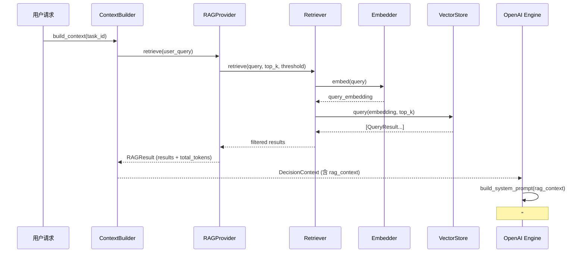

# RAG 模块设计与实现文档

> 📅 编写时间：2026-02-26
>
> 📦 模块路径：`control_platform/rag/`
>
> 🎯 定位：为 Arthas MCP 智能诊断平台提供 **检索增强生成（Retrieval-Augmented Generation）** 能力，通过知识库检索增强 LLM 在 Java 应用诊断场景中的推理准确性。

---

## 一、设计目标

| 目标 | 说明 |
|------|------|
| **增强诊断准确性** | 将 Arthas 工具文档、排查手册、历史案例等知识注入 LLM 上下文，减少幻觉 |
| **松耦合集成** | RAG 模块作为**可选增强**接入现有决策引擎，关闭后系统行为与原有完全一致 |
| **可替换存储** | 向量数据库通过抽象接口 + 工厂模式注入，可从 ChromaDB 无缝切换到 Qdrant/Milvus |
| **可扩展解析** | 文档解析器通过注册表分发，新增文件格式只需实现一个 Chunker 并注册 |
| **Token 预算感知** | RAG 知识纳入上下文窗口管理器的 Token 预算，不会挤压历史对话空间 |
| **优雅降级** | 任何环节异常（索引失败、检索超时、无结果）均返回 None，不阻断主流程 |

---

## 二、整体架构

### 2.1 组件关系图

```
┌─────────────────────────────────────────────────────────────────────┐
│                         外部调用层                                   │
│                                                                     │
│  ContextBuilder ──────────┐                                         │
│        │                  │                                         │
│        ▼                  ▼                                         │
│  RAGProvider (唯一对外接口)                                          │
│  ┌────────────────────────────────────────────────────────────┐     │
│  │  build_index()          retrieve()                         │     │
│  │       │                     │                              │     │
│  │       ▼                     ▼                              │     │
│  │  ChunkerRegistry       Retriever                           │     │
│  │       │                  │      │                          │     │
│  │       ▼                  ▼      ▼                          │     │
│  │  MarkdownChunker     Embedder  BaseVectorStore (抽象)      │     │
│  │  (可扩展)               │           │                      │     │
│  │                         │      ┌────┴──────────┐           │     │
│  │                         │      │ ChromaDB      │           │     │
│  │                         │      │ (可替换)      │           │     │
│  │                         │      └───────────────┘           │     │
│  │                         ▼                                  │     │
│  │                   OpenAI Embedding API                     │     │
│  └────────────────────────────────────────────────────────────┘     │
│                                                                     │
│  ContextWindowManager ◄── rag_context.total_tokens (Token 预算扣除) │
│  build_system_prompt  ◄── rag_context (注入 "## 参考知识" 段落)     │
└─────────────────────────────────────────────────────────────────────┘
```

### 2.2 数据流图



---

## 三、目录结构

```
control_platform/rag/
├── __init__.py               # 模块入口，导出核心类型
├── base_vector_store.py      # 向量数据库抽象基类 (BaseVectorStore, QueryResult)
├── base_chunker.py           # 文档解析器抽象基类 (BaseChunker, DocumentChunk)
├── embedder.py               # Embedding 封装 (OpenAI API)
├── markdown_chunker.py       # Markdown 文档解析器
├── chunker_registry.py       # 解析器注册表（扩展名 → Chunker 分发）
├── chroma_vector_store.py    # ChromaDB 向量数据库实现
├── vector_store_factory.py   # 向量数据库工厂
├── retriever.py              # 知识检索器
└── provider.py               # RAG 统一入口 (RAGProvider)

knowledge/                    # 知识库文档目录
├── tool_docs/                # Arthas 工具文档
│   ├── thread.md
│   ├── jvm.md
│   └── watch.md
├── troubleshooting/          # 排查手册
│   ├── cpu_troubleshooting.md
│   └── memory_troubleshooting.md
└── cases/                    # 历史诊断案例
    └── case_cpu_spike.md

control_platform/tests/test_rag/   # 测试目录
├── conftest.py               # 测试 fixtures
├── test_embedder.py
├── test_markdown_chunker.py
├── test_chunker_registry.py
├── test_chroma_vector_store.py
├── test_vector_store_factory.py
├── test_retriever.py
├── test_provider.py          # RAGProvider 端到端测试
└── test_rag_integration.py   # 与决策引擎的集成测试
```

---

## 四、核心组件详解

### 4.1 BaseVectorStore — 向量数据库抽象接口

**文件**：`base_vector_store.py`

**设计思路**：定义统一的 CRUD + 查询接口，所有上层组件（Retriever、Provider）仅依赖此抽象接口，不感知底层具体实现。

```python
class BaseVectorStore(ABC):
    def add_documents(self, documents, embeddings, metadatas, ids) -> None: ...
    def query(self, query_embedding, top_k=3, filter=None) -> List[QueryResult]: ...
    def delete(self, ids) -> None: ...
    def count(self) -> int: ...
    def reset(self) -> None: ...
```

**QueryResult 数据结构**：

| 字段 | 类型 | 说明 |
|------|------|------|
| `document` | `str` | 知识片段原始文本 |
| `score` | `float` | 相似度分数（0~1，越高越相似） |
| `metadata` | `dict` | 元数据（source_file、heading_path 等） |
| `id` | `str` | 文档在向量库中的唯一标识 |

**替换向量数据库只需**：
1. 新建 `xxx_vector_store.py` 继承 `BaseVectorStore`
2. 在 `VectorStoreFactory._STORE_REGISTRY` 中注册映射
3. 在 `requirements.txt` 中添加依赖

---

### 4.2 BaseChunker — 文档解析器抽象接口

**文件**：`base_chunker.py`

**设计思路**：定义统一的文档切片接口，`ChunkerRegistry` 根据文件扩展名自动分发。

```python
class BaseChunker(ABC):
    def supported_extensions(self) -> List[str]: ...
    def chunk(self, file_path, metadata=None) -> List[DocumentChunk]: ...
```

**DocumentChunk 数据结构**：

| 字段 | 类型 | 说明 |
|------|------|------|
| `content` | `str` | 知识片段文本 |
| `metadata` | `dict` | 元数据（至少含 source_file、file_type） |
| `chunk_id` | `str` | 全局唯一标识，格式 `{file_hash}_{chunk_index}` |

**新增文档格式支持只需**：
1. 新建 `xxx_chunker.py` 继承 `BaseChunker`
2. 在 `ChunkerRegistry.__init__` 中调用 `self.register(XxxChunker())`

---

### 4.3 MarkdownChunker — Markdown 解析器

**文件**：`markdown_chunker.py`

**切分策略**：按 Markdown 标题层级（`#` / `##` / `###`）切分文档，每个标题下的内容作为一个独立知识片段。

**核心处理逻辑**：

1. **逐行扫描**，使用正则 `^(#{1,6})\s+(.+)$` 识别标题行
2. **代码块免疫**：跟踪 ` ``` ` 状态，代码块内的 `#` 不误判为标题
3. **标题栈维护**：遇到新标题时弹出所有 `level >=` 当前的旧标题，维护层级路径
4. **heading_path 生成**：如 `"thread 命令 > 使用方式 > 查找最忙线程"`
5. **chunk_id 生成**：`{file_md5_12位}_{序号}`，保证全局唯一

**元数据示例**：

```json
{
    "source_file": "/path/to/thread.md",
    "file_name": "thread.md",
    "file_type": "markdown",
    "heading_path": "thread 命令 > 使用方式 > 查找最忙线程",
    "source_type": "tool_doc"
}
```

---

### 4.4 ChunkerRegistry — 解析器注册表

**文件**：`chunker_registry.py`

**职责**：管理 `文件扩展名 → Chunker` 的映射关系，按扩展名分发解析请求。

- 初始化时自动注册内置的 `MarkdownChunker`（支持 `.md`、`.markdown`）
- 提供 `register()` 方法供外部注册自定义 Chunker
- `chunk_file()` 方法根据文件扩展名查找 Chunker 并调用
- 未注册的扩展名记录 WARNING 日志并返回空列表

---

### 4.5 Embedder — 向量生成器

**文件**：`embedder.py`

**职责**：封装 OpenAI Embedding API，将文本转换为向量表示。

- 复用项目现有的 `llm_api_key` 和 `llm_base_url` 配置
- 默认模型：`text-embedding-3-small`（可通过 `rag_embedding_model` 配置）
- 支持 `embed(text)` 单条和 `embed_batch(texts)` 批量
- 按 `response.data[i].index` 排序确保输出顺序与输入一致
- 异常时返回空列表，记录 WARNING 日志

---

### 4.6 ChromaVectorStore — ChromaDB 实现

**文件**：`chroma_vector_store.py`

**特性**：

| 特性 | 说明 |
|------|------|
| **持久化模式** | `PersistentClient(path=rag_store_path)`，数据持久化到本地磁盘 |
| **内存模式** | `persist_directory` 为空时使用 `EphemeralClient()`，用于测试 |
| **相似度算法** | 余弦相似度（`hnsw:space: cosine`） |
| **距离转换** | `score = 1.0 - cosine_distance`，统一为 0~1 的相似度分数 |
| **reset 实现** | 删除并重建集合，保留原有 metadata 配置 |

---

### 4.7 VectorStoreFactory — 工厂模式

**文件**：`vector_store_factory.py`

**注册表**（延迟导入）：

```python
_STORE_REGISTRY = {
    "chroma": "control_platform.rag.chroma_vector_store.ChromaVectorStore",
}
```

- 根据 `settings.rag_store_type` 动态实例化对应实现
- 使用 `importlib.import_module` 延迟导入，避免不必要的依赖
- 新增向量库只需在 `_STORE_REGISTRY` 添加一行映射

---

### 4.8 Retriever — 知识检索器

**文件**：`retriever.py`

**检索流程**：

```
用户查询 → Embedder.embed() → VectorStore.query(top_k) → 阈值过滤 → 降序排列 → 截断返回
```

**参数说明**：

| 参数 | 默认值 | 说明 |
|------|--------|------|
| `top_k` | 3 | 返回最相似的前 K 个结果 |
| `similarity_threshold` | 0.3 | 过滤掉相似度低于此值的结果 |
| `filter` | None | 可选的元数据过滤条件（如 `{"source_type": "tool_doc"}`） |

**异常处理**：任何环节（Embedding 失败、查询失败）均返回空列表，不抛异常。

---

### 4.9 RAGProvider — 统一入口

**文件**：`provider.py`

**职责**：RAG 模块的**唯一对外接口**，供 `ContextBuilder` 调用。内部组装所有子组件。

#### 对外方法

| 方法 | 说明 |
|------|------|
| `build_index() → int` | 扫描知识库目录，切片 → Embedding → 写入向量库，返回新增片段数 |
| `retrieve(user_query) → RAGResult \| None` | 检索 → Token 截断 → 返回结果 |
| `is_available → bool` | RAG 是否可用（初始化成功且配置启用） |

#### 索引构建流程

```
knowledge/ 目录遍历
    → 文件 hash 比对（增量跳过未变更文件）
    → 目录名检测知识源类型（tool_doc / troubleshooting_guide / historical_case）
    → ChunkerRegistry.chunk_file()
    → Embedder.embed_batch()
    → VectorStore.add_documents()
    → 记录 hash 缓存
```

#### Token 预算截断

按相似度降序保留片段，累计 token 超过 `rag_max_tokens` 时停止。确保至少保留 1 个片段（即使单个片段已超预算）。

#### 降级模式

| 触发条件 | 行为 |
|----------|------|
| `rag_enabled=False` | 不初始化任何组件，所有方法返回 0 / None |
| 知识库目录不存在 | 记录 WARNING，`build_index()` 返回 0 |
| 初始化异常（如缺少 chromadb） | `is_available=False`，`retrieve()` 返回 None |
| 检索异常 | 记录 WARNING，返回 None，不阻断主流程 |

---

## 五、与现有系统的集成

### 5.1 集成点总览

RAG 模块通过 **3 个集成点** 融入现有决策流程，每个集成点都设计为可选增强：

```
ContextBuilder       →  调用 RAGProvider.retrieve()，填充 rag_context
build_system_prompt  →  将 rag_context 格式化为 "## 参考知识" 段落
ContextWindowManager →  从可用预算中扣除 rag_context.total_tokens
```

### 5.2 ContextBuilder 集成

`ContextBuilder.__init__` 接受可选的 `rag_provider` 参数：

```python
class ContextBuilder:
    def __init__(self, rag_provider: Optional[RAGProvider] = None):
        self._rag_provider = rag_provider
```

在 `build_context()` 的第 5 步中，如果 RAGProvider 可用且有用户查询，则执行检索：

```python
# 5. RAG 知识检索
rag_context = None
if self._rag_provider and user_query:
    rag_result = self._rag_provider.retrieve(user_query)
    if rag_result and rag_result.results:
        rag_context = {
            "results": [...],
            "total_tokens": rag_result.total_tokens,
        }
```

检索结果被写入 `DecisionContext.rag_context` 字段。

### 5.3 System Prompt 注入

`build_system_prompt()` 函数在 **角色设定（_ROLE_PROMPT）** 和 **ReAct 指令（_REACT_PROMPT）** 之间插入 RAG 知识段落：

```
[角色设定]
[## 参考知识]   ← RAG 注入位置
[ReAct 指令]
[工具列表]
```

RAG 段落格式：

```markdown
## 参考知识
以下是与用户问题相关的 Arthas 诊断知识，请参考但不要照搬，结合实际情况分析：

### 来源: thread.md > thread 命令 > 使用方式 > 查找最忙线程（相似度: 0.92）
thread -n 3 可以找出最忙的前3个线程...

### 来源: cpu_troubleshooting.md > CPU 排查步骤（相似度: 0.85）
CPU 使用率高时，首先使用 thread -n 3 查看...
```

### 5.4 Token 预算管理

`ContextWindowManager.optimize()` 在计算可用预算时，从总预算中扣除 RAG 占用的 token 数：

```python
if context.rag_context and context.rag_context.get("total_tokens"):
    rag_tokens = context.rag_context["total_tokens"]
    available_budget = max(available_budget - rag_tokens, 0)
```

这确保了 RAG 知识不会挤压历史对话的 token 空间。

---

## 六、配置项

所有配置项位于 `control_platform/config.py`，通过环境变量覆盖：

| 配置项 | 默认值 | 说明 |
|--------|--------|------|
| `rag_enabled` | `True` | 是否启用 RAG 知识检索增强 |
| `rag_knowledge_dir` | `"knowledge/"` | 知识库文档目录路径 |
| `rag_store_type` | `"chroma"` | 向量数据库类型 |
| `rag_store_path` | `"data/vector_db/"` | 向量数据库本地持久化路径 |
| `rag_store_url` | `""` | 向量数据库远程地址（仅远程模式使用） |
| `rag_top_k` | `3` | 检索返回的最大知识片段数 |
| `rag_similarity_threshold` | `0.3` | 相似度过滤阈值（0~1） |
| `rag_max_tokens` | `2048` | RAG 知识的 token 预算上限 |
| `rag_embedding_model` | `"text-embedding-3-small"` | Embedding 模型名称 |

**环境变量示例**：

```bash
export CP_RAG_ENABLED=true
export CP_RAG_KNOWLEDGE_DIR=./knowledge/
export CP_RAG_STORE_TYPE=chroma
export CP_RAG_TOP_K=5
export CP_RAG_SIMILARITY_THRESHOLD=0.4
export CP_RAG_MAX_TOKENS=4096
export CP_RAG_EMBEDDING_MODEL=text-embedding-3-large
```

---

## 七、知识库规范

### 7.1 目录约定

知识库根目录下的**子目录名称**用于自动检测知识源类型：

| 子目录 | 自动识别的 `source_type` | 用途 |
|--------|--------------------------|------|
| `tool_docs/` | `tool_doc` | Arthas 工具使用文档 |
| `troubleshooting/` | `troubleshooting_guide` | 问题排查手册 |
| `cases/` | `historical_case` | 历史诊断案例 |
| 其他 | `general` | 通用知识 |

### 7.2 Markdown 文档编写建议

- 使用清晰的标题层级（`#` → `##` → `###`），每个标题段落即为一个独立知识片段
- 命令用法用代码块包裹（` ``` ` 块内的 `#` 不会被误判为标题）
- 每个文档围绕一个主题，避免单文档过大
- 元数据自动从文件路径和标题层级中提取，无需手动标注

---

## 八、扩展指南

### 8.1 新增向量数据库（以 Qdrant 为例）

**Step 1**：创建实现文件 `rag/qdrant_vector_store.py`

```python
from control_platform.rag.base_vector_store import BaseVectorStore, QueryResult

class QdrantVectorStore(BaseVectorStore):
    def __init__(self, url: str = "", collection_name: str = "arthas_knowledge"):
        # 初始化 Qdrant 客户端
        ...

    def add_documents(self, documents, embeddings, metadatas, ids): ...
    def query(self, query_embedding, top_k=3, filter=None) -> List[QueryResult]: ...
    def delete(self, ids): ...
    def count(self) -> int: ...
    def reset(self): ...
```

**Step 2**：在 `vector_store_factory.py` 注册

```python
_STORE_REGISTRY = {
    "chroma": "control_platform.rag.chroma_vector_store.ChromaVectorStore",
    "qdrant": "control_platform.rag.qdrant_vector_store.QdrantVectorStore",  # 新增
}
```

**Step 3**：修改配置

```bash
export CP_RAG_STORE_TYPE=qdrant
export CP_RAG_STORE_URL=http://localhost:6333
```

**无需修改** Retriever、Provider、ContextBuilder 等任何上层代码。

### 8.2 新增文档格式（以 PDF 为例）

**Step 1**：创建实现文件 `rag/pdf_chunker.py`

```python
from control_platform.rag.base_chunker import BaseChunker, DocumentChunk

class PdfChunker(BaseChunker):
    def supported_extensions(self) -> List[str]:
        return [".pdf"]

    def chunk(self, file_path, metadata=None) -> List[DocumentChunk]:
        # 使用 PyPDF2/pdfplumber 解析 PDF
        ...
```

**Step 2**：在 `chunker_registry.py` 注册

```python
def _register_builtins(self):
    from control_platform.rag.markdown_chunker import MarkdownChunker
    from control_platform.rag.pdf_chunker import PdfChunker
    self.register(MarkdownChunker())
    self.register(PdfChunker())  # 新增
```

**无需修改** Provider、Retriever 等任何上层代码。

---

## 九、测试覆盖

### 9.1 测试矩阵

共 **43 个测试用例**，全部通过：

| 测试文件 | 用例数 | 覆盖内容 |
|---------|--------|---------|
| `test_embedder.py` | 5 | 单条/批量 Embedding、空列表、超时、无效 Key |
| `test_markdown_chunker.py` | 7 | 多级标题、代码块免疫、空文档、无标题、元数据、ID 唯一 |
| `test_chunker_registry.py` | 5 | 内置注册、扩展名分发、未知扩展、自定义注册、大小写 |
| `test_chroma_vector_store.py` | 6 | 写入/检索/过滤/删除/重置/空查询 |
| `test_vector_store_factory.py` | 4 | 创建 Chroma、大小写、无效类型、支持列表 |
| `test_retriever.py` | 6 | 相似度过滤、TopK、降序、Embedding 失败、异常、全低于阈值 |
| `test_provider.py` | 4 | 完整流程（Mock Embedding）、Token 截断、禁用模式、增量构建 |
| `test_rag_integration.py` | 6 | Prompt 注入验证、无 RAG 降级、ContextBuilder 集成、Token 预算扣除 |

### 9.2 测试策略

- **单元测试**：每个组件独立测试，外部依赖通过 Mock 隔离
- **ChromaDB 测试**：使用 `EphemeralClient()` 内存模式 + 唯一集合名避免数据残留
- **Embedding API 测试**：Mock `OpenAI.embeddings.create()` 返回固定向量
- **集成测试**：验证 `ContextBuilder → RAGProvider → build_system_prompt` 完整链路
- **降级测试**：验证 RAG 禁用/异常时系统行为与原有一致

### 9.3 运行测试

```bash
# 运行 RAG 模块全部测试
python -m pytest control_platform/tests/test_rag/ -v

# 运行单个测试文件
python -m pytest control_platform/tests/test_rag/test_provider.py -v

# 运行全部项目测试
python -m pytest control_platform/tests/ -v
```

---

## 十、设计决策记录

### Q1：为什么不用 LlamaIndex / LangChain？

> 当前知识库规模小（几十个 Markdown 文件），使用框架会引入大量不需要的依赖和复杂性。自行实现只需 ~400 行核心代码，完全可控，且接口设计预留了足够的扩展性。未来若需要更复杂的检索策略（Hybrid Search、Re-ranking），可以在现有抽象层上按需扩展。

### Q2：为什么选择 ChromaDB 作为默认向量库？

> ChromaDB 是纯 Python 库，`pip install` 即可使用，无需额外部署服务。支持本地持久化和内存模式，开发/测试体验好。通过抽象接口和工厂模式，可以随时替换为 Qdrant/Milvus 等生产级方案。

### Q3：RAG 知识为什么注入到 System Prompt 而不是单独的 message？

> 注入到 System Prompt 的 `角色设定` 和 `ReAct 指令` 之间，让 LLM 在理解角色后立即获得领域知识，再进入推理流程。相比单独 message，这种方式在实测中 LLM 对知识的利用率更高。

### Q4：增量索引是如何工作的？

> `RAGProvider` 内部维护 `_indexed_hashes` 字典（`{file_md5: file_path}`）。每次 `build_index()` 时，先计算文件 MD5，若 hash 已存在则跳过该文件。这意味着只有新增或修改的文件才会重新索引。注意：当前增量缓存是内存级的，进程重启后会全量重建。

### Q5：Token 预算如何协调？

> `ContextWindowManager` 的可用预算 = `总预算 - RAG token 占用`。RAG 的 token 占用由 `RAGProvider` 在检索时计算并写入 `rag_context["total_tokens"]`。此外 `RAGProvider` 自身也有 `rag_max_tokens` 限制，确保 RAG 部分不会无限膨胀。

---

## 十一、依赖

在 `requirements.txt` 中新增：

```
chromadb>=0.4.0
```

`openai` 已是项目现有依赖（Embedding API 复用 LLM 的 OpenAI SDK）。
