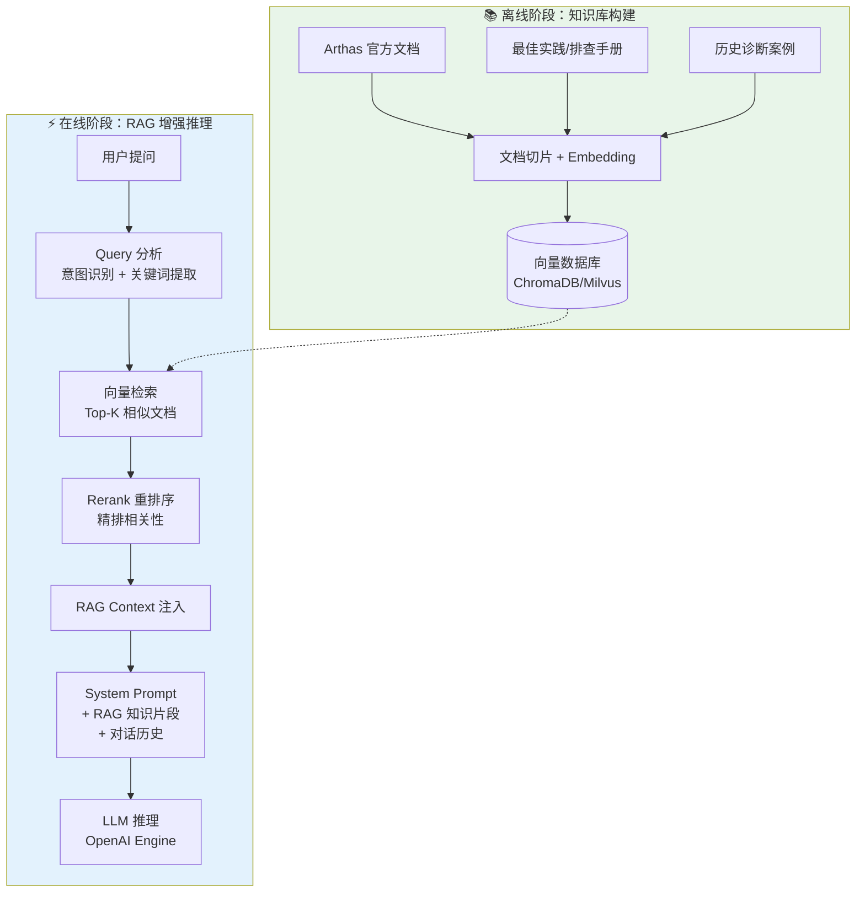

[任务规划完成]
我先来全面了解一下当前项目的整体架构和代码情况，然后再给出评价和 RAG 设计建议。
[查找目录]
好的，项目结构很清晰。让我深入了解各个核心模块的代码。
[读取文件]
让我继续查看剩余的关键模块：
[读取文件]
我已经对整个项目有了全面的了解。以下是我的综合评价和 RAG 设计建议。

---

## 一、项目现状评价

### ✅ 做得好的地方

1. **架构分层清晰** — 项目按 `protocol` → `session` → `event` → `decision` → `executor` → `db` 分层，职责边界明确，符合洋葱/六边形架构风格。

2. **事件驱动状态机设计优秀** — `USER_QUERY → LLM_THINKING → TOOL_CALL → TOOL_RESULT → LLM_THINKING → ... → LLM_CONCLUSION` 的 Stage 链式状态机设计很清晰，每个 StageType 有独立 Handler，ReAct 循环的编排干净利落。

3. **幂等性和容错考虑充分** — 每个 Handler 的 docstring 都标注了幂等性保证策略，TOOL_CALL 的冷却机制（`last_sent_at`）、Java 端 `putIfAbsent` 幂等保护、失败重试计数（`retry_count / max_retries`）、启动时故障恢复（`check_and_fail_stale_tasks`）都做得很到位。

4. **上下文窗口管理体系完整** — Token 计数 → 工具结果即时摘要 → 全文 LLM 摘要 → 滑动窗口硬裁剪的四层管道设计很有层次，延迟持久化 `CONTEXT_SUMMARY` 的策略（只有 tool_call 继续时才持久化）也很精巧。

5. **可观测性好** — Prompt 日志（`LlmPromptLog` 表）、完整的 Timeline 渲染、conversation 回放 API 都有，方便调试。

6. **双 JSON/Function-Calling 兼容** — OpenAI 标准 function calling + 文本 JSON fallback 的双模式解析，对不同模型兼容性好。

7. **审核机制** — 高危命令（heapdump、redefine 等）的 approval 流程完整（waiting_approval → approve/reject），reject 后自动回 LLM_THINKING 重新决策。

8. **测试覆盖** — 看到了每个模块都有对应的 test 目录，测试意识好。

### ⚠️ 可以改进的地方（不包括 MySQL 和分布式锁）

1. **`main.py` 过重（1100+ 行）** — WebSocket 处理、REST API、工具调用回调、对话渲染都在一个文件里，建议拆分为 `api/`, `ws/` 等子模块。

2. **`_build_chat_messages_for_display` 与 `OpenAIDecisionEngine._build_chat_messages` 重复** — 两处几乎相同的逻辑，违反 DRY，可以抽成共享方法。

3. **`DecisionContext.rag_context` 目前还是 `None` 占位** — 预留了字段但没有填充逻辑，正好引出你的下一个问题。

4. **缺少限流/速率控制** — 对 LLM API 调用没有看到并发限制或速率限制，高并发时可能遇到 API rate limit。

5. **缺少 Metrics/监控接口** — `/api/status` 有基本统计，但没有 Prometheus metrics 之类的，运营时不方便观测。

---

## 二、RAG 设计方案

你的核心诉求是：**用 RAG 引入 Arthas 领域知识，指导 LLM 更精准地排查问题**。

### 整体设计思路



### 分层架构设计

```
control_platform/
├── rag/                           # 新增 RAG 模块
│   ├── __init__.py
│   ├── config.py                  # RAG 专属配置
│   ├── knowledge_base/            # 知识库管理
│   │   ├── __init__.py
│   │   ├── loader.py              # 文档加载器（Markdown/PDF/代码）
│   │   ├── chunker.py             # 文档切片策略
│   │   └── indexer.py             # 向量索引构建/更新
│   ├── retriever/                 # 检索层
│   │   ├── __init__.py
│   │   ├── base.py                # 检索器抽象接口
│   │   ├── vector_retriever.py    # 向量相似度检索
│   │   ├── keyword_retriever.py   # 关键词/BM25 检索
│   │   └── hybrid_retriever.py    # 混合检索（向量+关键词）
│   ├── reranker.py                # 重排序（可选，提升精度）
│   ├── context_assembler.py       # RAG 上下文组装器
│   └── provider.py                # RAG Provider（统一入口）
```

### 关键设计细节

#### 1. 知识库内容分三类

| 类别 | 内容 | 切片策略 | 检索触发时机 |
|------|------|---------|-------------|
| **工具文档** | Arthas 每个命令的用法、参数、输出格式 | 按命令切片，每个命令一个 chunk | LLM_THINKING 前，根据可用 tools 自动注入 |
| **排查手册** | CPU 飙高、内存泄漏、死锁等典型场景的排查步骤 | 按场景切片 | 首次 LLM_THINKING，根据 user_query 语义检索 |
| **历史案例** | 过去成功的诊断案例（问题→步骤→结论） | 按案例切片 | 首次 LLM_THINKING，Few-shot 学习 |

#### 2. 接入点：在 `ContextBuilder.build_context` 中注入

```python
# decision/context_builder.py 中的修改
async def build_context(self, task_id, repo) -> DecisionContext:
    # ... 原有逻辑 ...
    
    # 🆕 RAG 检索增强
    rag_context = None
    if self._rag_provider:
        rag_context = await self._rag_provider.retrieve(
            user_query=task.user_query,
            available_tools=available_tools,
            conversation_history=messages,  # 传入对话历史做多轮感知
        )
    
    context = DecisionContext(
        task_id=task_id,
        ...,
        rag_context=rag_context,  # 填充预留字段
    )
    return context
```

#### 3. RAG Context 注入到 System Prompt

```python
# decision/openai_engine.py 中的修改
def _build_chat_messages(self, context, system_prompt):
    chat_messages = [{"role": "system", "content": system_prompt}]
    
    # 🆕 在 system prompt 之后注入 RAG 知识
    if context.rag_context:
        rag_prompt = self._format_rag_context(context.rag_context)
        chat_messages.append({
            "role": "system",
            "content": rag_prompt,
        })
    
    # ... 原有消息构建 ...
```

RAG 注入的 prompt 格式建议：

```
## 参考知识（来自 Arthas 文档和历史案例，请结合实际情况判断）

### 相关排查步骤
[检索到的排查手册片段]

### 相关工具用法
[检索到的工具文档片段]

### 类似案例
[检索到的历史诊断案例]
```

#### 4. `DecisionContext.rag_context` 数据结构

```python
@dataclass
class RagContext:
    """RAG 检索结果"""
    # 检索到的知识片段，按相关性降序
    chunks: List[RagChunk]
    # 总 token 估算（用于上下文预算管理）
    total_tokens: int
    # 检索耗时（ms）
    retrieval_time_ms: float
    # 使用的检索策略
    strategy: str  # "vector" | "keyword" | "hybrid"

@dataclass 
class RagChunk:
    """单个 RAG 知识片段"""
    content: str           # 文本内容
    source: str            # 来源（文档路径/案例ID）
    category: str          # "tool_doc" | "troubleshoot_guide" | "case_study"
    relevance_score: float # 相关性分数
    tokens: int            # token 数
```

#### 5. 与上下文窗口管理的协作

RAG 内容也需要占 token 预算。建议在 `ContextWindowManager` 中增加 RAG 预算管理：

```
总预算 = context_max_tokens - context_reserved_tokens
       = system_prompt 预留 + RAG 预留 + 对话历史预留

建议分配:
- system_prompt + tools schema: ~8K tokens（已有 context_reserved_tokens）
- RAG 知识片段: ~4K tokens（新增 rag_max_tokens 配置项）
- 对话历史: 剩余全部
```

#### 6. 推荐的技术选型

| 组件 | 推荐方案 | 理由 |
|------|---------|------|
| 向量数据库 | **ChromaDB**（单机）/ Milvus（分布式） | ChromaDB 零依赖、嵌入式，和 SQLite 定位一致，先跑起来再升级 |
| Embedding 模型 | **text-embedding-3-small**（OpenAI）或 **bge-m3**（本地） | 中文效果好，且你已有 OpenAI 兼容 API |
| 切片策略 | **递归字符切片** + 按 Markdown 标题切片 | Arthas 文档是 Markdown 格式，天然适合按标题切 |
| 重排序 | **Cohere Rerank** 或 **bge-reranker**（可选） | 前期可不加，混合检索即可 |

#### 7. 分阶段实施建议

**Phase 1：静态工具文档注入（最快见效）**
- 把 Arthas 每个命令的文档 hardcode 成 dict，用户提问时根据问题类型/关键词匹配注入
- 不需要向量数据库，纯规则匹配
- 预计 1-2 天可完成

**Phase 2：向量检索 + 排查手册**
- 引入 ChromaDB，导入 Arthas 官方文档 + 排查手册
- 在 `build_context` 中做语义检索
- 预计 3-5 天

**Phase 3：历史案例学习（Few-shot）**
- 将成功的诊断案例（问题→工具调用链→结论）存入知识库
- 检索相似案例作为 Few-shot 示例
- 利用已有的 `LlmPromptLog` 和 `DiagnosisTask` 表自动提取案例
- 预计 3-5 天

**Phase 4：动态知识更新**
- 每次诊断成功后自动将案例入库
- 用户反馈机制（结论好/差标记）优化检索排序

---

### 总结

项目当前完成度很高，核心的 **事件驱动状态机 + ReAct 循环 + 上下文管理 + 审核机制** 都已经跑通了。引入 RAG 的最佳切入点就是已经预留好的 `DecisionContext.rag_context` 字段和 `ContextBuilder`，不需要改动状态机和 Handler 的编排逻辑，只需要在推理前"注入更多知识"即可。

建议从 **Phase 1（静态工具文档注入）** 开始，先验证 RAG 对诊断质量的提升效果，再逐步引入向量检索和案例学习。你觉得这个方案怎么样？需要我开始实施哪个阶段？


[任务规划完成]
这是一个很好的问题。让我先回顾一下当前的 RAG 设计细节，再对比主流生产环境 RAG 的最佳实践来做分析。
[读取文件]
好的，我已经完整审阅了当前 RAG 模块的全部设计与代码实现。下面从**主流生产环境 RAG 系统**的角度，做一个系统性的差距分析。

---

## 当前 RAG 设计 vs 主流生产环境 RAG 的差距分析

### ✅ 做得好的地方（与主流一致）

| 维度 | 当前设计 | 评价 |
|------|---------|------|
| **模块化/可替换** | 抽象接口 + 工厂模式，向量库/Chunker 均可替换 | 👍 设计非常规范，甚至优于很多生产系统 |
| **优雅降级** | 任何环节异常返回 None，不阻断主流程 | 👍 生产必备能力 |
| **Token 预算感知** | RAG 结果纳入上下文窗口管理 | 👍 这是很多团队忽略的点，做得好 |
| **增量索引** | 基于文件 MD5 跳过未变更文件 | 👍 基本的增量能力已具备 |
| **松耦合集成** | ContextBuilder 可选注入 RAGProvider | 👍 对原有系统零入侵 |

---

### ⚠️ 有差距但当前阶段可接受的地方

#### 1. **分块策略偏简单（Naive Chunking）**

| 维度 | 当前 | 主流做法 |
|------|------|---------|
| 分块方式 | 按 Markdown 标题切分，每个 `#/##/###` 段落为一个 chunk | **Recursive Character Splitting** + 语义边界检测 |
| Chunk 大小控制 | ❌ 无限制，一个标题段落可能很长也可能只有一行 | 通常 **chunk_size=512~1024 tokens**，chunk_overlap=50~200 |
| 上下文保留 | ❌ 各 chunk 之间无重叠 | **Sliding Window Overlap**（相邻 chunk 有重叠内容，避免语义断裂） |

**影响**：如果一个 `##` 段落非常长（如 2000 tokens），整段作为一个 chunk 既浪费向量空间又降低检索精度；如果只有一行，又太碎片化。

**建议优先级**：🟡 中 — 当前知识库都是结构化的 Arthas 文档，标题段落大小比较可控，暂时够用。但扩大知识库后需要改。

---

#### 2. **缺少 Query 改写 / 扩展**

| 维度 | 当前 | 主流做法 |
|------|------|---------|
| 查询处理 | 直接用原始 user_query 做 Embedding | **Query Rewriting / HyDE / Multi-Query** |

主流做法：
- **HyDE (Hypothetical Document Embedding)**：先让 LLM 生成一个"假设性回答"，再用这个回答去检索（因为回答和知识片段的语义更接近）
- **Multi-Query**：将原始查询改写为 3~5 个不同角度的查询，分别检索后合并去重
- **Query Decomposition**：复杂问题拆分为子问题分别检索

**影响**：当用户问题很口语化（如"我的应用卡了怎么办"）时，直接 Embedding 可能和技术文档（"CPU 使用率过高排查步骤"）的语义距离较远，导致召回率不足。

**建议优先级**：🟡 中 — 你的场景是 Arthas 诊断，用户问题通常已经比较技术化，差距不大。

---

#### 3. **缺少 Re-ranking（重排序）**

| 维度 | 当前 | 主流做法 |
|------|------|---------|
| 排序方式 | 纯向量余弦相似度排序 | **Two-Stage: 向量召回 → Cross-Encoder 精排** |

主流做法：
- 第一阶段：向量检索 top_k=20（粗召回）
- 第二阶段：用 **Cross-Encoder**（如 `bge-reranker-v2-m3`、`cohere-rerank`）对 20 个结果做精排，取 top 3~5

**影响**：向量检索（Bi-Encoder）速度快但精度有限，Cross-Encoder 精度高但速度慢。Two-Stage 是目前业界共识的最佳方案。

**建议优先级**：🟢 低 — 当前知识库小（几十个文档），top_k=3 基本够用，上了量再考虑。

---

#### 4. **缺少混合检索（Hybrid Search）**

| 维度 | 当前 | 主流做法 |
|------|------|---------|
| 检索方式 | 纯向量语义检索 | **Hybrid = 向量检索 + BM25 关键词检索** |

主流做法：
- BM25（稀疏检索）擅长精确关键词匹配（如命令名 `thread -n 3`、类名 `java.lang.OutOfMemoryError`）
- 向量（稠密检索）擅长语义理解
- **RRF (Reciprocal Rank Fusion)** 融合两者的排序结果

**影响**：纯向量检索在你的场景下可能会漏掉一些关键词精确匹配的场景，比如用户问"watch 命令怎么用"，BM25 能直接匹配到 `watch.md`，而向量检索可能会因为语义模糊返回其他工具文档。

**建议优先级**：🟡 中 — 对 Arthas 这类命令行工具文档，关键词匹配其实非常重要。

---

#### 5. **缺少 Evaluation / 可观测性**

| 维度 | 当前 | 主流做法 |
|------|------|---------|
| 检索质量评估 | 无 | **RAGAS / TruLens / 自定义评估** |
| 可观测性 | 基础日志 | **LangSmith / Phoenix / 自定义 tracing** |

主流做法：
- **评估指标**：Context Recall / Context Precision / Faithfulness / Answer Relevancy
- **可观测性**：记录每次检索的 query → retrieved chunks → LLM response 完整链路，用于持续优化
- **A/B 测试**：不同分块策略、不同 top_k 的效果对比

**建议优先级**：🟡 中 — 后续迭代必须补上，否则无法量化 RAG 的效果。

---

### 🔴 与主流差距较大的地方

#### 6. **增量索引是内存级的，无持久化**

当前 `_indexed_hashes` 是一个内存字典，进程重启后丢失，会全量重建索引。

主流做法：
- 持久化到 SQLite / Redis / 向量库元数据中
- 支持文件删除检测（当前只能检测新增/修改，不能检测删除）
- 支持文件粒度的增量更新（先删旧 chunks 再加新 chunks）

**建议优先级**：🟠 中高 — 知识库稍大后每次重启都全量重建很浪费。

---

#### 7. **缺少 Chunk 上下文增强（Parent-Child / Context Window）**

| 维度 | 当前 | 主流做法 |
|------|------|---------|
| Chunk 返回 | 返回匹配的 chunk 原文 | **Small-to-Big / Parent Document Retriever** |

主流做法：
- 索引时用小 chunk（256 tokens）做检索粒度
- 返回时用大 chunk（1024 tokens）或整个 parent document section
- 这样既有精确的检索匹配，又能给 LLM 足够的上下文

**影响**：当前按标题切分，如果某个标题段落只有一两句话，LLM 获得的上下文可能不足以理解完整语义。

**建议优先级**：🟡 中

---

#### 8. **缺少 Embedding 缓存**

当前每次检索都调用 OpenAI Embedding API，没有缓存：

- 相同的 user_query 多次检索会重复调用 API（浪费钱+增加延迟）
- 主流做法：LRU Cache 或 Redis 缓存 query → embedding 的映射

**建议优先级**：🟠 中高 — 简单加一个 `functools.lru_cache` 就行，投入产出比很高。

---

### 📊 差距总览

```
┌────────────────────────────┬──────────┬──────────┬──────────────────────┐
│         能力维度             │  当前状态  │ 主流水平  │   建议优先级          │
├────────────────────────────┼──────────┼──────────┼──────────────────────┤
│ 模块化/可替换架构            │  ✅ 优     │  ✅       │  —                   │
│ 优雅降级                     │  ✅ 优     │  ✅       │  —                   │
│ Token 预算管理               │  ✅ 优     │  ✅       │  —                   │
│ Chunk 大小/Overlap 控制     │  ❌ 缺失   │  ✅       │  🟡 中               │
│ Query 改写 / HyDE           │  ❌ 缺失   │  ✅       │  🟡 中               │
│ Re-ranking (Cross-Encoder)  │  ❌ 缺失   │  ✅       │  🟢 低（量小不急）    │
│ Hybrid Search (BM25+向量)   │  ❌ 缺失   │  ✅       │  🟡 中（命令匹配重要）│
│ 检索质量评估 (RAGAS)         │  ❌ 缺失   │  ✅       │  🟡 中               │
│ 增量索引持久化               │  ⚠️ 内存级 │  ✅       │  🟠 中高             │
│ Embedding 缓存              │  ❌ 缺失   │  ✅       │  🟠 中高（简单收益大）│
│ Chunk 上下文增强             │  ❌ 缺失   │  ✅       │  🟡 中               │
│ 可观测性 / Tracing          │  ⚠️ 基础   │  ✅       │  🟡 中               │
└────────────────────────────┴──────────┴──────────┴──────────────────────┘
```

---

### 🎯 建议的演进路线

如果要逐步补齐差距，建议按以下顺序：

```
Phase 1 (快速见效，1-2天)
├── ① Embedding 缓存 (LRU Cache)
├── ② Chunk 大小限制 + Overlap
└── ③ 增量索引持久化 (SQLite / JSON)

Phase 2 (检索质量提升，3-5天)
├── ④ Hybrid Search (BM25 + 向量)
├── ⑤ Query 改写 (至少做关键词提取)
└── ⑥ 基础评估框架 (Context Precision/Recall)

Phase 3 (精细化，按需)
├── ⑦ Re-ranking (Cross-Encoder)
├── ⑧ Parent-Child Chunk 策略
└── ⑨ 完整可观测性 (Tracing)
```

---

### 总结

当前的 RAG 设计在**架构层面做得非常好**（模块化、可替换、松耦合、优雅降级），这是很多生产系统都达不到的水平。但在**检索策略层面**（分块、查询改写、混合检索、重排序、评估）偏基础，属于一个 **"架构成熟但策略简单" 的 V1 版本**。

对于当前阶段（小规模 Arthas 文档知识库），这个设计**完全够用**。但如果知识库规模扩大或对诊断准确率有更高要求，Phase 1 和 Phase 2 的能力需要逐步补上。好消息是你的抽象层设计得足够好，这些增强都可以在不破坏现有接口的前提下实现。


[任务规划完成]
好问题！你问的是主流 RAG（检索增强生成）系统在处理**分层结构文档（如 Markdown）的 chunk 上下文缺失**这个问题上，业界是怎么做的。我来总结一下主流方案：

## 主流 RAG 系统的做法

### 1. **Contextual Chunking（上下文注入） — Anthropic 推荐**

Anthropic 在 2024 年提出了 **Contextual Retrieval** 方案：

- 对每个 chunk，用 LLM 自动生成一段简短的上下文描述（context），说明这个 chunk 在整篇文档中的位置和角色
- 将这段上下文 **prepend 到 chunk 内容前面**，再做 embedding
- 例如：原始 chunk 是 `"-x 参数表示展开层级"`，注入后变成：
  > "本段内容来自 Arthas Java 诊断工具文档中 watch 命令的参数说明部分。-x 参数表示展开层级..."

**优点**：上下文信息最丰富，检索精度提升很多（Anthropic 报告减少 49% 的检索失败率）
**缺点**：需要对每个 chunk 调用一次 LLM，成本高（但可以用小模型或缓存优化）

### 2. **Parent-Child Retrieval（父子检索） — LlamaIndex / LangChain 主推**

这是 LlamaIndex 和 LangChain 中最常见的做法：

- **小 chunk 用于检索，大 chunk 用于回答**
- 将文档切成小 chunk 做 embedding（提高检索精度）
- 同时维护每个小 chunk 到其"父 chunk"（更大范围文本块）的映射
- 检索命中小 chunk 后，**返回的是父 chunk 的内容**给 LLM

```
小 chunk（检索用）："-x 参数表示展开层级"
    ↓ 映射到
父 chunk（回答用）："## watch 命令\nwatch 用于观察方法执行...\n### 参数说明\n-x 参数表示..."
```

**优点**：检索精准 + 回答上下文丰富
**缺点**：需要多层索引，存储成本增加

### 3. **Heading Hierarchy Prepend（标题层级前缀） — 最轻量的工业实践**

这是很多生产系统（包括 Notion AI、GitBook AI 等）的做法，也就是我们之前说的**方案 A**：

- 切 chunk 时，把**所有父级标题行**作为前缀拼到 content 里
- 简单高效，不需要额外的 LLM 调用

```
原始 chunk content:
  ### 参数说明
  -x 参数表示展开层级

注入后:
  # Arthas 使用指南
  ## watch 命令  
  ### 参数说明
  -x 参数表示展开层级
```

### 4. **Sliding Window + Overlap（滑动窗口重叠） — 通用文本常用**

- 切 chunk 时设置 overlap（如 chunk_size=512, overlap=128）
- 每个 chunk 与前后 chunk 有重叠内容，保证上下文连贯性
- **这个方法对 Markdown 标题层级问题帮助有限**，更适合纯文本连续内容

### 5. **Document Summary Index（文档摘要索引） — LlamaIndex**

- 先对整篇文档生成一个摘要
- 检索时先匹配文档摘要，再深入到具体 chunk
- 返回结果时，把文档摘要 + 命中 chunk 一起给 LLM

---

## 对比总结

| 方案 | 实现复杂度 | 效果 | 额外成本 | 代表系统 |
|------|-----------|------|---------|---------|
| Contextual Chunking (LLM注入) | 高 | ⭐⭐⭐⭐⭐ | LLM 调用 | Anthropic |
| Parent-Child Retrieval | 中 | ⭐⭐⭐⭐ | 多层索引 | LlamaIndex, LangChain |
| **标题层级前缀** | **低** | **⭐⭐⭐⭐** | **几乎无** | **Notion AI, GitBook AI** |
| Sliding Window Overlap | 低 | ⭐⭐⭐ | 少量存储 | OpenAI Cookbook |
| Document Summary Index | 中 | ⭐⭐⭐⭐ | LLM 调用 | LlamaIndex |

## 我的建议

对于你当前的项目，我建议**分两步走**：

1. **立即做：方案 3（标题层级前缀）** — 改动最小，效果立竿见影，只需要在 `markdown_chunker.py` 里把 `heading_stack` 中的标题行拼到 chunk content 前面
2. **后续优化：方案 2（Parent-Child）或方案 1（Contextual）** — 如果发现只有标题还不够（比如需要父级的正文内容），再升级

你想先实现哪个方案？