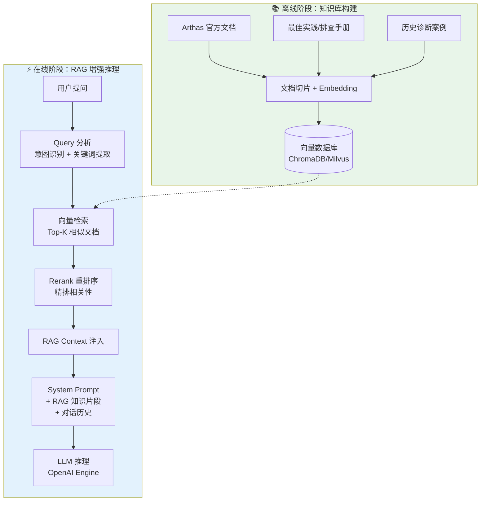

[任务规划完成]
我先来全面了解一下当前项目的整体架构和代码情况，然后再给出评价和 RAG 设计建议。
[查找目录]
好的，项目结构很清晰。让我深入了解各个核心模块的代码。
[读取文件]
让我继续查看剩余的关键模块：
[读取文件]
我已经对整个项目有了全面的了解。以下是我的综合评价和 RAG 设计建议。

---

## 一、项目现状评价

### ✅ 做得好的地方

1. **架构分层清晰** — 项目按 `protocol` → `session` → `event` → `decision` → `executor` → `db` 分层，职责边界明确，符合洋葱/六边形架构风格。

2. **事件驱动状态机设计优秀** — `USER_QUERY → LLM_THINKING → TOOL_CALL → TOOL_RESULT → LLM_THINKING → ... → LLM_CONCLUSION` 的 Stage 链式状态机设计很清晰，每个 StageType 有独立 Handler，ReAct 循环的编排干净利落。

3. **幂等性和容错考虑充分** — 每个 Handler 的 docstring 都标注了幂等性保证策略，TOOL_CALL 的冷却机制（`last_sent_at`）、Java 端 `putIfAbsent` 幂等保护、失败重试计数（`retry_count / max_retries`）、启动时故障恢复（`check_and_fail_stale_tasks`）都做得很到位。

4. **上下文窗口管理体系完整** — Token 计数 → 工具结果即时摘要 → 全文 LLM 摘要 → 滑动窗口硬裁剪的四层管道设计很有层次，延迟持久化 `CONTEXT_SUMMARY` 的策略（只有 tool_call 继续时才持久化）也很精巧。

5. **可观测性好** — Prompt 日志（`LlmPromptLog` 表）、完整的 Timeline 渲染、conversation 回放 API 都有，方便调试。

6. **双 JSON/Function-Calling 兼容** — OpenAI 标准 function calling + 文本 JSON fallback 的双模式解析，对不同模型兼容性好。

7. **审核机制** — 高危命令（heapdump、redefine 等）的 approval 流程完整（waiting_approval → approve/reject），reject 后自动回 LLM_THINKING 重新决策。

8. **测试覆盖** — 看到了每个模块都有对应的 test 目录，测试意识好。

### ⚠️ 可以改进的地方（不包括 MySQL 和分布式锁）

1. **`main.py` 过重（1100+ 行）** — WebSocket 处理、REST API、工具调用回调、对话渲染都在一个文件里，建议拆分为 `api/`, `ws/` 等子模块。

2. **`_build_chat_messages_for_display` 与 `OpenAIDecisionEngine._build_chat_messages` 重复** — 两处几乎相同的逻辑，违反 DRY，可以抽成共享方法。

3. **`DecisionContext.rag_context` 目前还是 `None` 占位** — 预留了字段但没有填充逻辑，正好引出你的下一个问题。

4. **缺少限流/速率控制** — 对 LLM API 调用没有看到并发限制或速率限制，高并发时可能遇到 API rate limit。

5. **缺少 Metrics/监控接口** — `/api/status` 有基本统计，但没有 Prometheus metrics 之类的，运营时不方便观测。

---

## 二、RAG 设计方案

你的核心诉求是：**用 RAG 引入 Arthas 领域知识，指导 LLM 更精准地排查问题**。

### 整体设计思路



### 分层架构设计

```
control_platform/
├── rag/                           # 新增 RAG 模块
│   ├── __init__.py
│   ├── config.py                  # RAG 专属配置
│   ├── knowledge_base/            # 知识库管理
│   │   ├── __init__.py
│   │   ├── loader.py              # 文档加载器（Markdown/PDF/代码）
│   │   ├── chunker.py             # 文档切片策略
│   │   └── indexer.py             # 向量索引构建/更新
│   ├── retriever/                 # 检索层
│   │   ├── __init__.py
│   │   ├── base.py                # 检索器抽象接口
│   │   ├── vector_retriever.py    # 向量相似度检索
│   │   ├── keyword_retriever.py   # 关键词/BM25 检索
│   │   └── hybrid_retriever.py    # 混合检索（向量+关键词）
│   ├── reranker.py                # 重排序（可选，提升精度）
│   ├── context_assembler.py       # RAG 上下文组装器
│   └── provider.py                # RAG Provider（统一入口）
```

### 关键设计细节

#### 1. 知识库内容分三类

| 类别 | 内容 | 切片策略 | 检索触发时机 |
|------|------|---------|-------------|
| **工具文档** | Arthas 每个命令的用法、参数、输出格式 | 按命令切片，每个命令一个 chunk | LLM_THINKING 前，根据可用 tools 自动注入 |
| **排查手册** | CPU 飙高、内存泄漏、死锁等典型场景的排查步骤 | 按场景切片 | 首次 LLM_THINKING，根据 user_query 语义检索 |
| **历史案例** | 过去成功的诊断案例（问题→步骤→结论） | 按案例切片 | 首次 LLM_THINKING，Few-shot 学习 |

#### 2. 接入点：在 `ContextBuilder.build_context` 中注入

```python
# decision/context_builder.py 中的修改
async def build_context(self, task_id, repo) -> DecisionContext:
    # ... 原有逻辑 ...
    
    # 🆕 RAG 检索增强
    rag_context = None
    if self._rag_provider:
        rag_context = await self._rag_provider.retrieve(
            user_query=task.user_query,
            available_tools=available_tools,
            conversation_history=messages,  # 传入对话历史做多轮感知
        )
    
    context = DecisionContext(
        task_id=task_id,
        ...,
        rag_context=rag_context,  # 填充预留字段
    )
    return context
```

#### 3. RAG Context 注入到 System Prompt

```python
# decision/openai_engine.py 中的修改
def _build_chat_messages(self, context, system_prompt):
    chat_messages = [{"role": "system", "content": system_prompt}]
    
    # 🆕 在 system prompt 之后注入 RAG 知识
    if context.rag_context:
        rag_prompt = self._format_rag_context(context.rag_context)
        chat_messages.append({
            "role": "system",
            "content": rag_prompt,
        })
    
    # ... 原有消息构建 ...
```

RAG 注入的 prompt 格式建议：

```
## 参考知识（来自 Arthas 文档和历史案例，请结合实际情况判断）

### 相关排查步骤
[检索到的排查手册片段]

### 相关工具用法
[检索到的工具文档片段]

### 类似案例
[检索到的历史诊断案例]
```

#### 4. `DecisionContext.rag_context` 数据结构

```python
@dataclass
class RagContext:
    """RAG 检索结果"""
    # 检索到的知识片段，按相关性降序
    chunks: List[RagChunk]
    # 总 token 估算（用于上下文预算管理）
    total_tokens: int
    # 检索耗时（ms）
    retrieval_time_ms: float
    # 使用的检索策略
    strategy: str  # "vector" | "keyword" | "hybrid"

@dataclass 
class RagChunk:
    """单个 RAG 知识片段"""
    content: str           # 文本内容
    source: str            # 来源（文档路径/案例ID）
    category: str          # "tool_doc" | "troubleshoot_guide" | "case_study"
    relevance_score: float # 相关性分数
    tokens: int            # token 数
```

#### 5. 与上下文窗口管理的协作

RAG 内容也需要占 token 预算。建议在 `ContextWindowManager` 中增加 RAG 预算管理：

```
总预算 = context_max_tokens - context_reserved_tokens
       = system_prompt 预留 + RAG 预留 + 对话历史预留

建议分配:
- system_prompt + tools schema: ~8K tokens（已有 context_reserved_tokens）
- RAG 知识片段: ~4K tokens（新增 rag_max_tokens 配置项）
- 对话历史: 剩余全部
```

#### 6. 推荐的技术选型

| 组件 | 推荐方案 | 理由 |
|------|---------|------|
| 向量数据库 | **ChromaDB**（单机）/ Milvus（分布式） | ChromaDB 零依赖、嵌入式，和 SQLite 定位一致，先跑起来再升级 |
| Embedding 模型 | **text-embedding-3-small**（OpenAI）或 **bge-m3**（本地） | 中文效果好，且你已有 OpenAI 兼容 API |
| 切片策略 | **递归字符切片** + 按 Markdown 标题切片 | Arthas 文档是 Markdown 格式，天然适合按标题切 |
| 重排序 | **Cohere Rerank** 或 **bge-reranker**（可选） | 前期可不加，混合检索即可 |

#### 7. 分阶段实施建议

**Phase 1：静态工具文档注入（最快见效）**
- 把 Arthas 每个命令的文档 hardcode 成 dict，用户提问时根据问题类型/关键词匹配注入
- 不需要向量数据库，纯规则匹配
- 预计 1-2 天可完成

**Phase 2：向量检索 + 排查手册**
- 引入 ChromaDB，导入 Arthas 官方文档 + 排查手册
- 在 `build_context` 中做语义检索
- 预计 3-5 天

**Phase 3：历史案例学习（Few-shot）**
- 将成功的诊断案例（问题→工具调用链→结论）存入知识库
- 检索相似案例作为 Few-shot 示例
- 利用已有的 `LlmPromptLog` 和 `DiagnosisTask` 表自动提取案例
- 预计 3-5 天

**Phase 4：动态知识更新**
- 每次诊断成功后自动将案例入库
- 用户反馈机制（结论好/差标记）优化检索排序

---

### 总结

项目当前完成度很高，核心的 **事件驱动状态机 + ReAct 循环 + 上下文管理 + 审核机制** 都已经跑通了。引入 RAG 的最佳切入点就是已经预留好的 `DecisionContext.rag_context` 字段和 `ContextBuilder`，不需要改动状态机和 Handler 的编排逻辑，只需要在推理前"注入更多知识"即可。

建议从 **Phase 1（静态工具文档注入）** 开始，先验证 RAG 对诊断质量的提升效果，再逐步引入向量检索和案例学习。你觉得这个方案怎么样？需要我开始实施哪个阶段？