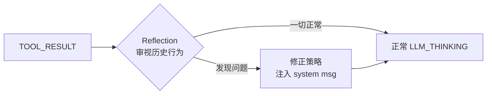
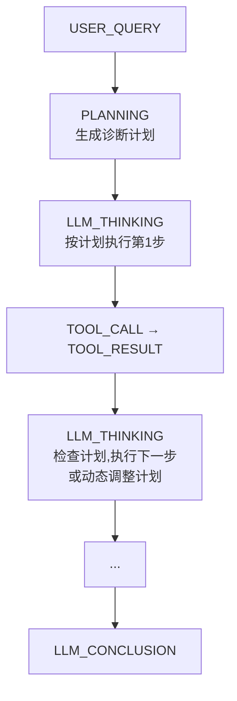
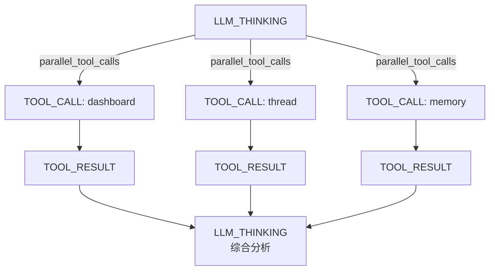
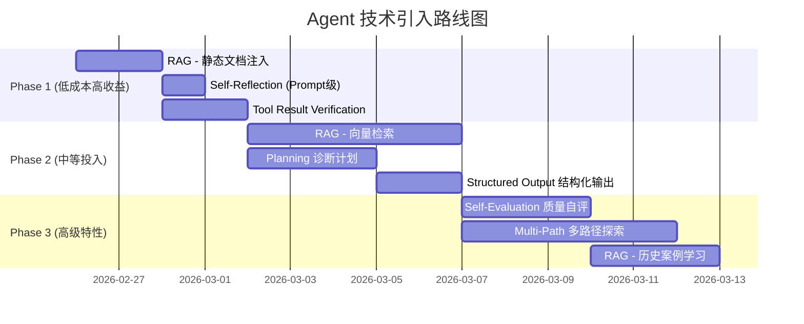

[任务规划完成]
好问题！让我先回顾一下历史对话中对项目的分析，再结合当前代码深入思考还能引入哪些 Agent 技术。
[搜索历史上下文]
让我再深入了解一下项目核心模块的实现细节，以便给出更有针对性的建议。
[读取文件]
再看看其他关键模块：
[读取文件]
我已经对项目有了非常全面的理解。基于当前项目的架构特点——**单 Agent ReAct 循环 + 事件驱动状态机 + 上下文窗口管理**，以下是除 RAG 之外，可以引入的 Agent 前沿技术，按**投入产出比从高到低**排序：

---

## 除 RAG 外，可以引入的 Agent 技术方案

### 一、🧠 自反思 / Self-Reflection（推荐指数：⭐⭐⭐⭐⭐）

**问题**：当前 ReAct 循环是线性的——LLM 每次只看上下文做下一步决策，缺乏对"自己做得好不好"的判断。比如 LLM 连续 5 次调用 `thread` 命令，参数每次都差不多，陷入了无效循环。

**方案**：在 `LLM_THINKING` 推理前注入一个 **Reflection 环节**，让 LLM 审视自己过去的行为：



**具体实现**：

1. **低成本方案（Prompt 级反思）** —— 在当前 `_REACT_PROMPT` 中增加反思指令，不需要额外 LLM 调用：

```python
_REFLECTION_PROMPT = """\
## 自我检查（每次决策前必须执行）

在做下一步决策前，请先检查：
1. **是否重复调用**：同一个工具是否已被调用 2 次以上且参数相似？如果是，换一种方法
2. **是否有效收敛**：每次工具调用后，你对问题的理解是否有实质性进展？如果连续 2 次没有新发现，考虑给出结论
3. **是否偏离主题**：当前调查方向是否还和用户的原始问题相关？
4. **信息是否充分**：已有信息是否已足够给出有价值的结论？不要为了追求完美而过度调查
"""
```

2. **高精度方案（独立 Reflection Agent）** —— 用一个轻量模型做反思判断：

```python
# 新增 reflection/reflector.py
class DiagnosisReflector:
    """诊断行为反思器"""
    
    async def reflect(self, context: DecisionContext) -> Optional[str]:
        """
        分析历史行为模式，返回反思建议（注入到下次推理的 system message 中）
        返回 None 表示无需干预
        """
        # 1. 检测重复调用模式
        repeated = self._detect_repetition(context.messages)
        # 2. 检测无效调查（工具返回空或无新信息）
        stalled = self._detect_stall(context.messages)
        # 3. 检测偏离主题
        drifted = self._detect_drift(context.user_query, context.messages)
        
        if any([repeated, stalled, drifted]):
            return self._build_reflection_prompt(repeated, stalled, drifted)
        return None
```

**接入点**：在 `ContextBuilder.build_context` 末尾，或 `OpenAIDecisionEngine._build_chat_messages` 中注入反思消息。

**收益**：减少无效工具调用（省 token + 省时间），提升诊断收敛速度。

---

### 二、📋 Planning / 诊断计划生成（推荐指数：⭐⭐⭐⭐⭐）

**问题**：当前 ReAct 是 **纯响应式** 的——每一步只看当前状态决定下一步，没有全局规划。遇到复杂问题（如"应用启动慢"），LLM 可能东一榔头西一棒，调查路径混乱。

**方案**：在 `USER_QUERY → LLM_THINKING` 之间增加一个 **Planning 阶段**，先生成诊断计划再执行：



**具体实现**：

```python
# 新增 ActionType
class ActionType(str, Enum):
    TOOL_CALL = "tool_call"
    CONCLUDE = "conclude"
    PLAN = "plan"           # 🆕 生成/更新诊断计划

# 新增 StageType
class StageType(str, PyEnum):
    # ... 原有 ...
    PLANNING = "PLANNING"   # 🆕 诊断计划
```

Planning Prompt 示例：

```
你是一个诊断规划专家。请根据用户问题，生成一个结构化的诊断计划：

用户问题：{user_query}
可用工具：{tool_list}

请输出 JSON 格式的诊断计划：
{
  "plan": [
    {"step": 1, "action": "检查 JVM 整体状态", "tool": "dashboard", "reason": "..."},
    {"step": 2, "action": "分析线程状态", "tool": "thread", "reason": "..."},
    {"step": 3, "action": "定位热点方法", "tool": "profiler", "reason": "..."}
  ],
  "expected_outcome": "定位导致 CPU 飙高的具体方法和调用链"
}
```

**收益**：
- 诊断路径有序、可解释
- 用户可以在 UI 上看到"诊断计划"进度条，体验更好
- LLM 每一步都有"锚点"参照，不容易跑偏

---

### 三、🔄 Tool Result Verification / 工具结果校验（推荐指数：⭐⭐⭐⭐）

**问题**：当前 LLM 直接消费工具原始输出。但 Arthas 返回的数据可能是：空结果、报错信息、格式异常、与预期不符——LLM 不一定能准确判断。

**方案**：在 `TOOL_RESULT → LLM_THINKING` 之间增加一个轻量级的 **Result Verifier**：

```python
# 新增 verification/tool_result_verifier.py
class ToolResultVerifier:
    """工具结果校验器"""
    
    def verify(self, tool_name: str, tool_args: dict, result: str) -> VerificationResult:
        """
        基于规则的快速校验（不调 LLM，零成本）
        """
        # 1. 空结果检测
        if not result or result.strip() in ("", "null", "{}"):
            return VerificationResult(
                valid=False,
                issue="工具返回空结果",
                suggestion=f"'{tool_name}' 未返回有效数据，可能目标不存在或参数有误"
            )
        
        # 2. 错误信息检测（Arthas 常见错误模式）
        error_patterns = ["No class found", "command not found", "Error", "Exception"]
        for pattern in error_patterns:
            if pattern in result:
                return VerificationResult(
                    valid=False,
                    issue=f"工具返回包含错误: {pattern}",
                    suggestion="建议检查参数后重试，或尝试其他工具"
                )
        
        # 3. 结果完整性检查（某些工具有特征字段）
        # ...
        
        return VerificationResult(valid=True)
```

**接入点**：在 `ToolResultHandler.handle` 中，`complete_and_next` 之前调用 Verifier，将校验结论追加到传给 LLM 的 `input_data` 中。

**收益**：帮助 LLM 更快识别无效结果，避免基于错误数据做出错误判断。

---

### 四、🌳 Multi-Path Exploration / 多路径探索（推荐指数：⭐⭐⭐）

**问题**：当前单线程 ReAct 是串行调查。对于复杂问题（如"应用整体健康度检查"），需要同时从 CPU、内存、线程、GC 多个维度并行调查。

**方案**：支持 **一次 LLM_THINKING 产出多个并行 TOOL_CALL**：



**实现要点**：
- `DecisionResult` 增加 `parallel_tool_calls: List[ToolCall]` 字段
- `LlmThinkingHandler` 支持一次创建多个 TOOL_CALL stage（同一 task 下并行 pending）
- `ToolCallHandler` 已经是异步发送（只发不等），天然支持并行
- 需要新增一个 **Barrier/Join 机制**：等所有并行 TOOL_RESULT 都回来后，才触发下一次 LLM_THINKING

```python
# 修改 ActionType
class ActionType(str, Enum):
    TOOL_CALL = "tool_call"
    PARALLEL_TOOL_CALLS = "parallel_tool_calls"  # 🆕
    CONCLUDE = "conclude"
```

**收益**：诊断速度提升 2-3x（对于需要多维度信息的场景），但实现复杂度较高。

---

### 五、📊 Structured Output / 结构化输出增强（推荐指数：⭐⭐⭐⭐）

**问题**：当前 LLM 结论是自由文本。结论的质量和格式完全取决于 LLM，不同问题类型的输出一致性差。

**方案**：根据诊断类型，要求 LLM 输出 **结构化的诊断报告**：

```python
# 新增 conclusion_schema.py
CONCLUSION_SCHEMAS = {
    "cpu_high": {
        "type": "object",
        "properties": {
            "root_cause": {"type": "string", "description": "根因分析"},
            "hot_methods": {"type": "array", "items": {"type": "object", "properties": {
                "class_name": {"type": "string"},
                "method_name": {"type": "string"},
                "cpu_percentage": {"type": "number"},
            }}},
            "call_chain": {"type": "string", "description": "关键调用链"},
            "severity": {"type": "string", "enum": ["critical", "warning", "info"]},
            "suggestions": {"type": "array", "items": {"type": "string"}},
        }
    },
    "memory_leak": { ... },
    "deadlock": { ... },
}
```

**接入点**：
1. 在 Planning 阶段识别问题类型
2. 在最终 `LLM_THINKING`（即将 conclude）时，注入对应的输出 schema
3. 利用 OpenAI 的 `response_format` / `json_schema` 参数强制结构化输出

**收益**：结论可被程序化消费（对接告警系统、自动生成工单等），质量一致。

---

### 六、🧪 Self-Evaluation / 诊断质量自评（推荐指数：⭐⭐⭐）

**问题**：诊断结束后，无法判断结论质量好不好。

**方案**：在 `LLM_CONCLUSION` 之后，增加一个 **Evaluation 阶段**，用另一次 LLM 调用评估诊断质量：

```python
class DiagnosisEvaluator:
    """诊断质量评估器"""
    
    EVAL_PROMPT = """
    请评估以下诊断过程的质量（1-10分）：
    
    用户问题：{user_query}
    诊断步骤：{steps_summary}
    最终结论：{conclusion}
    
    评估维度：
    1. 完整性：是否充分调查了所有相关维度？
    2. 准确性：结论是否有充分的数据支撑？
    3. 实用性：建议是否具体可操作？
    4. 效率：调查路径是否高效，有无冗余步骤？
    """
    
    async def evaluate(self, context, conclusion) -> EvalResult:
        # 调用轻量模型评分
        ...
```

**收益**：
- 低分诊断可触发自动重试（换策略重新诊断）
- 评分数据积累后可用于微调/优化 prompt
- 与后续 RAG 的历史案例库配合——只有高分案例才入库

---

### 七、总结：推荐实施路线图



| 技术 | 改动范围 | 实现难度 | 效果预期 |
|------|---------|---------|---------|
| **Self-Reflection（Prompt 级）** | 只改 `_REACT_PROMPT` | ⭐ | 减少 30%+ 无效调用 |
| **Tool Result Verification** | 新增 Verifier + 改 `ToolResultHandler` | ⭐⭐ | 减少错误判断 |
| **Planning 诊断计划** | 新增 StageType + Handler | ⭐⭐⭐ | 诊断路径有序、可解释 |
| **Structured Output** | 改 Prompt + 解析逻辑 | ⭐⭐ | 结论质量一致 |
| **Self-Evaluation** | 新增 Evaluator + Stage | ⭐⭐ | 闭环优化数据积累 |
| **Multi-Path 并行** | 改状态机 + 新增 Barrier | ⭐⭐⭐⭐ | 诊断速度 2-3x |

我的建议是 **Phase 1 先搞**——Self-Reflection 只需改几行 prompt，Tool Result Verification 是纯规则逻辑不需要调 LLM。这两个加上 RAG 静态文档注入，三板斧下去，诊断质量应该就能有一个质的飞跃。

你对哪个方向最感兴趣？需要我开始实施哪个？