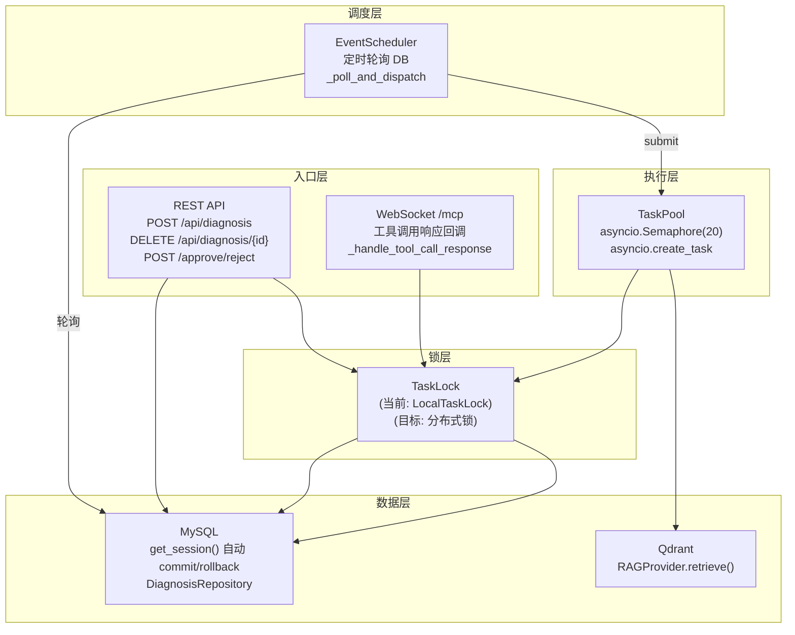
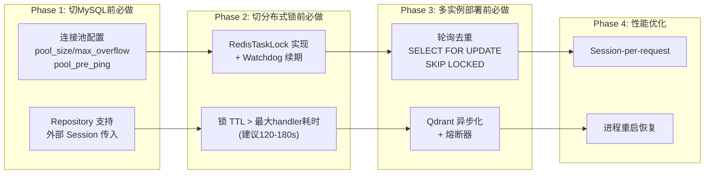

[任务规划完成]
好的，让我先全面了解你当前诊断系统的架构、并发控制、数据库访问和分布式相关的设计，然后做系统性的点评。
[查找文件]
[读取文件]
现在让我再看看 session 管理、配置和 RAG 中涉及 Qdrant 的部分，确保覆盖全面。
[查找文件]
现在让我再看一下最近打开的 context.md，它可能有关于上下文设计的最新文档。
[读取文件]
现在我已经完整审阅了你整个诊断系统的架构代码。下面给你一个在 **假设已使用 MySQL + 分布式锁 + Qdrant** 的场景下，对实际流量并发控制的系统性点评。

---

## 实际流量并发控制评估

### 📐 当前并发架构总览



---

### ✅ 做得很好的地方

| 维度 | 评价 | 具体表现 |
|------|------|---------|
| **任务级锁粒度** | ⭐⭐⭐⭐⭐ | 锁粒度是 `task_id`，不同诊断任务互不阻塞，同一任务的 stage 串行执行，既保证了并发吞吐又避免了状态竞争 |
| **非阻塞锁获取** | ⭐⭐⭐⭐⭐ | `acquire()` 是非阻塞的（try-lock 语义），锁被占用直接跳过，不会阻塞整个 event loop。这对 asyncio 单线程模型非常关键 |
| **统一的 locked() 上下文管理器** | ⭐⭐⭐⭐⭐ | 所有锁使用点（TaskPool、WS 回调、审核 API、删除 API）都通过 `async with task_lock.locked(task_id)` 统一模式，acquire/release 保证成对 |
| **Double-Check 幂等保护** | ⭐⭐⭐⭐⭐ | 在锁内执行前重新从 DB 加载 stage 并检查 `status != PENDING`，防止重复执行。`complete_and_next` 内部也有 PENDING 前置检查，形成双层幂等防护 |
| **Semaphore 全局并发上限** | ⭐⭐⭐⭐ | `asyncio.Semaphore(20)` 控制总并发数，防止突发大量任务压垮系统 |
| **Session 级写锁** | ⭐⭐⭐⭐ | `ClientSession._send_lock` 防止对同一 WebSocket 连接的并发写入，避免消息交织 |
| **冷却机制** | ⭐⭐⭐⭐ | `tool_call_cooldown` 防止调度器在工具响应到达前重复发送 TOOL_CALL 请求，减少 Java 端压力 |
| **WS 回调 + 轮询双通道** | ⭐⭐⭐⭐ | WS 回调是快速通道（低延迟），轮询是兜底通道（高可靠），两者幂等互补 |
| **锁抽象 + 依赖注入** | ⭐⭐⭐⭐ | `TaskLock` 抽象基类 + `LocalTaskLock` 实现，替换为分布式锁只需新增实现类 |
| **自动事务管理** | ⭐⭐⭐⭐ | `get_session()` 上下文管理器自动 commit/rollback，不需要业务代码手动管理事务 |
| **过期锁清理** | ⭐⭐⭐ | `cleanup_stale_locks(ttl=300s)` 清理长时间未使用的锁，防止内存泄漏 |

---

### ⚠️ 切换到 MySQL + 分布式锁 + Qdrant 后的并发问题

#### 1. 🔴 **数据库连接池配置缺失 → MySQL 并发下连接耗尽**

当前的 `create_async_engine` 初始化：

```python
_engine = create_async_engine(
    settings.db_url,
    echo=settings.debug,
    connect_args={"check_same_thread": False} if "sqlite" in settings.db_url else {},
)
```

**完全没有连接池参数**。SQLAlchemy 的默认连接池配置是 `pool_size=5, max_overflow=10`，即最大 15 个并发连接。

但你的系统中有大量并发 DB 访问点：
- EventScheduler 轮询（每 10s 一次复杂子查询）
- TaskPool 最多 20 个并发 handler，每个 handler 内多次 DB 操作
- WS 回调（每个工具响应触发 2-4 次 DB 操作）
- REST API（创建/查询/删除/审核）
- LLM 摘要持久化（`create_context_summary_stage`）
- Prompt 日志记录（`save_prompt_log`）

以 20 个并发任务为例：每个 LLM_THINKING handler 至少触发 `get_task` + `get_stage` + `get_task_stages`(ContextBuilder) + `complete_and_next` + `save_prompt_log` = **5 次 DB 操作**。加上 EventScheduler 和 WS 回调，峰值并发连接需求远超 15。

**后果**：`QueuePool limit of ... overflow ... reached, connection timed out` 异常，handler 执行失败。

**建议**：
```python
_engine = create_async_engine(
    settings.db_url,
    echo=settings.debug,
    pool_size=20,          # 基础连接数 = task_pool_max_concurrency
    max_overflow=30,       # 突发溢出
    pool_timeout=30,       # 获取连接超时
    pool_recycle=1800,     # MySQL 默认 wait_timeout=28800s，1800s 足够安全
    pool_pre_ping=True,    # 每次获取连接前 ping，解决 MySQL "gone away" 问题
)
```

**优先级**：🔴 高 — 切换 MySQL 后几乎立刻会遇到

---

#### 2. 🔴 **Repository 每个方法独立 Session → 事务边界过窄**

当前 `DiagnosisRepository` 的模式是 **每个方法自带 `async with get_session()`**，意味着每个方法都是一个独立的事务。

在 `TaskPool._run_handler()` 的执行链中：

```
get_task()          ← 事务1
get_stage()         ← 事务2
[状态检查]
handler.handle()    ← 内部可能调用 complete_and_next() → 事务3
                    ← 还可能 create_context_summary_stage() → 事务4
                    ← save_prompt_log() → 事务5
```

**问题 1：读写不一致**

在事务1中读到 `task.current_stage_seq = 5`，到事务3中 `complete_and_next` 执行时，另一个并发操作（如 WS 回调的 `_handle_tool_call_response`）可能已经把 `current_stage_seq` 改成了 6。虽然你通过 **task_id 级锁** 保护了同一 task 的串行执行，但这依赖于锁的正确性。如果锁实现有 bug 或者分布式锁续期失败，就会出问题。

**问题 2：部分提交**

如果 `complete_and_next()` 成功（事务3 已 commit），但随后 `save_prompt_log()` 失败（事务5 rollback），结果是 **stage 状态已变更但 prompt 日志缺失**。虽然 prompt 日志不影响业务正确性，但类似的模式在 `create_context_summary_stage` 中可能更严重 — 如果摘要 stage 创建成功但 `current_stage_seq` 更新失败（理论上在同一事务内，但 flush 异常时），会导致 stage_seq 孤立。

**建议**：

对于需要原子性的操作链，提供 **外部 Session 传入** 能力（你已经在注释中提到了这个设计但未实现）：

```python
# 方案：handler 层管理事务边界
async with get_session() as session:
    stage = await repo.get_stage(stage_id, session=session)
    next_stage = await repo.complete_and_next(stage.id, ..., session=session)
    await repo.save_prompt_log(..., session=session)
    # 全部成功 → 一次性 commit
```

**优先级**：🔴 高 — 多实例部署时锁+事务的交互是最容易出问题的地方

---

#### 3. 🔴 **分布式锁替换时的关键陷阱：锁内 await 时间不确定**

当前 `_execute_stage` 的锁持有范围：

```python
async with self._task_lock.locked(task_id):
    next_stage = await self._run_handler(task, stage, handler)
```

而 `_run_handler` 内部调用 `handler.handle()`，对于 `LlmThinkingHandler` 来说，这包含：
1. `ContextBuilder.build_context()` — DB 查询
2. `ContextWindowManager.optimize()` — 可能包含 LLM 摘要调用（30-60s）
3. `decision_engine.decide()` — LLM 推理调用（10-60s）
4. `repo.complete_and_next()` — DB 写入

**总计锁持有时间：可能 30-120 秒。**

对于 `LocalTaskLock`（进程内 `asyncio.Lock`）这没问题，因为协程切换不会丢锁。但对于 **分布式锁**（Redis/MySQL）：

- **锁超时（TTL）问题**：如果分布式锁 TTL 设为 60s，而 LLM 调用耗时 90s，锁会在 handler 执行中途被自动释放。此时轮询器可能拿到同一 task 的锁并开始重复执行。
- **续期（Renewal）必须**：必须实现锁续期（watchdog），在 handler 还在执行时自动延长 TTL。
- **进程崩溃后的锁残留**：如果持有锁的进程崩溃，锁必须能在 TTL 后自动释放（这是分布式锁的基本要求，但要确保 TTL > 最大 handler 执行时间）。

**建议**：

```python
class RedisTaskLock(TaskLock):
    def __init__(self, redis_client, ttl=120, renewal_interval=30):
        self._redis = redis_client
        self._ttl = ttl
        self._renewal_interval = renewal_interval
        self._renewal_tasks: Dict[str, asyncio.Task] = {}

    async def acquire(self, task_id: str) -> bool:
        acquired = await self._redis.set(
            f"task_lock:{task_id}", "1",
            nx=True, ex=self._ttl,
        )
        if acquired:
            # 启动续期协程
            self._renewal_tasks[task_id] = asyncio.create_task(
                self._renew_loop(task_id)
            )
        return bool(acquired)

    async def _renew_loop(self, task_id: str):
        while True:
            await asyncio.sleep(self._renewal_interval)
            await self._redis.expire(f"task_lock:{task_id}", self._ttl)
```

**优先级**：🔴 高 — 不实现续期机制，分布式锁形同虚设

---

#### 4. 🟡 **EventScheduler 轮询在多实例部署下的重复拉取**

当前 `_poll_and_dispatch` 的模式：

```python
pending_items = await self._repo.get_pending_stages(active_session_ids=...)
for task, stage in pending_items:
    await self._pool.submit(task, stage)
```

如果部署了 **多个实例**（横向扩展），每个实例都有自己的 EventScheduler，它们会：
1. 同时从 MySQL 查到相同的 pending stages
2. 同时 submit 到各自的 TaskPool
3. 各自尝试获取分布式锁

结果是 **N-1 个实例浪费性地获取锁失败**。虽然功能上没问题（锁保证了只有一个执行），但：
- 多实例同时查询 DB → 查询放大 N 倍
- 多实例同时竞争锁 → 锁竞争 N 倍
- 大量 `TaskLockNotAcquired` 日志噪声

**主流做法（三选一）**：

| 方案 | 适用场景 | 复杂度 |
|------|---------|-------|
| **轮询分片（Partition）** | 按 `task_id HASH % N` 分配给不同实例 | 中 |
| **轮询 + SELECT FOR UPDATE SKIP LOCKED** | MySQL 8.0+ 原生支持，谁抢到谁执行 | 低 |
| **消息队列替代轮询** | Redis Stream / RabbitMQ / Kafka，每条消息只被消费一次 | 高 |

最推荐的是 `SELECT FOR UPDATE SKIP LOCKED`，改动最小：

```sql
SELECT ds.*, dt.*
FROM diagnosis_stage ds
JOIN diagnosis_task dt ON ds.task_id = dt.task_id
WHERE ds.status = 'pending' AND dt.status = 'running'
FOR UPDATE SKIP LOCKED
LIMIT 10
```

**优先级**：🟡 中 — 单实例下不影响，多实例部署时必须解决

---

#### 5. 🟡 **get_session() 的 Session-per-call 模式 → MySQL 连接频繁获取/释放**

Repository 中每个方法都 `async with get_session() as session`，一次 handler 执行可能触发 **5-10 次 Session 获取/释放**。

每次 `get_session()` 都从连接池获取连接 → 操作 → commit/rollback → 归还连接。在高并发下：
- 连接池获取/归还的锁竞争增大
- MySQL 端的连接频繁切换增加开销
- 网络往返延迟累积

**主流做法**：**请求级 Session**（一次 handler 执行共享一个 Session）：

```python
# 在 TaskPool._run_handler 中创建 Session，传给 handler
async with get_session() as session:
    fresh_task = await session.get(DiagnosisTask, task_id)
    fresh_stage = await session.get(DiagnosisStage, stage_id)
    result = await handler.handle(fresh_task, fresh_stage, self._repo, session=session)
```

这需要 Repository 支持外部传入 Session（你的 repo 已经在方法签名注释中提到了这个设计，但未实现）。

**优先级**：🟡 中 — 性能优化层面

---

#### 6. 🟡 **Qdrant 访问无连接池和超时控制**

RAGProvider 中的向量检索是在 `LlmThinkingHandler` 执行路径上（通过 `ContextBuilder.build_context()`）：

```
LlmThinkingHandler.handle()
  → ContextBuilder.build_context()
    → RAGProvider.retrieve()
      → Retriever.retrieve()
        → Embedder.embed_batch()      ← 外部 API 调用
        → VectorStore.query()          ← Qdrant 查询
```

当前的 `BaseVectorStore` 接口是 **同步的**（没有 `async`），意味着 Qdrant 查询会阻塞 asyncio event loop。在高并发场景下，20 个 handler 同时做 Qdrant 查询会互相阻塞。

此外：
- 没有 Qdrant 连接超时配置
- 没有 Qdrant 连接重试机制
- 没有 Qdrant 连接池（Qdrant 的 Python 客户端 `qdrant-client` 默认使用 HTTP 短连接）
- Qdrant 不可用时没有熔断机制（虽然 RAGProvider 有 try/except 降级，但每次都尝试连接再失败的延迟很高）

**建议**：

```python
# 1. Qdrant 客户端应配置超时和连接池
from qdrant_client import QdrantClient
client = QdrantClient(
    url=settings.rag_store_url,
    timeout=10,           # 查询超时
    grpc_port=6334,       # 使用 gRPC 而非 HTTP，性能更好
    prefer_grpc=True,
)

# 2. VectorStore 接口应支持 async
class BaseVectorStore(ABC):
    @abstractmethod
    async def query(self, ...) -> List[QueryResult]: ...

# 3. Qdrant 不可用时的熔断器
class QdrantVectorStore(BaseVectorStore):
    def __init__(self):
        self._circuit_open = False
        self._last_failure_time = 0
        self._circuit_reset_timeout = 60  # 60s 后重试
```

**优先级**：🟡 中 — RAG 降级不影响诊断主流程，但影响诊断质量

---

#### 7. 🟡 **WebSocket 回调和轮询的竞态窗口**

考虑以下时序：

```
T1: WS 回调 _handle_tool_call_response → acquire lock ✅ → 开始处理
T2: EventScheduler 轮询 → 查到同一 stage (status=PENDING) → submit to Pool
T3: TaskPool._execute_stage → acquire lock ❌ (被 T1 持有) → 跳过
T4: WS 回调处理完成 → release lock → complete_and_next → stage 变为 COMPLETED
T5: (此时 T3 已经跳过了，没问题)
```

这条路径是正确的。但存在另一个竞态：

```
T1: EventScheduler 轮询 → 查到 TOOL_CALL stage (status=PENDING, last_sent_at=NULL)
T2: Pool → ToolCallHandler → 发送工具调用请求 → update_stage_last_sent_at ← 事务A
T3: WS 回调快速返回 → _handle_tool_call_response → acquire lock → complete_and_next ← 事务B
T4: 事务A commit（last_sent_at 已更新）
T5: 事务B commit（stage 已变为 COMPLETED）
-- 下一轮轮询 --
T6: EventScheduler 再次轮询 → stage 已 COMPLETED → 不返回 → OK ✅
```

这条路径也正确。**但如果事务B先于事务A提交**（因为各自独立 Session），`last_sent_at` 会覆盖 COMPLETED 状态？

实际上不会，因为 `update_stage_last_sent_at` 只更新 `last_sent_at` 字段，不影响 `status`。而 `complete_and_next` 有 PENDING 状态前置检查。所以 **当前的幂等保护是足够的**。

**但有一个边缘情况**：如果 ToolCallHandler 发送工具调用后、Java 端响应前，**进程重启**了。此时：
- `last_sent_at` 已写入 DB
- 但 WS 连接断开，Java 端的响应无处投递
- 下次轮询时 `tool_call_cooldown` 可能还在冷却中，stage 被跳过
- 冷却过期后重新发送，但 Java 端可能已经执行过了

**建议**：进程重启后应清除所有 TOOL_CALL stage 的 `last_sent_at`，或将 `tool_call_cooldown` 设为比 WS 重连时间更短的值。

**优先级**：🟡 中 — 仅影响进程重启恢复场景

---

#### 8. 🟢 **RAGProvider.build_index() 是同步阻塞操作**

`build_index()` 方法：
- 遍历文件系统
- 调用 Embedding API（HTTP 请求）
- 写入向量数据库

全部是 **同步阻塞** 操作。如果在 lifespan 中调用或通过 API 触发，会阻塞整个 asyncio event loop。

当前你在应用启动流程中没有调用 `build_index()`（是通过测试手动调用的），但如果后续添加自动索引构建，需要放到 `asyncio.to_thread()` 中运行。

**优先级**：🟢 低 — 当前不影响

---

#### 9. 🟢 **SessionManager._sessions 的并发访问**

`SessionManager` 使用 `asyncio.Lock` 保护 `_sessions` 字典的写操作（register/unregister），但 **读操作没有加锁**：

```python
async def get_session(self, session_id: str) -> Optional[ClientSession]:
    session = self._sessions.get(session_id)  # 无锁读取
    ...
```

在 asyncio 单线程模型下，`dict.get()` 是原子的（Python GIL + 协程不会在 dict.get 中途切换），所以 **当前实际上是安全的**。

但如果后续使用了多线程（如 `asyncio.to_thread` 或 `ThreadPoolExecutor`），就需要用 `asyncio.Lock` 或 `threading.RLock` 保护所有访问。

**优先级**：🟢 低 — asyncio 单线程模型下安全

---

### 📊 差距总览（假设 MySQL + 分布式锁 + Qdrant）

```
┌────────────────────────────────────────────────────┬──────────────┬────────────┬────────────────────┐
│              能力维度                                │   当前状态    │  生产要求   │   建议优先级        │
├────────────────────────────────────────────────────┼──────────────┼────────────┼────────────────────┤
│ 任务级锁粒度（task_id 级别）                         │  ✅ 优        │  ✅        │  —                 │
│ 非阻塞锁获取（try-lock 语义）                        │  ✅ 优        │  ✅        │  —                 │
│ 统一锁模式（locked() 上下文管理器）                   │  ✅ 优        │  ✅        │  —                 │
│ Double-Check 幂等保护                               │  ✅ 优        │  ✅        │  —                 │
│ Semaphore 全局并发限制                               │  ✅ 良        │  ✅        │  —                 │
│ WS + 轮询双通道互补                                  │  ✅ 良        │  ✅        │  —                 │
│ 锁抽象可替换                                         │  ✅ 良        │  ✅        │  —                 │
│ ────── 以下为需要改进的 ──────                       │              │            │                    │
│ MySQL 连接池配置                                     │  ❌ 缺失      │  ✅ 必须    │  🔴 高             │
│ 分布式锁续期（Watchdog）                              │  ❌ 缺失      │  ✅ 必须    │  🔴 高             │
│ Repository 事务边界（外部 Session 传入）               │  ⚠️ 设计有未实现 │  ✅ 推荐    │  🔴 高             │
│ 多实例轮询去重（SKIP LOCKED / 分片 / MQ）             │  ❌ 缺失      │  ✅ 多实例必须│  🟡 中             │
│ Session-per-request（减少连接获取/释放）              │  ❌ 每方法一个  │  ✅ 推荐    │  🟡 中             │
│ Qdrant 异步接口 + 连接超时 + 熔断                     │  ⚠️ 同步阻塞   │  ✅ 推荐    │  🟡 中             │
│ 进程重启后 TOOL_CALL 冷却清理                         │  ❌ 缺失      │  ✅ 推荐    │  🟡 中             │
│ RAG build_index 异步化                               │  ⚠️ 同步阻塞   │  ✅ 推荐    │  🟢 低             │
│ SessionManager 读写锁（多线程场景）                    │  ⚠️ 读无锁     │  视情况     │  🟢 低             │
└────────────────────────────────────────────────────┴──────────────┴────────────┴────────────────────┘
```

---

### 🛣️ 推荐演进路线



---

### 🎯 总结

你的并发控制架构在 **设计层面是非常扎实的**：

1. **task_id 级锁** + **非阻塞 try-lock** + **Semaphore** 的三层并发控制是正确的
2. **Double-Check 幂等** + **PENDING 状态前置检查** 的双层防护在 Agent 系统中很少见到做得这么完整
3. **WS 回调（快路径）+ 轮询（慢路径）** 的双通道设计兼顾了延迟和可靠性
4. **锁抽象** + **工厂模式** 的可替换设计为分布式演进做好了准备

如果给评分：**设计 9/10，当前单实例实现 8/10，多实例就绪度 5/10**。

最紧迫的三件事是：**MySQL 连接池配置**、**分布式锁续期机制**、**Repository 事务边界拓宽**。这三个解决后，你的系统就具备了多实例水平扩展的能力。